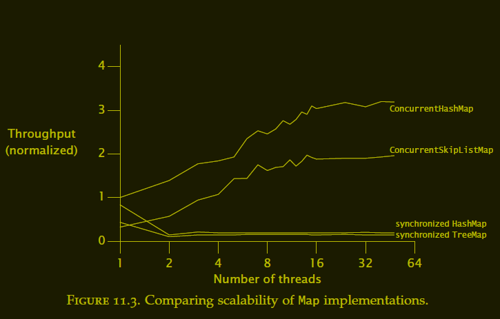

# Java Concurrency in Practice

### Resources
  - [Home](https://jcip.net/)
  - [Source Code](https://jcip.net/listings.html)
  - [Errata](https://jcip.net/errata.html)


# Part I Fundamentals


## The Cheat Sheet of the Concurrency Fundamentals

1.  The less mutable state, the easier it is to ensure thread safety

2.  Make fields final unless they need to be mutable

3.  Immutable objects are automatically thread-safe
    - Immutable objects simplify concurrent programming tremendously
    - Immutable objects are simpler and safer, and can be shared freely
      without locking or defensive copying

4.  Encapsulation makes it practical to manage the complexity
    - Encapsulating data within objects makes it easier to preserve their
      invariants
    - Encapsulating synchronization within objects makes it easier to comply
      with their synchronization policy

5.  Guard each mutable variable with a lock

6.  Guard all variables in an invariant with the same lock

7.  Hold locks for the duration of compound actions

8.  A program that accesses a mutable variable from multiple threads without 
    synchronization is a broken program

9.  Don’t rely on clever reasoning about why you don’t need to synchronize

10. Include thread safety in the design process—or explicitly document that 
    your class is not thread-safe

11. Document your synchronization policy


## Safe Publication Idioms

1. To publish an object safely, both the reference to the object and the 
   object’s state must be made visible to other threads at the same time
   
   A properly constructed object can be safely published by:

    - Initializing an object reference from a static initializer
      - ``` public static Holder holder = new Holder(42); ```
    
    - Storing a reference to it into a volatile field or AtomicReference
      
    - Storing a reference to it into a final field of a properly constructed object
      
    - Storing a reference to it into a field that is properly guarded by a lock
        - the thread-safe library collections offer safe publication guarantees
        - Other handoff mechanisms in the class library (such as ``` Future ``` and 
          ``` Exchanger ```) also constitute safe publication


2. To share mutable objects safely, they must be safely published and be either 
   thread-safe or guarded by a lock 

   The publication requirements for an object depend on its mutability:
     - Immutable objects can be published through any mechanism
     - Effectively immutable objects must be safely published
     - Mutable objects must be safely published, and must be either threadsafe 
       or guarded by a lock


## Sharing Objects Safely

  - When you publish an object, you should document how the object can be 
    accessed, ask yourself:
      - What you are allowed to do with it 
      - Do you need to acquire a lock before using it
      - Are you allowed to modify its state, or only to read it


  - The most useful policies for using and sharing objects in a concurrent 
    program are:
    - __Thread-Confined__ : 
      A thread-confined object is owned exclusively by and confined to one 
      thread, and can be modified by its owning thread
    - __Shared Read-Only__ : 
      A shared read-only object can be accessed concurrently by multiple threads 
      without additional synchronization, but cannot be modified by any thread
      - Shared read-only objects include immutable and effectively immutable 
        objects
    - __Shared Thread-Safe__ : 
      A thread-safe object performs synchronization internally, so multiple 
      threads can freely access it through its public interface without further 
      synchronization
    - __Guarded__ A guarded object can be accessed only with a specific lock 
      held  
      - Guarded objects include those that are encapsulated within other 
        thread-safe objects and published objects that are known to be guarded 
        by a specific lock


## Invariant

> An invariant is any logical rule that must be obeyed throughout the execution 
> of your program that can be communicated to a human, but not to your compiler 
> INVARIANTS ARE BAD

This definition can be cleaved out conditions into two groups 
  - those the compiler can be trusted with enforcing
  - and those that must be documented, discussed, commented, or otherwise 
    communicated to contributors in order for them to interact with the codebase 
    without introducing bugs 


## Patterns for Structuring Thread-Safe Classes

### The Design of Thread-Safe Classes

1. The design process for a thread-safe class should include these three basic elements
   - Identify the variables that form the object’s state 
   - Identify the invariants that constrain the state variables 
   - Establish a policy for managing concurrent access to the object’s state 


2. Gathering synchronization requirements
   > You cannot ensure thread safety without understanding an object’s invariants 
   > and postconditions. Constraints on the valid values or state transitions for 
   > state variables can create atomicity and encapsulation requirements.


3. State-Dependent Operations

   - To create operations that wait for a precondition to become true before 
     proceeding, it is often easier to use existing library classes, such as 
     blocking queues or semaphores, to provide the desired state-dependent 
     behavior


4. State ownership

   - When defining which variables form an object’s state, we want to consider 
     only the data that object owns. Ownership is not embodied explicitly in 
     the language, but is instead an element of class design


### Instance Confinement

1. Encapsulating data within an object confines access to the data to the 
   object’s methods, making it easier to ensure that the data is always accessed 
   with the appropriate lock held
   - If an object is intended to be confined to a specific scope, then letting 
     it escape from that scope is a bug
   - Confined objects can also escape by publishing other objects such as 
     iterators or inner class instances that may indirectly publish the 
     confined objects


2. Confinement makes it easier to build thread-safe classes because a class that 
   confines its state can be analyzed for thread safety without having to 
   examine the whole program


#### The Java Monitor Pattern

  > An object following the Java monitor pattern encapsulates all its mutable 
  > state and guards it with the object’s own intrinsic lock


### Delegating thread safety

  > If a class is composed of multiple independent thread-safe state variables 
  > and has no operations that have any invalid state transitions, then it can 
  > delegate thread safety to the underlying state variables
 
  > If a state variable is 
  > thread-safe, 
  > does not participate in any invariants that constrain its value, 
  > and has no prohibited state transitions for any of its operations, 
  > then it can safely be published


### Adding Functionality to Existing Thread-Safe Classes


### Building Blocks

[CyclicBarrier vs CountDownLatch](https://www.baeldung.com/java-cyclicbarrier-countdownlatch)

# Part II Structuring Concurrent Applications


## Chapter 6 Task Execution


### 6.1 Executing Tasks in Threads

### 6.2 Separating the specification of Execution Policy from Task Submission

#### Execution Policy (What, Where, When, How)

- In what thread will tasks be executed?

- In what order should tasks be executed (FIFO, LIFO, priority order)?

- How many tasks may execute concurrently?

- How many tasks may be queued pending execution?

- If a task has to be rejected because the system is overloaded, which task 
  should be selected as the victim, and how should the application be notified?

- What actions should be taken before or after executing a task?


### 6.3 Finding Exploitable Parallelism

1. A further problem with dividing heterogeneous tasks among multiple workers 
   is that the tasks may have disparate sizes

2. If you divide tasks A and B between two workers but A takes ten times as 
   long as B, you’ve only speeded up the total process by 9%

3. Finally, dividing a task among multiple workers always involves some amount 
   of coordination overhead; for the division to be worthwhile, this overhead 
   must be more than compensated by productivity improvements due to parallelism


## Chapter 7 Cancellation and Shutdown

### Overview

#### This chapter addresses mechanisms for 
  - Cancellation
  - Interruption
  - How to code tasks and services to be responsive to cancellation requests


### 7.1 Task Cancellation


1.  What does _cancellable_ meat?

    - An activity is _cancellable_ if external code can move it to completion 
      before its normal completion

      - User-requested cancellation
      - Time-limited activities
      - Application events
      - Errors
      - Shutdown


2. The ___Cooperative Mechanisms___

    - There is no safe way to preemptively stop a thread in Java, and therefore 
      no safe way to preemptively stop a task
      
    - There are only ___cooperative mechanisms___, by which the task and the code 
      requesting cancellation follow an agreed-upon protocol

    - How it works?

      - One such ___cooperative mechanism___ is setting a 
        “cancellation requested” flag that the task checks periodically
        - If it finds the flag set, the task terminates early 


3.  The ___Cancellation Policy___
    - A task that wants to be cancellable must have a ___cancellation policy___ 
      that specifies the “how”, “when”, and “what” of ___cancellation___
      - ___How other code can request cancellation___
      - ___When the task checks whether cancellation has been requested___
      - ___What actions the task takes in response to a cancellation request___


4.  ___Interruption___ is usually the most sensible way to implement 
    ___cancellation___

    - There is nothing in the API or language specification that ties
      ___interruption___ to any specific cancellation semantics, but in practice, 
      using ___interruption___ for anything but ___cancellation___ is fragile and difficult 
      to sustain in larger applications
      
    - Calling interrupt does not necessarily stop the target thread from doing 
      what it is doing; it merely delivers the message that ___interruption___ has 
      been requested
      
    - Threads should also have an ___interruption policy___
      - An interruption policy determines how a thread interprets an
        ___interruption___ request
        - What it does (if anything) 
        - When one is detected, what units of work are considered atomic with 
          respect to ___interruption___, and 
        - How quickly it reacts to ___interruption___
      - The most sensible ___interruption policy___ is some form of thread-level 
        or servicelevel cancellation: 
        - Exit as quickly as practical 
        - Cleaning up if necessary, and 
        - Possibly notifying some owning entity that the thread is exiting
        
    - Distinguish between how tasks and threads should react to ___interruption___ 
      - Tasks do not execute in threads they own; they borrow threads owned by 
        a service such as a thread pool
      - Code that doesn’t own the thread (for a thread pool, any code outside 
        of the thread pool implementation) should be careful to preserve the 
        interrupted status so that the owning code can eventually act on it
      - A task needn’t necessarily drop everything when it detects an 
        interruption request 
        - It can choose to postpone it until a more opportune time by 
          remembering that it was interrupted, finishing the task it was 
          performing, and then throwing ``` InterruptedException ``` or 
          otherwise indicating interruption
          - This technique can protect data structures from corruption when an 
            activity is interrupted in the middle of an update
      - A task should not assume anything about the interruption policy of its 
        executing thread unless it is explicitly designed to run within a service 
        that has a specific interruption policy
      - Whether a task interprets interruption as cancellation or takes some 
        other action on interruption, it should take care to preserve the 
        executing thread’s interruption status
        - If it is not simply going to propagate ``` InterruptedException ``` 
          to its caller, it should restore the interruption status after 
          catching ``` InterruptedException ```
          - ``` Thread.currentThread().interrupt(); ```
      - A thread should be interrupted only by its owner 
        - The owner can encapsulate knowledge of the thread’s interruption 
          policy in an appropriate cancellation mechanism such as a shutdown 
          method
      - Because each thread has its own interruption policy, you should not 
        interrupt a thread unless you know what interruption means to that 
        thread

    - Responding to interruption
      - Two practical strategies for handling ``` InterruptedException ```
        - Propagate the exception (possibly after some task-specific cleanup), 
          making your method an interruptible blocking method, too;
        - Restore the interruption status so that code higher up on the call 
          stack can deal with it
      - Another way to preserve the interruption request when don’t want to or 
        cannot propagate ``` InterruptedException ```
        - Restore the interrupted status by calling interrupt again
          - ``` Thread.currentThread().interrupt(); ```
        - What should not do is swallow the InterruptedException by catching it 
          and doing nothing in the catch block
        - Only code that implements a thread’s interruption policy may swallow 
          an interruption request ]
          - General-purpose task and library code should never swallow 
            interruption requests
     - Activities that do not support cancellation but still call interruptible 
       blocking methods will have to call them in a loop, retrying when 
       interruption is detected 
       - Setting the interrupted status too early could result in an infinite 
         loop, because most interruptible blocking methods check the interrupted 
         status on entry and throw InterruptedException immediately if it is set
       - Interruptible methods usually poll for interruption before blocking or 
         doing any significant work, so as to be as responsive to interruption 
         as possible 


5.  Cancellation via ``` Future ```

    > The General Principle: It is better to use existing library classes than to roll your own

    - The ``` cancel ``` method of ``` Future ```
      - ``` boolean cancel(boolean mayInterruptIfRunning) ```
      - Attempts to cancel execution of this task
      - This attempt will fail if the task has already completed, has already 
        been cancelled, or could not be cancelled for some other reason
      - If successful, and this task has not started when cancel is called, this 
        task should never run
      - If the task has already started, then the mayInterruptIfRunning 
        parameter determines whether the thread executing this task should be 
        interrupted in an attempt to stop the task 
      - After this method returns 
        - Subsequent calls to ``` isDone() ``` will always return ``` true ```
        - Subsequent calls to ``` isCancelled() ``` will always return true 
          if this method returned true 
      - [Parameters] 
        - ``` mayInterruptIfRunning ``` - true if the thread executing this 
          task should be interrupted; otherwise, in-progress tasks are allowed 
          to complete
        - This only says whether it was able to deliver the interruption, not 
          whether the task detected and acted on it 
        - When ``` mayInterruptIfRunning ``` is true and the task is currently 
          running in some thread, then that thread is interrupted
        - Setting this argument to ``` false ``` means “don’t run this task if 
          it hasn’t started yet”, and should be used for tasks that are not 
          designed to handle interruption
      - [Returns] 
        - ``` false ``` if the task could not be cancelled, typically because 
          it has already completed normally; true otherwise

    - The task execution threads created by the standard Executor 
      implementations implement an interruption policy that lets tasks be 
      cancelled using interruption, so it is safe to set mayInterruptIfRunning 
      when cancelling tasks through their Futures when they are running in a 
      standard Executor
      - You Should Not Interrupt a pool ``` Thread ``` directly when attempting 
        to cancel a task, because you won’t know what task is running when the 
        interrupt request is delivered—do this only through the task’s ``` Future ```
      - This is yet another reason to code tasks to treat interruption as a 
        cancellation request: then they can be cancelled through their Futures

    > When ``` Future.get ``` throws ``` InterruptedException ``` or
    > ``` TimeoutException ``` and you know that the result is no longer needed
    > by the program, cancel the task with ``` Future.cancel ``` 


6.  Dealing with Non-Interruptible Blocking

    - Why non-interruptible threads are blocked

        - Synchronous socket I/O in ``` java.io ```
            - The common form of blocking I/O in server applications is reading 
              or writing to a socket
            - Unfortunately, the ``` read ``` and ``` write ``` methods in 
              ``` InputStream ``` and ``` OutputStream ``` are not responsive to 
              interruption
            - However, closing the underlying socket makes any threads blocked 
              in ``` read ``` or ``` write ``` throw a ``` SocketException ```
            - ``` Socket::close ```
              - Any thread currently blocked in an I/O operation upon this 
                socket will throw a SocketException 
              - Once a socket has been closed, it is not available for further 
                networking use (i.e. can't be reconnected or rebound); a new 
                socket needs to be created
              - Closing this socket will also close the socket's InputStream and 
                OutputStream
              - If this socket has an associated channel then the channel is 
                closed as well
        
        - Synchronous I/O in ``` java.nio ```
            - Interrupting a ``` thread ``` waiting on an InterruptibleChannel 
              causes it to throw ``` ClosedByInterruptException ``` and close 
              the channel 
                - And, also causes all other threads blocked on the channel to 
                  throw ``` ClosedByInterruptException ```) 
            - Closing an ``` InterruptibleChannel ``` causes threads blocked on 
              channel operations to throw ``` AsynchronousCloseException ```
            - Most standard Channels implement ``` InterruptibleChannel ``` like
              ```  FileChannel ```

        - Asynchronous I/O with Selector
            - If a thread is blocked in Selector.select (in 
              ``` java.nio.channels ```), calling ``` close ``` or ``` wakeup ``` 
              causes it to return prematurely

        - Lock acquisition
            - If a thread is blocked waiting for an intrinsic lock, there is 
              nothing you can do to stop it, ___short of___ ensuring that it 
              eventually acquires the lock and makes enough progress that you 
              can get its attention some other way
            - However, the explicit ``` Lock ``` classes offer the 
              lockInterruptibly method, which allows you to wait for a lock and 
              still be responsive to interrupts

> ___short of (doing) something___ - 
> without something; without doing something; unless something happens
> - Short of a miracle, we're certain to lose
> - Short of asking her to leave (= and we don't want to do that) there's not a 
>   lot we can do about the situation.

> ___Intrinsic Lock___ - 
> Every Java object can implicitly act as a lock for purposes of 
> synchronization; these built-in locks are called intrinsic locks 
> or monitor locks 
> The lock is automatically acquired by the executing thread before 
> entering a synchronized block and automatically released when 
> control exits the synchronized block, whether by the normal control 
> path or by throwing an exception out of the block  
> The only way to acquire an intrinsic lock is to enter a 
> synchronized block or method guarded by that lock 


7.  Encapsulating nonstandard cancellation with ``` ThreadPoolExecutor::newTaskFor ```

      - Create an interface which extends Callable
        ``` 
        public interface ICancellableTask<T> extends Callable<T> {
            void cancel();
            RunnableFuture<T> newTask();
        } 
        ```

      - Create a new class to inherits from ThreadPoolExecutor and override the 
        ``` newTaskFor ``` method
        ``` 
        public class CancellingExecutor extends ThreadPoolExecutor {
            // Overriden constructors 
            @Override
            protected <T> RunnableFuture<T> newTaskFor(Callable<T> callable) {
                if (callable instanceof ICancellableTask) {
                    return ((ICancellableTask<T>) callable).newTask();
                } else {
                    return super.newTaskFor(callable);
                }
            }
        }
        ```

      - Create a new task class which implements ICancellableTask
        ``` 
        @Slf4j
        public class CancellableSocketTask implements ICancellableTask<Void> {
        
            static final int BUFSZ = 512;
        
            @GuardedBy("this")
            private final Socket socket;
        
            private CancellableSocketTask(@NonNull Socket socket) {
                this.socket = socket;
            }
        
            public static CancellableSocketTask of(@NonNull Socket socket) {
                return new CancellableSocketTask(socket);
            }
        
            // From ICancellableTask and called by RunnableFuture::cancel
            @Override 
            public synchronized void cancel() {
                log.info(">>>>>>> Being asked for cancelling this task.");
                try {
                    if (socket != null) {
                        socket.close();
                    }
                } catch (IOException ioe) {
                    log.warn(">>>>>>> Caught {} when closing the Socket",
                            ioe.getClass().getSimpleName());
                }
            }
        
            // From ICancellableTask and called by ThreadPoolExecutor::newTaskFor 
            @Override 
            public RunnableFuture<Void> newTask() {
                log.info(">>>>>>> Creating a new FutureTask which contains this SocketTask");
                return new FutureTask<>(this) {
                    @Override
                    public boolean cancel(boolean mayInterruptIfRunning) {
                        try {
                            CancellableSocketTask.this.cancel();
                        } finally {
                            return super.cancel(mayInterruptIfRunning);
                        }
                    }
                };
            }

            @Override
            public Void call() throws Exception {
        
                try (InputStream in = this.socket.getInputStream()) {
                    byte[] buf = new byte[BUFSZ];
                    while (true) {
                        int count = in.read(buf);
                        if (count < 0) {
                            break;
                        } else if (count > 0) {
                            processBuffer(buf, count);
                        }
                    }
                } catch (IOException e) { /* Allow thread to exit */
                    // SocketException
                    log.error(">>>>>>> Caught {} when reading the Socket.",
                            e.getClass().getSimpleName());
                } finally {
                    log.info(">>>>>>> Stopped reading.");
                }
        
                return null;
            }
        
            private void processBuffer(byte[] buf, int count) {
                log.info(">>>>>>> Processing {} bytes buffer", count);
            }

        }///:~
        ```


### 7.2 Stopping a Thread-Based Service

> Sensible encapsulation practices dictate that you should not manipulate a 
> thread—interrupt it, modify its priority, etc.—unless you own it 


> But, the thread API has no formal concept of thread ownership: 
> a thread is represented with a ``` Thread ``` object that can be freely shared 
> like any other object


> However, it makes sense to think of a thread as having an owner, 
> and this is usually the class that created the thread


> So a thread pool owns its worker threads, and if those threads need to be 
> interrupted, the thread pool should take care of it 


> Thread ownership IS NOT Transitive: the application may own the service and 
> the service may own the worker threads, but the application doesn’t own the 
> worker threads and therefore should not attempt to stop them directly


> Instead, the service should provide lifecycle methods for shutting itself 
> down that also shut down the owned threads; then the application can shut down 
> the service, and the service can shut down the threads 


> Executor-Service provides the shutdown and shutdownNow methods; 
> other thread-owning services should provide a similar shutdown mechanism

> Provide lifecycle methods whenever a thread-owning service has a lifetime 
> longer than that of the method that created it 


#### Example: A Logging Service

> Cancelling a producerconsumer activity requires cancelling both the producers 
> and the consumers 


#### 7.2.3 Poison Pills

A ___Poison Pill___
  - A recognizable object placed on the queue that means “when you get this, 
    stop.”
  - With a FIFO queue, ___Poison Pills___ ensure that consumers finish the 
    work on their queue before shutting down
  - Any work submitted prior to submitting the ___Poison Pill___ will be 
    retrieved before the pill
  - Producers should not submit any work after putting a poison pill on the 
    queue
  - ___Poison Pills___ work only when the number of producers and consumers 
    is known
  - ___Poison Pills___ work reliably only with unbounded queues


#### 7.2.4 One-Shot Execution Service

- A method needs to process a batch of tasks and does not return until all the 
  tasks are finished
    - Using private ``` Executor ``` whose lifetime is bounded by that method to
      simplify service lifecycle management
    - The ``` invokeAll ``` and ``` invokeAny ``` methods can often be useful 
      in such situations


#### 7.2.5 How to Keep Track of Cancelled Tasks after ``` shutdownNow ```

##### The Requirement

- To know which tasks have not completed, you need to know not only which tasks 
  didn’t start, but also which tasks were in progress when the executor was 
  shut down

- However, there is no general way to find out which tasks started but did not 
  omplete
    - This means that there is no way of knowing the state of the tasks in 
      progress at shutdown time unless the tasks themselves perform some sort 
      of checkpointing


#### The Solution

- The technique for determining which tasks were in progress at shutdown time:
  - Encapsulating an ``` ExecutorService ```
  - Instrumenting ``` execute ``` (and similarly submit, not shown) to remember 
    which tasks were cancelled after shutdown
      - Identifying which tasks started but did not complete normally
  - In order for this technique to work, the tasks must preserve the thread’s 
    interrupted status when they return, which well behaved tasks will do anyway 
    
    ``` 
    Thread.currentThread().interrupt();
    ```

    ``` 
    @Override
    public void execute(final Runnable runnable) {
        this.executor.execute(() -> {
            try {
                runnable.run();
            } finally {
                if (isShutdown() && Thread.currentThread().isInterrupted()) {
                    this.tasksCancelledAtShutdown.add(runnable);
                }
            }
        });
    }
    ```


### 7.3 Handling Abnormal Thread Termination

#### 7.3.0 A proactive approach to the problem of unchecked exceptions

> Task-processing threads such as the worker threads in a thread pool should 
> call tasks within a try-catch block that catches unchecked exceptions, or 
> within a try-finally block to ensure that if the thread exits abnormally 
> the framework is informed of this and can take corrective action

> This is one of the few times when you might want to consider catching 
> RuntimeException—when you are calling unknown, untrusted code through an 
> abstraction such as Runnable 


``` 
public void run() {
    Throwable thrown = null;
    try {
        while (!isInterrupted()) {
            runTask(getTaskFromWorkQueue());
        }
    } catch (Throwable e) {
        thrown = e;
    } finally {
        threadExited(this, thrown);
    }
}
```


#### 7.3.1 Uncaught Exception Handlers

- The ``` Thread ``` API also provides the ``` UncaughtExceptionHandler ``` 
  facility, which lets you detect when a thread dies due to an uncaught exception 
    - When a thread exits due to an uncaught exception, the JVM reports this 
      event to an application-provided ``` UncaughtExceptionHandler ```
    - What the handler should do with an uncaught exception depends on your 
      quality-of-service requirements


- The most common response is to write an error message and stack trace to the 
  application log
  ``` 
    @Slf4j
    public class UncaughtExceptionLoggingHandler implements
    Thread.UncaughtExceptionHandler {
    
        @Override
        public void uncaughtException(Thread t, Throwable e) {
            log.error(">>>>>>> Thread {} terminated with exception: {}", 
                    t.getName(), e);
        }
    
    }
  ```


> In long-running applications, always use uncaught exception handlers for all 
> threads that at least log the exception 


- To set an ``` UncaughtExceptionHandler ``` for pool threads, provide a 
  ``` ThreadFactory ``` to the ``` ThreadPoolExecutor ``` constructor


- The standard thread pools allow an uncaught task exception to terminate the 
  pool thread, but use a try-finally block to be notified when this happens so 
  the thread can be replaced


- Without an uncaught exception handler or other failure notification mechanism, 
  tasks can appear to fail silently, which can be very confusing


- If you want to be notified when a task fails due to an exception so that you 
  can take some task-specific recovery action, either wrap the task with a 
  Runnable or Callable that catches the exception or override the ``` afterExecute ```
  hook in ``` ThreadPoolExecutor ```
    - ``` protected void afterExecute(Runnable r, Throwable t) ```


- Note: Somewhat confusingly, exceptions thrown from tasks make it to the 
  uncaught exception handler only for tasks submitted with execute
  

- For tasks submitted with submit, any thrown exception, checked or not, 
  is considered to be part of the task’s return status
    - If a task submitted with submit terminates with an exception, it is 
      rethrown by ``` Future.get ```, wrapped in an ``` ExecutionException ```


### 7.4 JVM Shutdown

#### Different Ways to Shutdown JVM

- The JVM can shut down in an orderly manner
    - An orderly shutdown is initiated when the last “normal” (nondaemon) thread 
      terminates, someone calls System.exit, 
    - By other platform-specific means  (such as sending a SIGINT or 
      hitting Ctrl-C)
        - While this is the standard and preferred way for the JVM to shut down

- The JVM can also shut down in abrupt manner
    - Calling Runtime.halt
    - Killing the JVM process through the operating system (such as sending a 
      SIGKILL)


#### 7.4.1 Shutdown Hooks

- In an orderly shutdown, the JVM first starts all registered shutdown hooks
    - Shutdown hooks are unstarted threads that are registered with 
      ``` Runtime.addShutdownHook ``` (no guarantees on the order)
    - If any application threads (daemon or nondaemon) are still running at 
      shutdown time, they continue to run concurrently with the shutdown process
    - When all shutdown hooks have completed, the JVM may choose to run 
      finalizers if ``` runFinalizersOnExit ``` is true, and then halts
    - The JVM makes no attempt to stop or interrupt any application threads 
      that are still running at shutdown time; they are abruptly terminated 
      when the JVM eventually halts
    - If the shutdown hooks or finalizers don’t complete, then the orderly 
      shutdown process “hangs” and the JVM must be shut down abruptly


- In an abrupt shutdown, the JVM is not required to do anything other than halt 
  the JVM; shutdown hooks will not run


- Shutdown hooks should be thread-safe
    - They must use synchronization when accessing shared data and should be 
      careful to avoid deadlock
    - They should not make assumptions about 
        - the state of the application
            - whether other services have shut down already
            - all normal threads have completed or not
        - why the JVM is shutting down
    - Must therefore be coded extremely defensively


- Shutdown hooks should exit as quickly as possible

- Because shutdown hooks all run concurrently, shutdown hooks should not rely 
  on services that can be shut down by the application or other shutdown hooks 
    - Use a single shutdown hook for all services, rather than one for each 
      service, and have it call a series of shutdown actions 
    - This ensures that shutdown actions execute sequentially in a single thread, 
      thus avoiding the possibility of race conditions or deadlock between 
      shutdown actions


> Using only one single shutdown hook for all services can be used whether or 
> not you use shutdown hooks 


> Executing shutdown actions sequentially rather than concurrently eliminates 
> many potential sources of failure 


> In applications that maintain explicit dependency information among services, 
> executing shutdown actions sequentially can also ensure that shutdown actions 
> are performed in the right order 


#### 7.4.2 Daemon threads

- The existence of daemon threads will not prevent the JVM from shutting down
  This is what daemon threads are for 


- Threads are divided into two types
    - Normal threads 
    - daemon threads


- When the JVM starts up, all the threads it creates, except the main thread, 
  are daemon threads, such as
    - Garbage collector 
    - Other housekeeping threads 


- Any threads created by the main thread are also normal threads
    - When a new thread is created, it inherits the daemon status of the thread 
      that created it


- When a thread exits, the JVM performs an inventory of running threads, and 
  if the only threads that are left are daemon threads, it initiates an orderly 
  shutdown; when the JVM halts, the JVM just exits
    - Any remaining daemon threads are abandoned 
    - All finally blocks are not executed, stacks are not unwound


- Daemon threads should not be used for any sort of I/O


- Daemon threads are best saved for “housekeeping” tasks, such as a background 
  thread that periodically removes expired entries from an in-memory cache 


> Daemon threads are not a good substitute for properly managing the lifecycle 
> of services within an application


## Chapter 8 Applying Thread Pools

### 8.1 Implicit Couplings between Tasks and Execution Policies

#### Overview
> Not all tasks are compatible with all Execution Policies

- Types of tasks that require specific execution policies include
    - Dependent Tasks
    - Tasks that exploit thread confinement
        - Single-threaded executors make stronger promises about concurrency 
          than do arbitrary thread pools. They guarantee that tasks are not 
          executed concurrently
    - Response-Time-Sensitive Tasks
    - Tasks that use ``` ThreadLocal ```
        - ``` ThreadLocal ``` makes sense to use in pool threads only if the 
          thread-local value has a lifetime that is bounded by that of a task
        - ``` ThreadLocal ``` should not be used in pool threads to communicate 
          values between tasks


> Thread pools work best when tasks are homogeneous and independent

> Mixing long-running and short-running tasks risks “clogging” the pool unless 
> it is very large

> Submitting tasks that depend on other tasks risks deadlock unless the pool is 
> unbounded and large enough that tasks are never queued or rejected

> Tasks that exploit thread confinement require sequential execution

> Document the requirements above so that future maintainers do not undermine 
> safety or liveness by substituting an incompatible execution policy


#### 8.1.1 Thread Starvation Deadlock

- What is ___thread starvation deadlock___
     - If tasks that depend on other tasks execute in a thread pool, they can 
       deadlock
     -  In a single-threaded executor, a task that submits another task to the 
        same  executor and waits for its result will ___always deadlock___
     - In larger thread pools, if all threads are executing tasks that are 
       blocked waiting for other tasks still on the work queue


> Whenever submitting to an Executor tasks that are not independent, be aware of 
> the possibility of thread starvation deadlock, and document any pool sizing or 
> configuration constraints in the code or configuration file where the Executor 
> is configured


#### 8.1.2 Long-running tasks

- Thread pools can have responsiveness problems if tasks can block for extended 
  periods of time, even if deadlock is not a possibility


### 8.2 Sizing thread pools


#### Overview

> The ideal size for a thread pool depends on the types of tasks that will be 
> submitted and the characteristics of the deployment system


> Thread pool sizes should be provided by a configuration mechanism or computed 
> dynamically by consulting ``` Runtime.availableProcessors ```

- To size a thread pool properly, need to understand 
    - the computing environment 
    - the resource budget 
    - the nature of the tasks


> If having different categories of tasks with very different behaviors, 
> consider using multiple thread pools so each can be tuned according to its 
> workload


- How many processors does the deployment system have?


- How much memory?


- Do tasks perform mostly computation, I/O, or some combination?


- Do they require a scarce resource, such as a JDBC connection?


#### Compute-Intensive Tasks

- An Ncpu-processor system usually achieves optimum utilization with a 
  thread pool of ___Ncpu + 1___ threads
    - Even Compute-Intensive Threads occasionally take a page fault or pause for 
      some other reason, so an “extra” runnable thread prevents CPU cycles from 
      going unused when this happens  


#### For Tasks that also include I/O or other Blocking Operations

- Needs a larger pool since not all of the threads will be schedulable at all 
  times


- In order to size the pool properly, you must estimate the ratio of waiting 
  time to compute time for your tasks 


- Alternatively, the size of the thread pool can be tuned by running the 
  application using several different pool sizes under a benchmark load and 
  observing the level of CPU utilization


- Other Resources that can contribute to sizing constraints
    - Memory 
    - File handles 
    - Socket handles 
    - Database Connections
    - Add up how much of that resource each task requires and divide that into 
      the total quantity available, the result will be an upper bound on the 
      pool size


> When tasks require a pooled resource such as database connections, 
> thread pool size and resource pool size affect each other

>If each task requires a connection, the effective size of the thread pool is 
> limited by the connection pool size

> When the only consumers of connections are pool tasks, the effective size of 
> the connection pool is limited by the thread pool size


### 8.3 Configuring ``` ThreadPoolExecutor ```

#### The most general constructor of ``` ThreadPoolExecutor ```

``` 
public ThreadPoolExecutor(
        int corePoolSize,
        int maximumPoolSize,
        long keepAliveTime,
        TimeUnit unit,
        BlockingQueue<Runnable> workQueue,
        ThreadFactory threadFactory,
        RejectedExecutionHandler handler) { ... }
```

#### 8.3.1 Thread creation and teardown

- The ___core pool size___, ___maximum pool size___, and ___keep-alive time___ 
  govern thread ___creation___ and ___teardown___


- ``` corePoolSize ```, the core size is the target size
    - The implementation attempts to maintain the pool at this size even when 
      there are no tasks to execute and will not create more threads than this 
      unless the work queue is full
    - When a ThreadPoolExecutor is initially created, the core threads are not 
      started immediately but instead as tasks are submitted, unless you call 
      ``` prestartAllCoreThreads ```


- ``` maximumPoolSize ```, the maximum pool size is the upper bound on how many 
  pool threads can be active at once 


- ``` keepAliveTime ```, a thread that has been idle for longer than the 
  ``` keepAliveTime ``` becomes a candidate for reaping and can be terminated 
  if the current pool size exceeds the core size


- ``` allowCoreThreadTimeOut ``` allows you to request that all pool threads be 
  able to time out; enable this feature with a core size of zero if you want a 
  bounded thread pool with a bounded work queue but still have all the threads 
  torn down when there is no work to do


#### 8.3.2 Managing Queued Tasks

- Bounded thread pools limit the number of tasks that can be executed concurrently


- With tasks that depend on other tasks, bounded thread pools or queues can 
  cause thread starvation deadlock; instead, use an unbounded pool configuration 
  like newCachedThreadPool


#### 8.3.3 Saturation Policies

> ``` AbortPolicy ```, ``` CallerRunsPolicy ```, ``` DiscardPolicy ```, and 
> ``` DiscardOldestPolicy ```

- The saturation policy for a ThreadPoolExecutor can be modified by calling
  ``` 
  // ThreadPoolExecutor::setRejectedExecutionHandler
  public void setRejectedExecutionHandler(RejectedExecutionHandler handler) 
  ```

- The saturation policy is also used when a task is submitted to an Executor 
  that has been shut down


- The default policy: ``` AbortPolicy ``` causes execute to throw the unchecked 
  ``` RejectedExecutionException ```


- The ``` DiscardPolicy ``` silently discards the newly submitted task if it 
  cannot be  queued for execution 


- the ``` DiscardOldestPolicy ``` discards the task that would otherwise be 
  executed next and tries to resubmit the new task


- The ``` CallerRunsPolicy ``` implements a form of throttling that neither 
  discards tasks nor throws an exception, but instead tries to slow down the 
  flow of new tasks by pushing some of the work back to the caller
  ``` 
  public static class ThreadPoolExecutor.CallerRunsPolicy extends Object 
        implements RejectedExecutionHandler
  ```

    - A handler for rejected tasks that runs the rejected task directly in the 
      calling thread of the execute method, unless the executor has been shut 
      down, in which case the task is discarded 
    - Since this would probably take some time, the main thread cannot submit 
      any more tasks for at least a little while and giving the worker threads 
      some time to catch up on the backlog 
    - Enabling more graceful degradation under load


- How to ___make ``` execute ``` block___ when the work queue is full
    - Using a ``` Semaphore ``` to bound the task injection rate as shown in 
      ``` BoundedExecutor ```
    - In such an approach, use an ___unbounded queue___ 
        - There’s no reason to bound both the queue size and the injection rate
    - Set the bound on the semaphore to be equal to the pool size plus the 
      number of queued tasks you want to allow
        - Since the semaphore is bounding the number of tasks both currently 
          executing and awaiting execution

    ``` 
    public class BoundedExecutor {
        private final ExecutorService executor;
        private final Semaphore semaphore;
        public void submitTask(final Runnable command) 
                throws InterruptedException {
            this.semaphore.acquire();
            try {
                this.executor.execute(() -> {
                    try {
                        command.run();
                    } finally {
                        semaphore.release();
                    }
                });
            } catch (RejectedExecutionException ree) {
                semaphore.release();
            }
        }
    }
    ```


#### 8.3.4 Thread Factories

- Specifying a thread factory allows to customize the configuration of pool threads


- ``` ThreadFactory ``` has a single method, ``` newThread ```, that is called 
  whenever a thread pool needs to create a new thread 


- Reasons to use a custom thread factory
    - To specify an ``` UncaughtExceptionHandler ``` for pool threads
    - To instantiate an instance of a custom ``` Thread ``` class, such as one 
      that performs debug logging
    - To modify the priority
    - To set the daemon status
    - To give pool threads more meaningful names to simplify interpreting thread 
      dumps and error logs
    - To take advantage of ___security policies___ to grant permissions to 
      particular codebases
        - To use the ``` privilegedThreadFactory ``` factory method in Executors 
          to construct your thread factory
        - It creates pool threads that have the same permissions, 
          ``` AccessControlContext ```, and ``` contextClassLoader ``` as
          the thread creating the ``` privilegedThreadFactory ```
        - Otherwise, threads created by the thread pool inherit permissions from 
          whatever client happens to be calling ``` execute ``` or ``` submit ``` 
          at the time a new thread is needed, which could cause confusing 
          security-related exceptions


#### 8.3.5 Customizing ThreadPoolExecutor after Construction

- The options passed to the ThreadPoolExecutor constructors can also be modified 
  after construction via setters
    - core thread pool size 
    - maximum thread pool size 
    - keep-alive time 
    - thread factory 
    - rejected execution handler

- If the Executor is created through one of the factory methods in ``` Executors ```
  (except ``` newSingleThreadExecutor ``` method), you can cast the result to 
  ``` ThreadPoolExecutor ``` to access the setters
  ``` 
    ExecutorService exec = Executors.newCachedThreadPool();
    if (exec instanceof ThreadPoolExecutor) {
        ((ThreadPoolExecutor) exec).setCorePoolSize(10);
    } else {
        throw new AssertionError("Oops, bad assumption");
    }
  ```


- ``` Executors::unconfigurableExecutorService ```,  a factory method, takes an 
  existing ``` ExecutorService ``` and wraps it with one exposing only the 
  methods of ``` ExecutorService ``` so it cannot be further configured
  

- ``` Executors::newSingleThreadExecutor ``` returns an ``` ExecutorService ``` wrapped 
  in ``` unconfigurableExecutorService ```, rather than a raw ThreadPoolExecutor
    - A single-threaded executor is actually implemented as a thread pool with 
      one thread, it also promises not to execute tasks concurrently


- To prevent the execution policy from being modified, wrap the 
  ``` ExecutorService ``` with an ``` unconfigurableExecutorService ``` 
  ``` 
  public static ExecutorService unconfigurableExecutorService(
          ExecutorService executor)
  ```


### 8.4 Extending ``` ThreadPoolExecutor ```

#### Overview

- ``` ThreadPoolExecutor ``` was designed for extension and providing several 
  “hooks” for subclasses to override to extend the behavior of 
  ``` ThreadPoolExecutor ``` : 
    - ``` beforeExecute ``` and ``` afterExecute ``` 
        - are called in the thread that executes the task
        - can be used for adding logging, timing, monitoring, or statistics 
          gathering
        - ``` afterExecute ``` is called whether the task completes by returning 
          normally from run or by throwing an Exception
        - If the task completes with an ``` Error ```, ``` afterExecute ``` is 
          not called
        - If beforeExecute throws a ``` RuntimeException ```, the task is not 
          executed and ``` afterExecute ``` is not called
    - ``` terminated ```  
        - The ``` terminated ``` hook is called when the thread pool completes 
          the shutdown process, after all tasks have finished and all worker 
          threads have shut down 
        - Used to release resources allocated by the ``` Executor ``` during its 
          lifecycle, perform notification or logging, or finalize statistics 
          gathering


``` 
protected void beforeExecute(Thread t, Runnable r)
```
- Parameters 
    - Thread t - the thread that will run task r
    - Runnable r - the task that will be executed
- Method invoked prior to executing the given Runnable in the given thread
- This method is invoked by thread t that will execute task r, and may be 
  used to re-initialize ThreadLocals, or to perform logging 
- This implementation does nothing, but may be customized in subclasses
- Note: To properly nest multiple overridings, subclasses should generally 
  invoke ``` super.beforeExecute ``` ___at the end___ of this method 


``` 
protected void afterExecute(Runnable r, Throwable t)
```
- Parameters:
    - Runnable r - the runnable that has completed
    - Throwable t - the exception that caused termination, or ``` null ``` if 
      execution completed normally
- Method invoked upon completion of execution of the given ``` Runnable ```
- This method is invoked by the thread that executed the task
- If non-null, the ``` Throwable ``` is the uncaught RuntimeException or 
  ``` Error ``` that caused execution to terminate abruptly
- This implementation does nothing, but may be customized in subclasses
    - Note: To properly nest multiple overridings, subclasses should generally 
      invoke ``` super.afterExecute ``` at the beginning of this method 
- Note: 
    - When actions are enclosed in tasks (such as ``` FutureTask ```) either 
      explicitly or via methods such as ``` submit ```, these task objects 
      catch and maintain computational exceptions, and so they do not cause 
      abrupt termination, and the internal exceptions are not passed to this 
      method
    - To trap both kinds of failures in this method
    ``` 
    protected void afterExecute(Runnable r, Throwable t) {
        super.afterExecute(r, t);
        if (t == null && r instanceof Future<?> && ((Future<?>)r).isDone()) {
            try {
                Object result = ((Future<?>) r).get();
            } catch (CancellationException ce) {
                t = ce;
            } catch (ExecutionException ee) {
                t = ee.getCause();
            } catch (InterruptedException ie) {
                // ignore/reset
                Thread.currentThread().interrupt();
            }
        }
        if (t != null)
            System.out.println(t);
        }
    }
    ```

``` 
protected void terminated()
```
- Method invoked when the ``` Executor ``` has terminated
- Default implementation does nothing
- Note: To properly nest multiple overridings, subclasses should generally 
  invoke ``` super.terminated ``` within this method 


#### 8.4.1 Example: adding statistics to a thread pool


### 8.5 Parallelizing Recursive Algorithms

#### Overview

> Sequential loop iterations are suitable for parallelization when each 
> iteration is independent of the others and the work done in each iteration of 
> the loop body is significant enough to offset the cost of managing a new task


- Loops, whose iterations are independent, being frequently good candidates for 
  parallelization if the loop body
  contain 
    - nontrivial computation 
    - perform potentially blocking I/O 


#### Loop Parallelization for Recursive Designs

- The easier case is when each iteration does not require the results of the 
  recursive iterations it invokes
    - the traversal is still sequential: only the calls to compute are executed 
      in parallel


#### 8.5.1 Example: A Puzzle Framework

- Result-Bearing Latch 
    - The requirement: 
        - In order to stop searching when we find a solution, we need a way to 
          determine whether any thread has found a solution yet
        - If we want to accept the first solution found, we also need to update the 
          solution only if no other task has already found one
    - It's often easier and less error-prone to use existing library classes 
      rather than low-level language mechanisms
    - ``` ValueLatch ``` below uses a ``` CountDownLatch ``` to provide the 
      needed latching behavior, and uses locking to ensure that the solution is 
      set only once

``` 
package com.yulikexuan.concurrency.threadpool.recursive;

import javax.annotation.concurrent.GuardedBy;
import java.util.concurrent.CountDownLatch;

public class ValueLatch<T> {

    @GuardedBy("this")
    private T value = null;

    private final CountDownLatch doneLatch = new CountDownLatch(1);

    public boolean isSet() {
        return (doneLatch.getCount() == 0);
    }

    public synchronized void setValue(T newValue) {
        if (!isSet()) {
            value = newValue;
            doneLatch.countDown();
        }
    }

    public T getValue() throws InterruptedException {
        doneLatch.await();
        synchronized (this) {
            return value;
        }
    }

}
```

# Part III Liveness, Performance, and Testing

## Chapter 10 Avoiding Liveness Hazards

### 10.1 Deadlock

#### Overview

- When a set of Java threads deadlock, that’s the end of the game 
    - those threads are permanently out of commission 


- Depending on what those threads do, the application may stall completely, 
  or a particular subsystem may stall, or performance may suffer


- The only way to restore the application to health is to abort and restart it
    - and hope the same thing doesn’t happen again 


- Deadlocks rarely manifest themselves immediately 
    - The fact that a class has a potential deadlock doesn’t mean that it ever 
      will deadlock, just that it can 
    - When deadlocks do manifest themselves, it is often at the worst possible 
      time—under heavy production load 


#### Lock-Ordering Deadlocks

> A program will be free of lock-ordering deadlocks if all threads acquire the 
> locks they need in a fixed global order 

- Verifying consistent lock ordering requires a global analysis of your 
  program’s locking behavior


#### 10.1.2 Dynamic lock Order Deadlocks

``` 
public static void transferMoney(
        Account fromAccount, Account toAccount, DollarAmount amount) {
        
    synchronized (fromAccount) {
        synchronized (toAccount) {
            // Operations
        }
    }
}
```

- Since the order of arguments is out of our control, to fix the problem we 
  must induce an ordering on the locks and acquire them according to the induced 
  ordering consistently throughout the application


- One way to induce an ordering on objects is to use ``` System.identityHashCode ```, 
  which returns the value that would be returned by ``` Object.hashCode ```

``` 
    private static final Object tieLock = new Object();
    
    public void transferMoney(
            final Account fromAcct,
            final Account toAcct,
            final DollarAmount amount) throws InsufficientFundsException {

        class Helper {
            public void transfer() throws InsufficientFundsException {
                if (fromAcct.getBalance().compareTo(amount) < 0) {
                    throw new InsufficientFundsException();
                } else {
                    fromAcct.debit(amount);
                    toAcct.credit(amount);
                }
            }
        }

        int fromHash = System.identityHashCode(fromAcct);
        int toHash = System.identityHashCode(toAcct);

        if (fromHash < toHash) {
            synchronized (fromAcct) {
                synchronized (toAcct) {
                    new Helper().transfer();
                }
            }
        } else if (fromHash > toHash) {
            synchronized (toAcct) {
                synchronized (fromAcct) {
                    new Helper().transfer();
                }
            }
        } else {
            synchronized (tieLock) {
                synchronized (fromAcct) {
                    synchronized (toAcct) {
                        new Helper().transfer();
                    }
                }
            }
        }
    }
```

``` 
public static int identityHashCode(Object x)
```
- Returns the same hash code for the given object as would be returned by the 
  default method hashCode(), whether or not the given object's class overrides 
  hashCode(). The hash code for the null reference is zero 


- If Account has a unique, immutable, comparable key such as an account number 
    - Order objects by their key, thus eliminating the need for the tie-breaking 
      lock


- A production application may perform billions of lock acquire-release cycles 
  per day
    - Only one of those needs to be timed just wrong to bring the application to 
      deadlock 
    - Even a thorough load-testing regimen may not disclose all latent deadlocks


#### 10.1.3 Deadlocks between Cooperating Objects (caused by Alien Methods)

- ___Alien Method___
> From the perspective of a class C, an alien method is one whose behavior is 
> not fully specified by C

- ___Alien Method___ includes 
    - Methods in other classes
    - Overrideable methods (neither private nor final) in C itself


> Invoking an alien method with a lock held is asking for liveness trouble 
> The alien method might acquire other locks (risking deadlock) or block for an 
> unexpectedly long time, stalling other threads that need the lock you hold


#### 10.1.4 Open Calls

> A method call is an abstraction barrier intended to shield you from the 
> details of what happens on the other side

> But because you don’t know what is happening on the other side of the call, 
> calling an alien method with a lock held is difficult to analyze and therefore 
> risky

> Calling a method with no locks held is called an ___Open Call___
>   - Using open calls to avoid deadlock is analogous to using encapsulation to 
>     provide thread safety

> Restricting yourself to open calls makes it far easier to identify the code 
> paths that acquire multiple locks and therefore to ensure that locks are 
> acquired in a consistent order

> __Strive to use open calls throughout your program__
>   - Programs that rely on open calls are far easier to analyze for 
>     deadlock-freedom than those that allow calls to alien methods with locks 
>     held


#### 10.1.5 Resource Deadlocks

> Tasks that wait for the results of other tasks are the primary source of 
> thread-starvation deadlock 


### 10.2 Avoiding and Diagnosing Deadlocks

#### Overview

> A program that never acquires more than one lock at a time cannot experience 
> lock-ordering deadlock

- If having to acquire multiple locks, __lock ordering__ must be a part of the 
  design
    - Try to minimize the number of potential locking interactions, 
    - Follow and document a lock-ordering protocol for locks that may be 
      acquired together


- In programs that use fine-grained locking, audit your code for deadlock 
  freedom using a two-part strategy
    1. Identify where multiple locks could be acquired (try to make this a small 
       set) 
    2. Perform a global analysis of all such instances to ensure that lock 
       ordering is consistent across your entire program


- Using open calls wherever possible simplifies this analysis substantially


#### 10.2.1 Timed Lock Attempts

- The timed tryLock feature of ``` Lock ```
``` 
boolean tryLock(long time, TimeUnit unit) throws InterruptedException
```

- Using timed lock acquisition to acquire multiple locks can be effective 
  against deadlock even when timed locking is not used consistently throughout 
  the program 


- If a lock acquisition times out, you can release the locks, back off and wait 
  for a while, and try again, possibly clearing the deadlock condition and 
  allowing the program to recover 


- This technique works only when the two locks are acquired together; 
   - If multiple locks are acquired due to the nesting of method calls, you 
     cannot just release the outer lock, even if you know you hold it 


#### 10.2.2 Deadlock Analysis with Thread Dumps

- The JVM can help identify deadlocks when they do happen using ___Thread Dumps___


- A thread dump includes a stack trace for each running thread, similar to the 
  stack trace that accompanies an exception 


- Thread dumps also include locking information, such as which locks are held 
  by each thread, in which stack frame they were acquired, and which lock a 
  blocked thread is waiting to acquire 


- Before generating a thread dump, the JVM searches the is-waiting-for graph for 
  cycles to find deadlocks
    - If it finds one, it includes deadlock information identifying which locks 
      and threads are involved, and where in the program the offending lock 
      acquisitions are 


- To trigger a thread dump, you can send the JVM process a SIGQUIT signal 
  (kill -3) on Unix platforms, or press the Ctrl-\ key on Unix 
    - Or Ctrl-Break on Windows platforms


- Many IDEs can request a thread dump as well 


### 10.3 Other Liveness Hazards

#### 10.3.1 Starvation

> It is generally wise to resist the temptation to tweak thread priorities

> As soon as you start modifying priorities, the behavior of your application 
> becomes platform-specific and you introduce the risk of starvation 

> Avoid the temptation to use thread priorities, since they increase platform 
> dependence and can cause liveness problems

> Most concurrent applications can use the default priority for all threads

#### 10.3.2 Poor Responsiveness

#### 10.3.3 Livelock


## Chapter 11 Performance and Scalability

### Overview

> Many of the techniques for improving performance also increase complexity, 
> thus increasing the likelihood of safety and liveness failures

- Worse, some techniques intended to improve performance are actually 
  counterproductive or trade one sort of performance problem for another 


### 11.1 Thinking about Performance

#### Overview

> When the performance of an activity is limited by availability of a particular 
> resource, we say it is bound by that resource: CPU-bound, database-bound, etc.


#### 11.1.1 Performance versus Scalability

> Scalability describes the ability to improve throughput or capacity when 
> additional computing resources (such as additional CPUs, memory, storage, or 
> I/O bandwidth) are added

> Of the various aspects of performance, the “how much” aspects—scalability, 
> throughput, and capacity—are usually of greater concern for server 
> applications than the “how fast” aspects 


#### 11.1.2 Evaluating Performance Tradeoffs

> Avoid premature optimization. First make it right, then make it fast—if it is 
> not already fast enough

- Before deciding that one approach is “faster” than another, ask yourself some 
  questions:
    - What do you mean by “faster”?
    - Under what conditions will this approach actually be faster? 
        - Under light or heavy load? 
        - With large or small data sets? 
        - Can you support your answer with measurements?
    - How often are these conditions likely to arise in your situation? 
        - Can you support your answer with measurements?
    - Is this code likely to be used in other situations where the conditions 
      may be different?
    - What hidden costs, such as increased development or maintenance risk, are 
      you trading for this improved performance? 
        - Is this a good tradeoff?


- It is therefore imperative that any performance tuning exercise be accompanied 
  by concrete performance requirements (so you know both of when to tune and 
  when to stop tuning) and with a measurement program in place using a realistic 
  configuration and load profile 
    - Measure again after tuning to verify that you’ve achieved the desired 
      improvements

> Measure, DO NOT GUESS

### 11.2 Amdahl’s Law

#### Overview

- Amdahl’s law describes how much a program can theoretically be sped up by 
  additional computing resources, based on the proportion of parallelizable and 
  serial components

> If F is the fraction of the calculation that must be executed serially, then 
> Amdahl’s law says that on a machine with N processors, we can achieve a 
> speedup of at most:  


> All concurrent applications have some sources of serialization; if you think 
> yours does not, look again.


#### 11.2.1 Example: Serialization Hidden in Frameworks


#### 11.2.2 Applying Amdahl’s Law Qualitatively


### 11.3 Costs Introduced by Threads

#### Overview

> For threads to offer a performance improvement, the performance benefits of 
> parallelization must outweigh the costs introduced by concurrency


#### 11.3.1 Context Switching

- If there are more runnable threads than CPUs, eventually the OS will preempt 
  one thread so that another can use the CPU
    - This causes a context switch, which requires saving the execution context 
      of the currently running thread and restoring the execution context of the 
      newly scheduled thread
    - Context switches are not free; thread scheduling requires manipulating 
      shared data structures in the OS and JVM
    - A context switch causes a flurry of cache misses, and thus threads run a 
      little more slowly when they are first scheduled

> A context switch costs the equivalent of 5,000 to 10,000 clock cycles, or 
> several microseconds on most current processors


#### 11.3.2 Memory Synchronization

> Stack-Confined variables (local variables) are automatically Thread-Local

#### 11.3.3 Blocking


### 11.4 Reducing Lock Contention

#### Overview

> Serialization hurts scalability and that context switches hurt performance

> Contended locking causes both, so reducing lock contention can improve both 
> performance and scalability


> Access to resources guarded by an exclusive lock is serialized — only one 
> thread at a time may access it

> Safety comes at a price. Persistent contention for a lock limits scalability

> The principal threat to scalability in concurrent applications is the 
> exclusive resource lock

- Two factors influence the likelihood of contention for a lock 
    - How often that lock is requested 
    - How long it is held once acquired


- There are three ways to reduce lock contention:
    - Reduce the duration for which locks are held;
    - Reduce the frequency with which locks are requested 
    - Replace exclusive locks with coordination mechanisms that permit greater 
      concurrency 


#### 11.4.1 Narrowing Lock Scope (“Get In, Get Out”)

> An effective way to reduce the likelihood of contention is to hold locks 
> as briefly as possible

> Moving code that doesn’t require the lock out of synchronized blocks, 
> especially for expensive operations and potentially blocking operations such 
> as I/O


#### 11.4.2 Reducing Lock Granularity

> Having threads ask for the lock less often can be accomplished by lock 
> splitting and lock striping, which involve using separate locks to guard 
> multiple independent state variables previously guarded by a single lock


#### 11.4.3 Lock Striping


#### 11.4.4 Avoiding hot fields


#### 11.4.5 Alternatives to Exclusive Locks

> If your class has a small number of hot fields that do not participate in 
> invariants with other variables, replacing them with atomic variables may 
> improve scalability


#### 11.4.6 Monitoring CPU utilization

> When testing for scalability, the goal is usually to keep the processors 
> fully utilized

- If the CPUs are asymmetrically utilized (some CPUs are running hot but others 
  are not) your first goal should be to find increased parallelism in your 
  program


- There are several likely causes why the CPUs are not fully utilized
    - Insufficent Load
    - I/O-Bound
    - Externally Bound
    - Lock Contention
        - Locks that are mostly uncontended rarely show up in a thread dump
        - A a heavily contended lock will almost always have at least one thread 
          waiting to acquire it and so will frequently appear in thread dumps


#### 11.4.7 Just Say NO to Object Pooling

- In modern JVM versions, object allocation and garbage collection have improved 
  substantially


- To work around “slow” object lifecycles, many developers turned to object 
  pooling, where objects are recycled instead of being garbage collected and 
  allocated anew when needed 


- In concurrent applications, object pooling fares even worse 


- When threads allocate new objects, very little inter-thread coordination is 
  required, as allocators typically use thread-local allocation blocks to 
  eliminate most synchronization on heap data structures 


- If threads request an object from a pool, some synchronization is necessary 
  to coordinate access to the pool data structure, creating the possibility that 
  a thread will block
    - Because blocking a thread due to lock contention is hundreds of times more 
      expensive than an allocation
    - Even a small amount of pool-induced contention would be a scalability 
      bottleneck 
    - Even an uncontended synchronization is usually more expensive than 
      allocating an object


[When to use Object Pooling in Java](https://www.ard.ninja/blog/when-to-use-object-pooling-in-java/)


### 11.5 Example: Comparing Map Performance




### 11.6 Reducing Context Switch Overhead

> Many tasks involve operations that may block; transitioning between the 
> running and blocked states entails a context switch

> Inline logging involves I/O and locking, which can lead to increased context 
> switching and therefore increased service times

> Longer service time mean more lock contention

> Contended lock acquisition means more context switches

> A coding style that encourages more context switches thus yields lower overall 
> throughput


## Chapter 12 Testing Concurrent Programs

### Overview

> The major challenge in constructing tests for concurrent programs is that 
> potential failures may be rare probabalistic occurrences rather than 
> deterministic ones; tests that disclose such failures must be more extensive 
> and run for longer than typical sequential tests 


- Safety: nothing bad ever happens
- liveness: something good eventually happens


- Performance can be measured in a number of ways
    - Throughput: the rate at which a set of concurrent tasks is completed
    - Responsiveness: the delay between a request for and completion of some 
      action (also called latency) 
    - Scalability: the improvement in throughput (or lack thereof) as more 
      resources usually CPUs) are made available


### 12.1 Testing for Correctness

#### 12.1.1 Basic Unit Tests

> Including a set of sequential tests in your test suite is often helpful, 
> since they can disclose when a problem is not related to concurrency issues 
> before you start looking for data races

#### 12.1.2 Testing blocking operations

- If a method is supposed to block under certain conditions, then a test for 
  that behavior should succeed only if the thread does not proceed
    - Testing that a method blocks is similar to testing that a method throws 
      an exception; if the method returns normally, the test has failed
    - Introducing an additional complication: once the method successfully 
      blocks, you have to convince it somehow to unblock 
        - The obvious way to do this is via interruption—start a blocking 
          activity in a separate thread, 
            - Wait until the thread blocks
            - Interrupt it 
            - And then assert that the blocking operation completed
  ``` 
    @Test
    void test_Take_Method_Blocks_When_Empty() {

        // Given
        final Thread taker = new Thread(() -> {
            try {
                int unused = boundedBuffer.take();
                fail(); // if we get here, it's an error
            } catch (InterruptedException success) {
                Thread.currentThread().interrupt();
            }
        });

        // When
        taker.start();

        // Then
        await().until(() -> !isThreadAlive(taker));
    }

    static boolean isThreadAlive(@NonNull Thread thread) {
        try {
            Thread.sleep(LOCKUP_DETECT_TIMEOUT);
            thread.interrupt();
            thread.join(LOCKUP_DETECT_TIMEOUT);
            return thread.isAlive();
        } catch (Exception unexpected) {
            fail();
            throw new IllegalStateException();
        }
    }
  ```

> The result of Thread.getState should not be used for concurrency control, 
> and is of limited usefulness for testing—its primary utility is as a source 
> of debugging information 


#### 12.1.3 Testing Safety

- To test that a concurrent class performs correctly under unpredictable 
  concurrent access, we need to set up multiple threads performing different 
  operations (put and take, for example) over some amount of time and then 
  somehow test that nothing went wrong 

> Constructing tests to disclose safety errors in concurrent classes is a 
> chickenand-egg problem: the test programs themselves are concurrent programs

> Developing good concurrent tests can be more difficult than developing the 
> classes they test

> The challenge to constructing effective safety tests for concurrent classes is 
> identifying easily checked properties that will, with high probability, fail 
> if something goes wrong, while at the same time not letting the failure 
> auditing code limit concurrency artificially 

> It is best if checking the test property does not require any synchronization

> Tests should be run on multiprocessor systems to increase the diversity of 
> potential interleavings 

> However, having more than a few CPUs does not necessarily make tests more 
> effective

> To maximize the chance of detecting timing-sensitive data races, there should 
> be more active threads than CPUs, so that at any given time some threads are 
> running and some are switched out, thus reducing the predicatability of 
> interactions between threads


#### 12.1.4 Testing resource management

> The second aspect to test is that the thread does not do things it is not 
> supposed to do, such as leak resources. Any object that holds or manages other 
> objects should not continue to maintain references to those objects longer 
> than necessary. Such storage leaks prevent garbage collectors from reclaiming 
> memory (or threads, file handles, sockets, database connections, or other 
> limited resources) and can lead to resource exhaustion and application failure


#### 12.1.5 Using Callbacks

> Callbacks to client-provided code can be helpful in constructing test cases; 
> callbacks are often made at known points in an object’s lifecycle that are 
> good opportunities to assert invariants


#### 12.1.6 Generating More Interleavings

> A useful trick for increasing the number of interleavings, and therefore more 
> effectively exploring the state space of your programs, is to use 
> ``` Thread.yield ``` to encourage more context switches during operations that 
> access shared state

> The effectiveness of this technique is platform-specific, since the JVM is 
> free to treat Thread.yield as a no-op [JLS 17.9]; using a short but nonzero 
> sleep would be slower but more reliable 

``` 
public synchronized void transferCredits(Account from, Account to, int amount) {
    from.setBalance(from.getBalance() - amount);
    if (random.nextInt(1000) > THRESHOLD) {
        Thread.yield();
    }
    to.setBalance(to.getBalance() + amount);
}
```

- By sometimes yielding in the middle of an operation, you may activate 
  timing-sensitive bugs in code that does not use adequate synchronization to 
  access state
    - The inconvenience of adding these calls for testing and removing them for 
      production can be reduced by adding them using aspect-oriented programming 
      (AOP) tools


### 12.2 Testing for Performance

#### Overview

> It is almost always worthwhile to include some basic functionality testing 
> within performance tests to ensure that you are not testing the performance 
> of broken code

> Performance tests seek to measure end-to-end performance metrics for 
> representative use cases

> A common secondary goal of performance testing is to select sizings 
> empirically for various bounds, numbers of threads, buffer capacities, and so 
> on


#### 12.2.1 Measure the Time Taken for a Run - Extending PutTakeTest to Add Timing

- Get a more accurate measure by timing the entire run and dividing by the 
  number of operations to get a per-operation time
    - We are already using a CyclicBarrier to start and stop the worker threads, 
      so we can extend this by using a barrier action that measures the start 
      and end time


- Learn several things from permormance tests
    - The throughput of the producer-consumer handoff operation for various 
      combinations of parameters 
    - How the bounded buffer scales with different numbers of threads
    - How we might select the bound size


- Answering those questions above requires running the test for various 
  combinations of parameters


#### 12.2.2 Comparing Multiple Algorithms

- A linked queue must allocate a link node object for each insertion, and hence 
  seems to be doing more work than the array-based queue
    - However, even though it has more allocation and GC overhead
        - A linked queue allows more concurrent access by puts and takes than 
          an array-based queue because the best linked queue algorithms allow 
          the head and tail to be updated independently
    - Because allocation is usually thread-local, algorithms that can reduce 
      contention by doing more allocation usually scale better


#### 12.2.3 Measuring Responsiveness

- Sometimes it is more important to know how long an individual action might 
  take to complete, and in this case we want to measure the variance of service 
  time 
    - Measuring variance allows us to estimate the answers to quality-of-service 
      questions like “What percentage of operations will succeed in under 100 
      milliseconds?”


- Histograms of task completion times are normally the best way to visualize 
  variance in service time


- Unless threads are continually blocking anyway because of tight synchronization 
  requirements
    - Unfair semaphores provide much better throughput 
    - Fair semaphores provide lower variance 


- Because the results are so dramatically different, Semaphore forces its 
  clients to decide which of the two factors to optimize for 


### 12.3 Avoiding Performance Testing Pitfalls

#### Overview

- In practice, developers have to watch out for a number of coding pitfalls that 
  prevent performance tests from yielding meaningful results


#### 12.3.1 Garbage Collection

> The timing of garbage collection is unpredictable, so there is always the 
> possibility that the garbage collector will run during a measured test run

> If a test program performs N iterations and triggers no garbage collection 
> but iteration N + 1 would trigger a garbage collection, a small variation in 
> the size of the run could have a big (but spurious) effect on the measured 
> time per iteration


- There are two strategies for preventing garbage collection from biasing your 
  results
    - One is to ensure that garbage collection does not run at all during your 
      test (you can invoke the JVM with ``` -verbose:gc ``` to find out)
    - Alternatively, you can make sure that the garbage collector runs a number 
      of times during your run so that the test program adequately reflects the 
      cost of ongoing allocation and garbage collection 
        - This strategy is often better - it requires a longer test and is more 
          likely to reflect real-world performance 


- Most producer-consumer applications involve a fair amount of allocation and 
  garbage collection—producers allocate new objects that are used and discarded 
  by consumers 
    - Running the bounded buffer test for long enough to incur multiple garbage 
      collections yields more accurate results


#### 12.3.2 Dynamic Compilation

- Dynamically compiled languages like Java uses a combination of bytecode 
  interpretation and dynamic compilation
    - When a class is first loaded, the JVM executes it by interpreting the 
      bytecode 
    - At some point, if a method is run often enough, the dynamic compiler 
      kicks in and converts it to machine code; 
        - When compilation completes, it switches from interpretation to direct 
          execution


> The timing of compilation is unpredictable; So, your timing tests should run 
> only after all code has been compiled


- There is no value in measuring the speed of the interpreted code since most 
  programs run long enough that all frequently executed code paths are compiled 

- Allowing the compiler to run during a measured test run can bias test results 
  in two ways: 
    - Compilation consumes CPU resources, and measuring the run time of a 
      combination of interpreted 
    - Compiled code is not a meaningful performance metric 


- Code may also be decompiled (reverting to interpreted execution) and 
  recompiled for various reasons
    - Loading a class that invalidates assumptions made by prior compilations 
    - Gathering sufficient profiling data to decide that a code path should be 
      recompiled with different optimizations

> bias something: to have an effect on the results of research or an experiment 
> so that they do not show the real situation


- One way to to prevent compilation from biasing your results is to run your 
  program for a long time (at least several minutes) so that compilation and 
  interpreted execution represent a small fraction of the total run time

- Another approach is to use an unmeasured “warm-up” run, in which your code is 
  executed enough to be fully compiled when you actually start timing


> On HotSpot, running your program with ``` -XX:+PrintCompilation ``` prints 
> out a message when dynamic compilation runs, so you can verify that this is 
> prior to, rather than during, measured test runs

- Running the same test several times in the same JVM instance can be used to 
  validate the testing methodology 
    - The first group of results should be discarded as warm-up; seeing 
      inconsistent results in the remaining groups suggests that the test should 
      be examined further to determine why the timing results are not repeatable


> The JVM uses various background threads for housekeeping tasks

- When measuring multiple unrelated computationally intensive activities in a 
  single run, place explicit pauses between the measured trials to give the JVM 
  a chance to catch up with background tasks with minimal interference from 
  measured tasks


#### 12.3.3 Unrealistic Sampling of Code Paths

> Runtime compilers use profiling information to help optimize the code being 
> compiled

- The JVM is permitted to use information specific to the execution in order to 
  produce better code, which means that compiling method M in one program may 
  generate different code than compiling M in another 


- In some cases, the JVM may make optimizations based on assumptions that may 
  only be true temporarily, and later back them out by invalidating the compiled 
  code if they become untrue


- It's important that your test programs not only adequately approximate the 
  usage patterns of a typical application, but also approximate 
  ___the set of code paths___ used by such an application 
    - Otherwise, a dynamic compiler could make special optimizations to a purely 
      single-threaded test program that could not be applied in real applications 
      containing at least occasional parallelism


> Tests of multithreaded performance should normally be mixed with tests of 
> single-threaded performance, even if you want to measure only singlethreaded 
> performance


#### 12.3.4 Unrealistic Degrees of Contention

> Concurrent applications tend to interleave two very different sorts of work: 
> accessing shared data, such as fetching the next task from a shared work 
> queue, and thread-local computation (executing the task, assuming the task 
> itself does not access shared data)


#### 12.3.5 Dead Code Elimination

- One of the challenges of writing good benchmarks (in any language) is that 
  optimizing compilers are adept at spotting and eliminating dead code: code 
  that has no effect on the outcome
    - For a benchmark this is a big problem because then you are measuring less 
      execution than you think

> Many microbenchmarks perform much “better” when run with HotSpot’s -server 
> compiler than with -client, not just because the server compiler can produce 
> more efficient code, but also because it is more adept at optimizing dead code

> Prefer -server to -client for both production and testing on multiprocessor 
> systems

> Writing effective performance tests requires tricking the optimizer into not 
> optimizing away your benchmark as dead code

- A cheap trick for preventing a calculation from being optimized away without 
  introducing too much overhead is to compute the hashCode of the field of some 
  derived object, compare it to an arbitrary value such as the current value of 
  ``` System.nanoTime ```, and print a useless and ignorable message if they 
  happen to match
    - The comparison will rarely succeed, and if it does, its only effect will 
      be to insert a harmless space character into the output
    - The ``` System.out.print ``` method buffers output until 
      ``` System.out.println ``` is called, so in the rare case that ``` hashCode ```
      and ``` System.nanoTime ``` are equal, no I/O is actually performed

  ``` 
  if (foo.x.hashCode() == System.nanoTime()) {
      System.out.print(" ");
  }
  ```

> Not only should every computed result be used, but results should also be 
> unguessable; otherwise, a smart dynamic optimizing compiler is allowed to 
> replace actions with precomputed results

> Any test program whose input is static data is vulnerable to the optimization


### 12.4 Complementary Testing Aproaches

#### Overview

> We’d like to believe that an effective testing program should “find all the 
> bugs”, this is an unrealistic goal

- NASA devotes more of its engineering resources to testing (it is estimated 
  they employ 20 testers for each developer) than any commercial entity could 
  afford to—and the code produced is still not free of defects

> In complex programs, no amount of testing can find all coding errors 

> The goal of testing is not so much to find errors as it is to increase 
> confidence that the code works as expected

> Since it is unrealistic to assume you can find all the bugs, the goal of a 
> quality assurance (QA) plan should be to achieve the greatest possible 
> confidence given the testing resources available

> By employing complementary testing methodologies such as code review and 
> static analysis, you can achieve greater confidence than you could with any 
> single approach


#### 12.4.1 Code Review

> Even concurrency experts make mistakes; taking the time to have someone else 
> review the code is almost always worthwhile

> Expert concurrent programmers are better at finding subtle races than are 
> most test programs


#### 12.4.2 Static Analysis Tools

- FindBugs includes detectors for the following concurrencyrelated bug patterns, 
  and more are being added all the time:
    - Inconsistent synchronization
        - Analysis tools must guess at the synchronization policy because Java 
          classes do not have formal concurrency specifications
        - In the future, if annotations such as ``` @GuardedBy ``` are standardized, 
          auditing tools could interpret annotations rather than having to 
          guess at the relationship between variables and locks, thus improving 
          the quality of analysis
    - Invoking Thread.run
    - Unreleased lock
        - Unlike intrinsic locks, explicit locks (see Chapter 13) are not 
          automatically released when control exits the scope in which they were 
          acquired 
            - The standard idiom is to release the lock from a finally block; 
              otherwise the lock can remain unreleased in the event of an 
              ``` Exception ```
    - Empty synchronized block
    - Double-checked locking
        - Double-checked locking is a broken idiom for reducing synchronization 
          overhead in lazy initialization (see Section 16.2.4) that involves 
          reading a shared mutable field without appropriate synchronization
    - Starting a thread from a constructor
        - Starting a thread from a constructor introduces the risk of 
          subclassing problems, and can allow the ``` this ``` reference to 
          escape the constructor
    - Notification errors
        - The ``` notify ``` and ``` notifyAll ``` methods indicate that an 
          object’s state may have changed in a way that would unblock threads 
          that are waiting on the associated condition queue
        - These methods should be called only when the state associated with the 
          condition queue has changed
        - A synchronized block that calls ``` notify ``` or ``` notifyAll ``` 
          but does not modify any state is likely to be an error. (See Chapter 14.)
    - Condition wait errors
        - When waiting on a condition queue, ``` Object.wait ``` or 
          ``` Condition.await ``` should be called in a loop, with the 
          appropriate lock held, after testing some state predicate (see Chapter 14). 
            - Calling ``` Object.wait ``` or ``` Condition.await ``` without the 
              lock held, not in a loop, or without testing some state predicate 
              is almost certainly an error
    - Misuse of Lock and Condition
        - Using a Lock as the lock argument for a synchronized block is likely 
          to be a typo, as is calling Condition.wait instead of await (though 
          the latter would likely be caught in testing, since it would throw an 
          ``` IllegalMonitorStateException ``` the first time it was called) 
    - Sleeping or waiting while holding a lock
        - Calling ``` Thread.sleep ``` with a lock held can prevent other 
          threads from making progress for a long time and is therefore a 
          potentially serious  liveness hazard
        - Calling Object.wait or Condition.await with two locks held poses a 
          similar hazard
    - Spin loops
        - Code that does nothing but spin (busy wait) checking a field for an 
          expected value can waste CPU time and, if the field is not volatile, 
          is not guaranteed to terminate. Latches or condition waits are often a 
          better technique when waiting for a state transition to occur


#### 12.4.3 Aspect-Oriented Testing Techniques


#### 12.4.4 Profilers and Monitoring Tools


# Part IV Advanced Topics


## Chapter 13 Explicit Locks


### Overview

> Before Java 5.0, the only mechanisms for coordinating access to shared data 
> were synchronized and volatile 

> Java 5.0 adds another option: ``` ReentrantLock ```

- ``` ReentrantLock ``` is not a replacement for intrinsic locking, but rather 
  an alternative with advanced features for when intrinsic locking proves too 
  limited


### 13.1 ``` Lock ``` and ``` ReentrantLock ```

#### Overview 

``` 
public interface Lock {
    void lock();
    void lockInterruptibly() throws InterruptedException;
    boolean tryLock();
    boolean tryLock(long timeout, TimeUnit unit)
    throws InterruptedException;
    void unlock();
    Condition newCondition();
}
```

- ``` Lock ``` offers a choice of unconditional, polled, timed, and 
  interruptible lock acquisition, and all lock and unlock operations are 
  explicit


- ``` ReentrantLock ``` implements Lock, providing the same mutual exclusion 
  and memory-visibility guarantees as synchronized 
    - Acquiring a ``` ReentrantLock ``` has the same memory semantics as 
      ___entering___ a synchronized block 
    - Releasing a ``` ReentrantLock ``` has the same memory semantics as
      ___exiting___ a synchronized block


> ``` ReentrantLock ``` : When a thread requests a lock that is already held by 
> another thread, the requesting thread blocks 

> But because intrinsic locks are reentrant, if a thread tries to acquire a lock 
> that it already holds, the request succeeds. Reentrancy means that locks are 
> acquired on a per-thread rather than per-invocation basis 

- ``` ReentrantLock ``` supports all of the lock-acquisition modes defined by 
  Lock, providing more flexibility for dealing with lock unavailability than 
  does synchronized


- Why create a new locking mechanism that is so similar to intrinsic locking?
    - It's not possible to interrupt a thread waiting to acquire a lock
    - It's not possible to attempt to acquire a lock without being willing to 
      wait for it forever
    - Intrinsic locks also must be released in the same block of code in which 
      they are acquired


- The idiom: the lock must be released in a finally block 
    - Otherwise, the lock would never be released if the guarded code were to 
      throw an exception


- When using locking, you must also consider what happens if an exception is 
  thrown out of the try block; if it is possible for the object to be left in 
  an inconsistent state, additional try-catch or try-finally blocks may be 
  needed 

``` 
    Lock lock = new ReentrantLock();
    ...
    lock.lock();
    try {
        // update object state
        // catch exceptions and restore invariants if necessary
    } finally {
        lock.unlock();
    }
```

> Should always consider the effect of exceptions when using any form of 
> locking, including intrinsic locking

> Failing to use finally to release a Lock is a ticking time bomb


- Failing to use finally to release a Lock make you have a hard time tracking 
  down its origin as there will be no record of where or when the Lock should 
  have been released
    - This is one reason not to use ``` ReentrantLock ``` as a blanket 
      substitute for synchronized

- It is more “dangerous” because it doesn’t automatically clean up the lock 
  when control leaves the guarded block


#### 13.1.1 Polled and Timed Lock Acquisition

> With intrinsic locks, there is no way to cancel a lock acquisition once it is 
> started, so intrinsic locks put the ability to implement time-budgeted 
> activities at risk 

> The timed tryLock is also responsive to interruption and so can be used when
> you need both timed and interruptible lock acquisition

``` 
boolean tryLock()
```

- Returns: true if the lock was acquired and false otherwise


#### 13.1.2 Interruptible Lock Acquisition

> Interruptible lock acquisition allows locking to be used within cancellable 
> activities

> Acquiring an intrinsic lock, that are not responsive to interruption
> These non-interruptible blocking mechanisms complicate the implementation of 
> cancellable tasks

> The ``` lockInterruptibly ``` method allows you to try to acquire a lock while 
> remaining responsive to interruption, and its inclusion in Lock avoids 
> creating another category of non-interruptible blocking mechanisms

> The timed tryLock is also responsive to interruption and so can be used when 
> you need both timed and interruptible lock acquisition


``` 
void lockInterruptibly() throws InterruptedException
```

  - Acquires the lock unless the current thread is interrupted 
      - Acquires the lock if it is available and returns immediately 
      - If the lock is not available then the current thread becomes disabled 
        for thread scheduling purposes and lies dormant (處於休眠狀態) until one 
        of two things happens 
          - The lock is acquired by the current thread
          - Some other thread interrupts the current thread, and interruption of 
            lock acquisition is supported 
      - If the current thread 
          - has its interrupted status set on entry to this method
          - is interrupted while acquiring the lock, and interruption of lock 
            acquisition is supported,
          - then ``` InterruptedException ``` is thrown and the current thread's 
            interrupted status is cleared 


#### 13.1.3 Non-Block-Structured Locking

> With intrinsic locks, acquire-release pairs are block-structured—a lock is 
> always released in the same basic block in which it was acquired, regardless 
> of how control exits the block 


#### 13.2 Performance Considerations