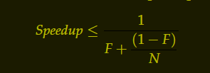

# Java Concurrency in Practice

### Resources
  - [Home](https://jcip.net/)
  - [Source Code](https://jcip.net/listings.html)
  - [Errata](https://jcip.net/errata.html)
  - [Chapter 12 Testing Concurrent Programs](README_TEST.md)

### Content

[CompletableFuture](README_CompletableFuture.md)

[Testing Concurrent Programs](README_TEST.md)

[Cancellation and Shutdown](README_Cancellation_and_Shutdown.md)

# Part I Fundamentals


## The Cheat Sheet of the Concurrency Fundamentals

1.  The less mutable state, the easier it is to ensure thread safety

2.  Make fields final unless they need to be mutable

3.  Immutable objects are automatically thread-safe
    - Immutable objects simplify concurrent programming tremendously
    - Immutable objects are simpler and safer, and can be shared freely
      without locking or defensive copying

4.  Encapsulation makes it practical to manage the complexity
    - Encapsulating data within objects makes it easier to preserve their
      invariants
    - Encapsulating synchronization within objects makes it easier to comply
      with their synchronization policy

5.  Guard each mutable variable with a lock

6.  Guard all variables in an invariant with the same lock

7.  Hold locks for the duration of compound actions

8.  A program that accesses a mutable variable from multiple threads without 
    synchronization is a broken program

9.  Don’t rely on clever reasoning about why you don’t need to synchronize

10. Include thread safety in the design process—or explicitly document that 
    your class is not thread-safe

11. Document your synchronization policy


## Safe Publication Idioms

1. To publish an object safely, both the reference to the object and the 
   object’s state must be made visible to other threads at the same time
   
   A properly constructed object can be safely published by:

    - Initializing an object reference from a static initializer
      - ``` public static Holder holder = new Holder(42); ```
    
    - Storing a reference to it into a volatile field or AtomicReference
      
    - Storing a reference to it into a final field of a properly constructed object
      
    - Storing a reference to it into a field that is properly guarded by a lock
        - the thread-safe library collections offer safe publication guarantees
        - Other handoff mechanisms in the class library (such as ``` Future ``` and 
          ``` Exchanger ```) also constitute safe publication


2. To share mutable objects safely, they must be safely published and be either 
   thread-safe or guarded by a lock 

   The publication requirements for an object depend on its mutability:
     - Immutable objects can be published through any mechanism
     - Effectively immutable objects must be safely published
     - Mutable objects must be safely published, and must be either threadsafe 
       or guarded by a lock


## Sharing Objects Safely

  - When you publish an object, you should document how the object can be 
    accessed, ask yourself:
      - What you are allowed to do with it 
      - Do you need to acquire a lock before using it
      - Are you allowed to modify its state, or only to read it


  - The most useful policies for using and sharing objects in a concurrent 
    program are:
    - __Thread-Confined__ : 
      A thread-confined object is owned exclusively by and confined to one 
      thread, and can be modified by its owning thread
    - __Shared Read-Only__ : 
      A shared read-only object can be accessed concurrently by multiple threads 
      without additional synchronization, but cannot be modified by any thread
      - Shared read-only objects include immutable and effectively immutable 
        objects
    - __Shared Thread-Safe__ : 
      A thread-safe object performs synchronization internally, so multiple 
      threads can freely access it through its public interface without further 
      synchronization
    - __Guarded__ A guarded object can be accessed only with a specific lock 
      held  
      - Guarded objects include those that are encapsulated within other 
        thread-safe objects and published objects that are known to be guarded 
        by a specific lock


## Invariant

> An invariant is any logical rule that must be obeyed throughout the execution 
> of your program that can be communicated to a human, but not to your compiler 
> INVARIANTS ARE BAD

This definition can be cleaved out conditions into two groups 
  - those the compiler can be trusted with enforcing
  - and those that must be documented, discussed, commented, or otherwise 
    communicated to contributors in order for them to interact with the codebase 
    without introducing bugs 


## Patterns for Structuring Thread-Safe Classes

### The Design of Thread-Safe Classes

1. The design process for a thread-safe class should include these three basic elements
   - Identify the variables that form the object’s state 
   - Identify the invariants that constrain the state variables 
   - Establish a policy for managing concurrent access to the object’s state 


2. Gathering synchronization requirements
   > You cannot ensure thread safety without understanding an object’s invariants 
   > and postconditions. Constraints on the valid values or state transitions for 
   > state variables can create atomicity and encapsulation requirements.


3. State-Dependent Operations

   - To create operations that wait for a precondition to become true before 
     proceeding, it is often easier to use existing library classes, such as 
     blocking queues or semaphores, to provide the desired state-dependent 
     behavior


4. State ownership

   - When defining which variables form an object’s state, we want to consider 
     only the data that object owns. Ownership is not embodied explicitly in 
     the language, but is instead an element of class design


### Instance Confinement

1. Encapsulating data within an object confines access to the data to the 
   object’s methods, making it easier to ensure that the data is always accessed 
   with the appropriate lock held
   - If an object is intended to be confined to a specific scope, then letting 
     it escape from that scope is a bug
   - Confined objects can also escape by publishing other objects such as 
     iterators or inner class instances that may indirectly publish the 
     confined objects


2. Confinement makes it easier to build thread-safe classes because a class that 
   confines its state can be analyzed for thread safety without having to 
   examine the whole program


#### The Java Monitor Pattern

  > An object following the Java monitor pattern encapsulates all its mutable 
  > state and guards it with the object’s own intrinsic lock


### Delegating thread safety

  > If a class is composed of multiple independent thread-safe state variables 
  > and has no operations that have any invalid state transitions, then it can 
  > delegate thread safety to the underlying state variables
 
  > If a state variable is 
  > thread-safe, 
  > does not participate in any invariants that constrain its value, 
  > and has no prohibited state transitions for any of its operations, 
  > then it can safely be published


### Adding Functionality to Existing Thread-Safe Classes


### Building Blocks

[CyclicBarrier vs CountDownLatch](https://www.baeldung.com/java-cyclicbarrier-countdownlatch)

# Part II Structuring Concurrent Applications


## Chapter 6 Task Execution


### 6.1 Executing Tasks in Threads

### 6.2 Separating the specification of Execution Policy from Task Submission

#### Execution Policy (What, Where, When, How)

- In what thread will tasks be executed?

- In what order should tasks be executed (FIFO, LIFO, priority order)?

- How many tasks may execute concurrently?

- How many tasks may be queued pending execution?

- If a task has to be rejected because the system is overloaded, which task 
  should be selected as the victim, and how should the application be notified?

- What actions should be taken before or after executing a task?


### 6.3 Finding Exploitable Parallelism

1. A further problem with dividing heterogeneous tasks among multiple workers 
   is that the tasks may have disparate sizes

2. If you divide tasks A and B between two workers but A takes ten times as 
   long as B, you’ve only speeded up the total process by 9%

3. Finally, dividing a task among multiple workers always involves some amount 
   of coordination overhead; for the division to be worthwhile, this overhead 
   must be more than compensated by productivity improvements due to parallelism


## Chapter 7 Cancellation and Shutdown

### Overview

#### This chapter addresses mechanisms for 
  - Cancellation
  - Interruption
  - How to code tasks and services to be responsive to cancellation requests


### 7.1 Task Cancellation


1.  What does _cancellable_ meat?

    - An activity is _cancellable_ if external code can move it to completion 
      before its normal completion

      - User-requested cancellation
      - Time-limited activities
      - Application events
      - Errors
      - Shutdown


2. The ___Cooperative Mechanisms___

    - There is no safe way to preemptively stop a thread in Java, and therefore 
      no safe way to preemptively stop a task
      
    - There are only ___cooperative mechanisms___, by which the task and the code 
      requesting cancellation follow an agreed-upon protocol

    - How it works?

      - One such ___cooperative mechanism___ is setting a 
        “cancellation requested” flag that the task checks periodically
        - If it finds the flag set, the task terminates early 


3.  The ___Cancellation Policy___
    - A task that wants to be cancellable must have a ___cancellation policy___ 
      that specifies the “how”, “when”, and “what” of ___cancellation___
      - ___How other code can request cancellation___
      - ___When the task checks whether cancellation has been requested___
      - ___What actions the task takes in response to a cancellation request___


4.  ___Interruption___ is usually the most sensible way to implement 
    ___cancellation___

    - There is nothing in the API or language specification that ties
      ___interruption___ to any specific cancellation semantics, but in practice, 
      using ___interruption___ for anything but ___cancellation___ is fragile and difficult 
      to sustain in larger applications
      
    - Calling interrupt does not necessarily stop the target thread from doing 
      what it is doing; it merely delivers the message that ___interruption___ has 
      been requested
      
    - Threads should also have an ___interruption policy___
      - An interruption policy determines how a thread interprets an
        ___interruption___ request
        - What it does (if anything) 
        - When one is detected, what units of work are considered atomic with 
          respect to ___interruption___, and 
        - How quickly it reacts to ___interruption___
      - The most sensible ___interruption policy___ is some form of thread-level 
        or servicelevel cancellation: 
        - Exit as quickly as practical 
        - Cleaning up if necessary, and 
        - Possibly notifying some owning entity that the thread is exiting
        
    - Distinguish between how tasks and threads should react to ___interruption___ 
      - Tasks do not execute in threads they own; they borrow threads owned by 
        a service such as a thread pool
      - Code that doesn’t own the thread (for a thread pool, any code outside 
        of the thread pool implementation) should be careful to preserve the 
        interrupted status so that the owning code can eventually act on it
      - A task needn’t necessarily drop everything when it detects an 
        interruption request 
        - It can choose to postpone it until a more opportune time by 
          remembering that it was interrupted, finishing the task it was 
          performing, and then throwing ``` InterruptedException ``` or 
          otherwise indicating interruption
          - This technique can protect data structures from corruption when an 
            activity is interrupted in the middle of an update
      - A task should not assume anything about the interruption policy of its 
        executing thread unless it is explicitly designed to run within a service 
        that has a specific interruption policy
      - Whether a task interprets interruption as cancellation or takes some 
        other action on interruption, it should take care to preserve the 
        executing thread’s interruption status
        - If it is not simply going to propagate ``` InterruptedException ``` 
          to its caller, it should restore the interruption status after 
          catching ``` InterruptedException ```
          - ``` Thread.currentThread().interrupt(); ```
      - A thread should be interrupted only by its owner 
        - The owner can encapsulate knowledge of the thread’s interruption 
          policy in an appropriate cancellation mechanism such as a shutdown 
          method
      - Because each thread has its own interruption policy, you should not 
        interrupt a thread unless you know what interruption means to that 
        thread

    - Responding to interruption
      - Two practical strategies for handling ``` InterruptedException ```
        - Propagate the exception (possibly after some task-specific cleanup), 
          making your method an interruptible blocking method, too;
        - Restore the interruption status so that code higher up on the call 
          stack can deal with it
      - Another way to preserve the interruption request when don’t want to or 
        cannot propagate ``` InterruptedException ```
        - Restore the interrupted status by calling interrupt again
          - ``` Thread.currentThread().interrupt(); ```
        - What should not do is swallow the InterruptedException by catching it 
          and doing nothing in the catch block
        - Only code that implements a thread’s interruption policy may swallow 
          an interruption request ]
          - General-purpose task and library code should never swallow 
            interruption requests
     - Activities that do not support cancellation but still call interruptible 
       blocking methods will have to call them in a loop, retrying when 
       interruption is detected 
       - Setting the interrupted status too early could result in an infinite 
         loop, because most interruptible blocking methods check the interrupted 
         status on entry and throw InterruptedException immediately if it is set
       - Interruptible methods usually poll for interruption before blocking or 
         doing any significant work, so as to be as responsive to interruption 
         as possible 


5.  Cancellation via ``` Future ```

    > The General Principle: It is better to use existing library classes than to roll your own

    - The ``` cancel ``` method of ``` Future ```
      - ``` boolean cancel(boolean mayInterruptIfRunning) ```
      - Attempts to cancel execution of this task
      - This attempt will fail if the task has already completed, has already 
        been cancelled, or could not be cancelled for some other reason
      - If successful, and this task has not started when cancel is called, this 
        task should never run
      - If the task has already started, then the mayInterruptIfRunning 
        parameter determines whether the thread executing this task should be 
        interrupted in an attempt to stop the task 
      - After this method returns 
        - Subsequent calls to ``` isDone() ``` will always return ``` true ```
        - Subsequent calls to ``` isCancelled() ``` will always return true 
          if this method returned true 
      - [Parameters] 
        - ``` mayInterruptIfRunning ``` - true if the thread executing this 
          task should be interrupted; otherwise, in-progress tasks are allowed 
          to complete
        - This only says whether it was able to deliver the interruption, not 
          whether the task detected and acted on it 
        - When ``` mayInterruptIfRunning ``` is true and the task is currently 
          running in some thread, then that thread is interrupted
        - Setting this argument to ``` false ``` means “don’t run this task if 
          it hasn’t started yet”, and should be used for tasks that are not 
          designed to handle interruption
      - [Returns] 
        - ``` false ``` if the task could not be cancelled, typically because 
          it has already completed normally; true otherwise

    - The task execution threads created by the standard Executor 
      implementations implement an interruption policy that lets tasks be 
      cancelled using interruption, so it is safe to set mayInterruptIfRunning 
      when cancelling tasks through their Futures when they are running in a 
      standard Executor
      - You Should Not Interrupt a pool ``` Thread ``` directly when attempting 
        to cancel a task, because you won’t know what task is running when the 
        interrupt request is delivered—do this only through the task’s ``` Future ```
      - This is yet another reason to code tasks to treat interruption as a 
        cancellation request: then they can be cancelled through their Futures

    > When ``` Future.get ``` throws ``` InterruptedException ``` or
    > ``` TimeoutException ``` and you know that the result is no longer needed
    > by the program, cancel the task with ``` Future.cancel ``` 


6.  Dealing with Non-Interruptible Blocking

    - Why non-interruptible threads are blocked

        - Synchronous socket I/O in ``` java.io ```
            - The common form of blocking I/O in server applications is reading 
              or writing to a socket
            - Unfortunately, the ``` read ``` and ``` write ``` methods in 
              ``` InputStream ``` and ``` OutputStream ``` are not responsive to 
              interruption
            - However, closing the underlying socket makes any threads blocked 
              in ``` read ``` or ``` write ``` throw a ``` SocketException ```
            - ``` Socket::close ```
              - Any thread currently blocked in an I/O operation upon this 
                socket will throw a SocketException 
              - Once a socket has been closed, it is not available for further 
                networking use (i.e. can't be reconnected or rebound); a new 
                socket needs to be created
              - Closing this socket will also close the socket's InputStream and 
                OutputStream
              - If this socket has an associated channel then the channel is 
                closed as well
        
        - Synchronous I/O in ``` java.nio ```
            - Interrupting a ``` thread ``` waiting on an InterruptibleChannel 
              causes it to throw ``` ClosedByInterruptException ``` and close 
              the channel 
                - And, also causes all other threads blocked on the channel to 
                  throw ``` ClosedByInterruptException ```) 
            - Closing an ``` InterruptibleChannel ``` causes threads blocked on 
              channel operations to throw ``` AsynchronousCloseException ```
            - Most standard Channels implement ``` InterruptibleChannel ``` like
              ```  FileChannel ```

        - Asynchronous I/O with Selector
            - If a thread is blocked in Selector.select (in 
              ``` java.nio.channels ```), calling ``` close ``` or ``` wakeup ``` 
              causes it to return prematurely

        - Lock acquisition
            - If a thread is blocked waiting for an intrinsic lock, there is 
              nothing you can do to stop it, ___short of___ ensuring that it 
              eventually acquires the lock and makes enough progress that you 
              can get its attention some other way
            - However, the explicit ``` Lock ``` classes offer the 
              lockInterruptibly method, which allows you to wait for a lock and 
              still be responsive to interrupts

> ___short of (doing) something___ - 
> without something; without doing something; unless something happens
> - Short of a miracle, we're certain to lose
> - Short of asking her to leave (= and we don't want to do that) there's not a 
>   lot we can do about the situation.

> ___Intrinsic Lock___ - 
> Every Java object can implicitly act as a lock for purposes of 
> synchronization; these built-in locks are called intrinsic locks 
> or monitor locks 
> The lock is automatically acquired by the executing thread before 
> entering a synchronized block and automatically released when 
> control exits the synchronized block, whether by the normal control 
> path or by throwing an exception out of the block  
> The only way to acquire an intrinsic lock is to enter a 
> synchronized block or method guarded by that lock 


7.  Encapsulating nonstandard cancellation with ``` ThreadPoolExecutor::newTaskFor ```

      - Create an interface which extends Callable
        ``` 
        public interface ICancellableTask<T> extends Callable<T> {
            void cancel();
            RunnableFuture<T> newTask();
        } 
        ```

      - Create a new class to inherits from ThreadPoolExecutor and override the 
        ``` newTaskFor ``` method
        ``` 
        public class CancellingExecutor extends ThreadPoolExecutor {
            // Overriden constructors 
            @Override
            protected <T> RunnableFuture<T> newTaskFor(Callable<T> callable) {
                if (callable instanceof ICancellableTask) {
                    return ((ICancellableTask<T>) callable).newTask();
                } else {
                    return super.newTaskFor(callable);
                }
            }
        }
        ```

      - Create a new task class which implements ICancellableTask
        ``` 
        @Slf4j
        public class CancellableSocketTask implements ICancellableTask<Void> {
        
            static final int BUFSZ = 512;
        
            @GuardedBy("this")
            private final Socket socket;
        
            private CancellableSocketTask(@NonNull Socket socket) {
                this.socket = socket;
            }
        
            public static CancellableSocketTask of(@NonNull Socket socket) {
                return new CancellableSocketTask(socket);
            }
        
            // From ICancellableTask and called by RunnableFuture::cancel
            @Override 
            public synchronized void cancel() {
                log.info(">>>>>>> Being asked for cancelling this task.");
                try {
                    if (socket != null) {
                        socket.close();
                    }
                } catch (IOException ioe) {
                    log.warn(">>>>>>> Caught {} when closing the Socket",
                            ioe.getClass().getSimpleName());
                }
            }
        
            // From ICancellableTask and called by ThreadPoolExecutor::newTaskFor 
            @Override 
            public RunnableFuture<Void> newTask() {
                log.info(">>>>>>> Creating a new FutureTask which contains this SocketTask");
                return new FutureTask<>(this) {
                    @Override
                    public boolean cancel(boolean mayInterruptIfRunning) {
                        try {
                            CancellableSocketTask.this.cancel();
                        } finally {
                            return super.cancel(mayInterruptIfRunning);
                        }
                    }
                };
            }

            @Override
            public Void call() throws Exception {
        
                try (InputStream in = this.socket.getInputStream()) {
                    byte[] buf = new byte[BUFSZ];
                    while (true) {
                        int count = in.read(buf);
                        if (count < 0) {
                            break;
                        } else if (count > 0) {
                            processBuffer(buf, count);
                        }
                    }
                } catch (IOException e) { /* Allow thread to exit */
                    // SocketException
                    log.error(">>>>>>> Caught {} when reading the Socket.",
                            e.getClass().getSimpleName());
                } finally {
                    log.info(">>>>>>> Stopped reading.");
                }
        
                return null;
            }
        
            private void processBuffer(byte[] buf, int count) {
                log.info(">>>>>>> Processing {} bytes buffer", count);
            }

        }///:~
        ```


### 7.2 Stopping a Thread-Based Service

> Sensible encapsulation practices dictate that you should not manipulate a 
> thread—interrupt it, modify its priority, etc.—unless you own it 


> But, the thread API has no formal concept of thread ownership: 
> a thread is represented with a ``` Thread ``` object that can be freely shared 
> like any other object


> However, it makes sense to think of a thread as having an owner, 
> and this is usually the class that created the thread


> So a thread pool owns its worker threads, and if those threads need to be 
> interrupted, the thread pool should take care of it 


> Thread ownership IS NOT Transitive: the application may own the service and 
> the service may own the worker threads, but the application doesn’t own the 
> worker threads and therefore should not attempt to stop them directly


> Instead, the service should provide lifecycle methods for shutting itself 
> down that also shut down the owned threads; then the application can shut down 
> the service, and the service can shut down the threads 


> Executor-Service provides the shutdown and shutdownNow methods; 
> other thread-owning services should provide a similar shutdown mechanism

> Provide lifecycle methods whenever a thread-owning service has a lifetime 
> longer than that of the method that created it 


#### Example: A Logging Service

> Cancelling a producerconsumer activity requires cancelling both the producers 
> and the consumers 


#### 7.2.3 Poison Pills

A ___Poison Pill___
  - A recognizable object placed on the queue that means “when you get this, 
    stop.”
  - With a FIFO queue, ___Poison Pills___ ensure that consumers finish the 
    work on their queue before shutting down
  - Any work submitted prior to submitting the ___Poison Pill___ will be 
    retrieved before the pill
  - Producers should not submit any work after putting a poison pill on the 
    queue
  - ___Poison Pills___ work only when the number of producers and consumers 
    is known
  - ___Poison Pills___ work reliably only with unbounded queues


#### 7.2.4 One-Shot Execution Service

- A method needs to process a batch of tasks and does not return until all the 
  tasks are finished
    - Using private ``` Executor ``` whose lifetime is bounded by that method to
      simplify service lifecycle management
    - The ``` invokeAll ``` and ``` invokeAny ``` methods can often be useful 
      in such situations


#### 7.2.5 How to Keep Track of Cancelled Tasks after ``` shutdownNow ```

##### The Requirement

- To know which tasks have not completed, you need to know not only which tasks 
  didn’t start, but also which tasks were in progress when the executor was 
  shut down

- However, there is no general way to find out which tasks started but did not 
  omplete
    - This means that there is no way of knowing the state of the tasks in 
      progress at shutdown time unless the tasks themselves perform some sort 
      of checkpointing


#### The Solution

- The technique for determining which tasks were in progress at shutdown time:
  - Encapsulating an ``` ExecutorService ```
  - Instrumenting ``` execute ``` (and similarly submit, not shown) to remember 
    which tasks were cancelled after shutdown
      - Identifying which tasks started but did not complete normally
  - In order for this technique to work, the tasks must preserve the thread’s 
    interrupted status when they return, which well behaved tasks will do anyway 
    
    ``` 
    Thread.currentThread().interrupt();
    ```

    ``` 
    @Override
    public void execute(final Runnable runnable) {
        this.executor.execute(() -> {
            try {
                runnable.run();
            } finally {
                if (isShutdown() && Thread.currentThread().isInterrupted()) {
                    this.tasksCancelledAtShutdown.add(runnable);
                }
            }
        });
    }
    ```


### 7.3 Handling Abnormal Thread Termination

#### 7.3.0 A proactive approach to the problem of unchecked exceptions

> Task-processing threads such as the worker threads in a thread pool should 
> call tasks within a try-catch block that catches unchecked exceptions, or 
> within a try-finally block to ensure that if the thread exits abnormally 
> the framework is informed of this and can take corrective action

> This is one of the few times when you might want to consider catching 
> RuntimeException—when you are calling unknown, untrusted code through an 
> abstraction such as Runnable 


``` 
public void run() {
    Throwable thrown = null;
    try {
        while (!isInterrupted()) {
            runTask(getTaskFromWorkQueue());
        }
    } catch (Throwable e) {
        thrown = e;
    } finally {
        threadExited(this, thrown);
    }
}
```


#### 7.3.1 Uncaught Exception Handlers

- The ``` Thread ``` API also provides the ``` UncaughtExceptionHandler ``` 
  facility, which lets you detect when a thread dies due to an uncaught exception 
    - When a thread exits due to an uncaught exception, the JVM reports this 
      event to an application-provided ``` UncaughtExceptionHandler ```
    - What the handler should do with an uncaught exception depends on your 
      quality-of-service requirements


- The most common response is to write an error message and stack trace to the 
  application log
  ``` 
    @Slf4j
    public class UncaughtExceptionLoggingHandler implements
    Thread.UncaughtExceptionHandler {
    
        @Override
        public void uncaughtException(Thread t, Throwable e) {
            log.error(">>>>>>> Thread {} terminated with exception: {}", 
                    t.getName(), e);
        }
    
    }
  ```


> In long-running applications, always use uncaught exception handlers for all 
> threads that at least log the exception 


- To set an ``` UncaughtExceptionHandler ``` for pool threads, provide a 
  ``` ThreadFactory ``` to the ``` ThreadPoolExecutor ``` constructor


- The standard thread pools allow an uncaught task exception to terminate the 
  pool thread, but use a try-finally block to be notified when this happens so 
  the thread can be replaced


- Without an uncaught exception handler or other failure notification mechanism, 
  tasks can appear to fail silently, which can be very confusing


- If you want to be notified when a task fails due to an exception so that you 
  can take some task-specific recovery action, either wrap the task with a 
  Runnable or Callable that catches the exception or override the ``` afterExecute ```
  hook in ``` ThreadPoolExecutor ```
    - ``` protected void afterExecute(Runnable r, Throwable t) ```


- Note: Somewhat confusingly, exceptions thrown from tasks make it to the 
  uncaught exception handler only for tasks submitted with execute
  

- For tasks submitted with submit, any thrown exception, checked or not, 
  is considered to be part of the task’s return status
    - If a task submitted with submit terminates with an exception, it is 
      rethrown by ``` Future.get ```, wrapped in an ``` ExecutionException ```


### 7.4 JVM Shutdown

#### Different Ways to Shutdown JVM

- The JVM can shut down in an orderly manner
    - An orderly shutdown is initiated when the last “normal” (nondaemon) thread 
      terminates, someone calls System.exit, 
    - By other platform-specific means  (such as sending a SIGINT or 
      hitting Ctrl-C)
        - While this is the standard and preferred way for the JVM to shut down

- The JVM can also shut down in abrupt manner
    - Calling Runtime.halt
    - Killing the JVM process through the operating system (such as sending a 
      SIGKILL)


#### 7.4.1 Shutdown Hooks

- In an orderly shutdown, the JVM first starts all registered shutdown hooks
    - Shutdown hooks are unstarted threads that are registered with 
      ``` Runtime.addShutdownHook ``` (no guarantees on the order)
    - If any application threads (daemon or nondaemon) are still running at 
      shutdown time, they continue to run concurrently with the shutdown process
    - When all shutdown hooks have completed, the JVM may choose to run 
      finalizers if ``` runFinalizersOnExit ``` is true, and then halts
    - The JVM makes no attempt to stop or interrupt any application threads 
      that are still running at shutdown time; they are abruptly terminated 
      when the JVM eventually halts
    - If the shutdown hooks or finalizers don’t complete, then the orderly 
      shutdown process “hangs” and the JVM must be shut down abruptly


- In an abrupt shutdown, the JVM is not required to do anything other than halt 
  the JVM; shutdown hooks will not run


- Shutdown hooks should be thread-safe
    - They must use synchronization when accessing shared data and should be 
      careful to avoid deadlock
    - They should not make assumptions about 
        - the state of the application
            - whether other services have shut down already
            - all normal threads have completed or not
        - why the JVM is shutting down
    - Must therefore be coded extremely defensively


- Shutdown hooks should exit as quickly as possible

- Because shutdown hooks all run concurrently, shutdown hooks should not rely 
  on services that can be shut down by the application or other shutdown hooks 
    - Use a single shutdown hook for all services, rather than one for each 
      service, and have it call a series of shutdown actions 
    - This ensures that shutdown actions execute sequentially in a single thread, 
      thus avoiding the possibility of race conditions or deadlock between 
      shutdown actions


> Using only one single shutdown hook for all services can be used whether or 
> not you use shutdown hooks 


> Executing shutdown actions sequentially rather than concurrently eliminates 
> many potential sources of failure 


> In applications that maintain explicit dependency information among services, 
> executing shutdown actions sequentially can also ensure that shutdown actions 
> are performed in the right order 


#### 7.4.2 Daemon threads

- The existence of daemon threads will not prevent the JVM from shutting down
  This is what daemon threads are for 


- Threads are divided into two types
    - Normal threads 
    - daemon threads


- When the JVM starts up, all the threads it creates, except the main thread, 
  are daemon threads, such as
    - Garbage collector 
    - Other housekeeping threads 


- Any threads created by the main thread are also normal threads
    - When a new thread is created, it inherits the daemon status of the thread 
      that created it


- When a thread exits, the JVM performs an inventory of running threads, and 
  if the only threads that are left are daemon threads, it initiates an orderly 
  shutdown; when the JVM halts, the JVM just exits
    - Any remaining daemon threads are abandoned 
    - All finally blocks are not executed, stacks are not unwound


- Daemon threads should not be used for any sort of I/O


- Daemon threads are best saved for “housekeeping” tasks, such as a background 
  thread that periodically removes expired entries from an in-memory cache 


> Daemon threads are not a good substitute for properly managing the lifecycle 
> of services within an application


## Chapter 8 Applying Thread Pools

### 8.1 Implicit Couplings between Tasks and Execution Policies

#### Overview
> Not all tasks are compatible with all Execution Policies

- Types of tasks that require specific execution policies include
    - Dependent Tasks
    - Tasks that exploit thread confinement
        - Single-threaded executors make stronger promises about concurrency 
          than do arbitrary thread pools. They guarantee that tasks are not 
          executed concurrently
    - Response-Time-Sensitive Tasks
    - Tasks that use ``` ThreadLocal ```
        - ``` ThreadLocal ``` makes sense to use in pool threads only if the 
          thread-local value has a lifetime that is bounded by that of a task
        - ``` ThreadLocal ``` should not be used in pool threads to communicate 
          values between tasks


> Thread pools work best when tasks are homogeneous and independent

> Mixing long-running and short-running tasks risks “clogging” the pool unless 
> it is very large

> Submitting tasks that depend on other tasks risks deadlock unless the pool is 
> unbounded and large enough that tasks are never queued or rejected

> Tasks that exploit thread confinement require sequential execution

> Document the requirements above so that future maintainers do not undermine 
> safety or liveness by substituting an incompatible execution policy


#### 8.1.1 Thread Starvation Deadlock

- What is ___thread starvation deadlock___
     - If tasks that depend on other tasks execute in a thread pool, they can 
       deadlock
     -  In a single-threaded executor, a task that submits another task to the 
        same  executor and waits for its result will ___always deadlock___
     - In larger thread pools, if all threads are executing tasks that are 
       blocked waiting for other tasks still on the work queue


> Whenever submitting to an Executor tasks that are not independent, be aware of 
> the possibility of thread starvation deadlock, and document any pool sizing or 
> configuration constraints in the code or configuration file where the Executor 
> is configured


#### 8.1.2 Long-running tasks

- Thread pools can have responsiveness problems if tasks can block for extended 
  periods of time, even if deadlock is not a possibility


### 8.2 Sizing thread pools


#### Overview

> The ideal size for a thread pool depends on the types of tasks that will be 
> submitted and the characteristics of the deployment system


> Thread pool sizes should be provided by a configuration mechanism or computed 
> dynamically by consulting ``` Runtime.availableProcessors ```

- To size a thread pool properly, need to understand 
    - the computing environment 
    - the resource budget 
    - the nature of the tasks


> If having different categories of tasks with very different behaviors, 
> consider using multiple thread pools so each can be tuned according to its 
> workload


- How many processors does the deployment system have?


- How much memory?


- Do tasks perform mostly computation, I/O, or some combination?


- Do they require a scarce resource, such as a JDBC connection?


#### Compute-Intensive Tasks

- An Ncpu-processor system usually achieves optimum utilization with a 
  thread pool of ___Ncpu + 1___ threads
    - Even Compute-Intensive Threads occasionally take a page fault or pause for 
      some other reason, so an “extra” runnable thread prevents CPU cycles from 
      going unused when this happens  


#### For Tasks that also include I/O or other Blocking Operations

- Needs a larger pool since not all of the threads will be schedulable at all 
  times


- In order to size the pool properly, you must estimate the ratio of waiting 
  time to compute time for your tasks 


- Alternatively, the size of the thread pool can be tuned by running the 
  application using several different pool sizes under a benchmark load and 
  observing the level of CPU utilization


- Other Resources that can contribute to sizing constraints
    - Memory 
    - File handles 
    - Socket handles 
    - Database Connections
    - Add up how much of that resource each task requires and divide that into 
      the total quantity available, the result will be an upper bound on the 
      pool size


> When tasks require a pooled resource such as database connections, 
> thread pool size and resource pool size affect each other

>If each task requires a connection, the effective size of the thread pool is 
> limited by the connection pool size

> When the only consumers of connections are pool tasks, the effective size of 
> the connection pool is limited by the thread pool size


### 8.3 Configuring ``` ThreadPoolExecutor ```

#### The most general constructor of ``` ThreadPoolExecutor ```

``` 
public ThreadPoolExecutor(
        int corePoolSize,
        int maximumPoolSize,
        long keepAliveTime,
        TimeUnit unit,
        BlockingQueue<Runnable> workQueue,
        ThreadFactory threadFactory,
        RejectedExecutionHandler handler) { ... }
```

#### 8.3.1 Thread creation and teardown

- The ___core pool size___, ___maximum pool size___, and ___keep-alive time___ 
  govern thread ___creation___ and ___teardown___


- ``` corePoolSize ```, the core size is the target size
    - The implementation attempts to maintain the pool at this size even when 
      there are no tasks to execute and will not create more threads than this 
      unless the work queue is full
    - When a ThreadPoolExecutor is initially created, the core threads are not 
      started immediately but instead as tasks are submitted, unless you call 
      ``` prestartAllCoreThreads ```


- ``` maximumPoolSize ```, the maximum pool size is the upper bound on how many 
  pool threads can be active at once 


- ``` keepAliveTime ```, a thread that has been idle for longer than the 
  ``` keepAliveTime ``` becomes a candidate for reaping and can be terminated 
  if the current pool size exceeds the core size


- ``` allowCoreThreadTimeOut ``` allows you to request that all pool threads be 
  able to time out; enable this feature with a core size of zero if you want a 
  bounded thread pool with a bounded work queue but still have all the threads 
  torn down when there is no work to do


#### 8.3.2 Managing Queued Tasks

- Bounded thread pools limit the number of tasks that can be executed concurrently


- With tasks that depend on other tasks, bounded thread pools or queues can 
  cause thread starvation deadlock; instead, use an unbounded pool configuration 
  like newCachedThreadPool


#### 8.3.3 Saturation Policies

> ``` AbortPolicy ```, ``` CallerRunsPolicy ```, ``` DiscardPolicy ```, and 
> ``` DiscardOldestPolicy ```

- The saturation policy for a ThreadPoolExecutor can be modified by calling
  ``` 
  // ThreadPoolExecutor::setRejectedExecutionHandler
  public void setRejectedExecutionHandler(RejectedExecutionHandler handler) 
  ```

- The saturation policy is also used when a task is submitted to an Executor 
  that has been shut down


- The default policy: ``` AbortPolicy ``` causes execute to throw the unchecked 
  ``` RejectedExecutionException ```


- The ``` DiscardPolicy ``` silently discards the newly submitted task if it 
  cannot be  queued for execution 


- the ``` DiscardOldestPolicy ``` discards the task that would otherwise be 
  executed next and tries to resubmit the new task


- The ``` CallerRunsPolicy ``` implements a form of throttling that neither 
  discards tasks nor throws an exception, but instead tries to slow down the 
  flow of new tasks by pushing some of the work back to the caller
  ``` 
  public static class ThreadPoolExecutor.CallerRunsPolicy extends Object 
        implements RejectedExecutionHandler
  ```

    - A handler for rejected tasks that runs the rejected task directly in the 
      calling thread of the execute method, unless the executor has been shut 
      down, in which case the task is discarded 
    - Since this would probably take some time, the main thread cannot submit 
      any more tasks for at least a little while and giving the worker threads 
      some time to catch up on the backlog 
    - Enabling more graceful degradation under load


- How to ___make ``` execute ``` block___ when the work queue is full
    - Using a ``` Semaphore ``` to bound the task injection rate as shown in 
      ``` BoundedExecutor ```
    - In such an approach, use an ___unbounded queue___ 
        - There’s no reason to bound both the queue size and the injection rate
    - Set the bound on the semaphore to be equal to the pool size plus the 
      number of queued tasks you want to allow
        - Since the semaphore is bounding the number of tasks both currently 
          executing and awaiting execution

    ``` 
    public class BoundedExecutor {
        private final ExecutorService executor;
        private final Semaphore semaphore;
        public void submitTask(final Runnable command) 
                throws InterruptedException {
            this.semaphore.acquire();
            try {
                this.executor.execute(() -> {
                    try {
                        command.run();
                    } finally {
                        semaphore.release();
                    }
                });
            } catch (RejectedExecutionException ree) {
                semaphore.release();
            }
        }
    }
    ```


#### 8.3.4 Thread Factories

- Specifying a thread factory allows to customize the configuration of pool threads


- ``` ThreadFactory ``` has a single method, ``` newThread ```, that is called 
  whenever a thread pool needs to create a new thread 


- Reasons to use a custom thread factory
    - To specify an ``` UncaughtExceptionHandler ``` for pool threads
    - To instantiate an instance of a custom ``` Thread ``` class, such as one 
      that performs debug logging
    - To modify the priority
    - To set the daemon status
    - To give pool threads more meaningful names to simplify interpreting thread 
      dumps and error logs
    - To take advantage of ___security policies___ to grant permissions to 
      particular codebases
        - To use the ``` privilegedThreadFactory ``` factory method in Executors 
          to construct your thread factory
        - It creates pool threads that have the same permissions, 
          ``` AccessControlContext ```, and ``` contextClassLoader ``` as
          the thread creating the ``` privilegedThreadFactory ```
        - Otherwise, threads created by the thread pool inherit permissions from 
          whatever client happens to be calling ``` execute ``` or ``` submit ``` 
          at the time a new thread is needed, which could cause confusing 
          security-related exceptions


#### 8.3.5 Customizing ThreadPoolExecutor after Construction

- The options passed to the ThreadPoolExecutor constructors can also be modified 
  after construction via setters
    - core thread pool size 
    - maximum thread pool size 
    - keep-alive time 
    - thread factory 
    - rejected execution handler

- If the Executor is created through one of the factory methods in ``` Executors ```
  (except ``` newSingleThreadExecutor ``` method), you can cast the result to 
  ``` ThreadPoolExecutor ``` to access the setters
  ``` 
    ExecutorService exec = Executors.newCachedThreadPool();
    if (exec instanceof ThreadPoolExecutor) {
        ((ThreadPoolExecutor) exec).setCorePoolSize(10);
    } else {
        throw new AssertionError("Oops, bad assumption");
    }
  ```


- ``` Executors::unconfigurableExecutorService ```,  a factory method, takes an 
  existing ``` ExecutorService ``` and wraps it with one exposing only the 
  methods of ``` ExecutorService ``` so it cannot be further configured
  

- ``` Executors::newSingleThreadExecutor ``` returns an ``` ExecutorService ``` wrapped 
  in ``` unconfigurableExecutorService ```, rather than a raw ThreadPoolExecutor
    - A single-threaded executor is actually implemented as a thread pool with 
      one thread, it also promises not to execute tasks concurrently


- To prevent the execution policy from being modified, wrap the 
  ``` ExecutorService ``` with an ``` unconfigurableExecutorService ``` 
  ``` 
  public static ExecutorService unconfigurableExecutorService(
          ExecutorService executor)
  ```


### 8.4 Extending ``` ThreadPoolExecutor ```

#### Overview

- ``` ThreadPoolExecutor ``` was designed for extension and providing several 
  “hooks” for subclasses to override to extend the behavior of 
  ``` ThreadPoolExecutor ``` : 
    - ``` beforeExecute ``` and ``` afterExecute ``` 
        - are called in the thread that executes the task
        - can be used for adding logging, timing, monitoring, or statistics 
          gathering
        - ``` afterExecute ``` is called whether the task completes by returning 
          normally from run or by throwing an Exception
        - If the task completes with an ``` Error ```, ``` afterExecute ``` is 
          not called
        - If beforeExecute throws a ``` RuntimeException ```, the task is not 
          executed and ``` afterExecute ``` is not called
    - ``` terminated ```  
        - The ``` terminated ``` hook is called when the thread pool completes 
          the shutdown process, after all tasks have finished and all worker 
          threads have shut down 
        - Used to release resources allocated by the ``` Executor ``` during its 
          lifecycle, perform notification or logging, or finalize statistics 
          gathering


``` 
protected void beforeExecute(Thread t, Runnable r)
```
- Parameters 
    - Thread t - the thread that will run task r
    - Runnable r - the task that will be executed
- Method invoked prior to executing the given Runnable in the given thread
- This method is invoked by thread t that will execute task r, and may be 
  used to re-initialize ThreadLocals, or to perform logging 
- This implementation does nothing, but may be customized in subclasses
- Note: To properly nest multiple overridings, subclasses should generally 
  invoke ``` super.beforeExecute ``` ___at the end___ of this method 


``` 
protected void afterExecute(Runnable r, Throwable t)
```
- Parameters:
    - Runnable r - the runnable that has completed
    - Throwable t - the exception that caused termination, or ``` null ``` if 
      execution completed normally
- Method invoked upon completion of execution of the given ``` Runnable ```
- This method is invoked by the thread that executed the task
- If non-null, the ``` Throwable ``` is the uncaught RuntimeException or 
  ``` Error ``` that caused execution to terminate abruptly
- This implementation does nothing, but may be customized in subclasses
    - Note: To properly nest multiple overridings, subclasses should generally 
      invoke ``` super.afterExecute ``` at the beginning of this method 
- Note: 
    - When actions are enclosed in tasks (such as ``` FutureTask ```) either 
      explicitly or via methods such as ``` submit ```, these task objects 
      catch and maintain computational exceptions, and so they do not cause 
      abrupt termination, and the internal exceptions are not passed to this 
      method
    - To trap both kinds of failures in this method
    ``` 
    protected void afterExecute(Runnable r, Throwable t) {
        super.afterExecute(r, t);
        if (t == null && r instanceof Future<?> && ((Future<?>)r).isDone()) {
            try {
                Object result = ((Future<?>) r).get();
            } catch (CancellationException ce) {
                t = ce;
            } catch (ExecutionException ee) {
                t = ee.getCause();
            } catch (InterruptedException ie) {
                // ignore/reset
                Thread.currentThread().interrupt();
            }
        }
        if (t != null)
            System.out.println(t);
        }
    }
    ```

``` 
protected void terminated()
```
- Method invoked when the ``` Executor ``` has terminated
- Default implementation does nothing
- Note: To properly nest multiple overridings, subclasses should generally 
  invoke ``` super.terminated ``` within this method 


#### 8.4.1 Example: adding statistics to a thread pool


### 8.5 Parallelizing Recursive Algorithms

#### Overview

> Sequential loop iterations are suitable for parallelization when each 
> iteration is independent of the others and the work done in each iteration of 
> the loop body is significant enough to offset the cost of managing a new task


- Loops, whose iterations are independent, being frequently good candidates for 
  parallelization if the loop body
  contain 
    - nontrivial computation 
    - perform potentially blocking I/O 


#### Loop Parallelization for Recursive Designs

- The easier case is when each iteration does not require the results of the 
  recursive iterations it invokes
    - the traversal is still sequential: only the calls to compute are executed 
      in parallel


#### 8.5.1 Example: A Puzzle Framework

- Result-Bearing Latch 
    - The requirement: 
        - In order to stop searching when we find a solution, we need a way to 
          determine whether any thread has found a solution yet
        - If we want to accept the first solution found, we also need to update the 
          solution only if no other task has already found one
    - It's often easier and less error-prone to use existing library classes 
      rather than low-level language mechanisms
    - ``` ValueLatch ``` below uses a ``` CountDownLatch ``` to provide the 
      needed latching behavior, and uses locking to ensure that the solution is 
      set only once

``` 
package com.yulikexuan.concurrency.threadpool.recursive;

import javax.annotation.concurrent.GuardedBy;
import java.util.concurrent.CountDownLatch;

public class ValueLatch<T> {

    @GuardedBy("this")
    private T value = null;

    private final CountDownLatch doneLatch = new CountDownLatch(1);

    public boolean isSet() {
        return (doneLatch.getCount() == 0);
    }

    public synchronized void setValue(T newValue) {
        if (!isSet()) {
            value = newValue;
            doneLatch.countDown();
        }
    }

    public T getValue() throws InterruptedException {
        doneLatch.await();
        synchronized (this) {
            return value;
        }
    }

}
```

# Part III Liveness, Performance, and Testing

## Chapter 10 Avoiding Liveness Hazards

### 10.1 Deadlock

#### Overview

- When a set of Java threads deadlock, that’s the end of the game 
    - those threads are permanently out of commission 


- Depending on what those threads do, the application may stall completely, 
  or a particular subsystem may stall, or performance may suffer


- The only way to restore the application to health is to abort and restart it
    - and hope the same thing doesn’t happen again 


- Deadlocks rarely manifest themselves immediately 
    - The fact that a class has a potential deadlock doesn’t mean that it ever 
      will deadlock, just that it can 
    - When deadlocks do manifest themselves, it is often at the worst possible 
      time—under heavy production load 


#### Lock-Ordering Deadlocks

> A program will be free of lock-ordering deadlocks if all threads acquire the 
> locks they need in a fixed global order 

- Verifying consistent lock ordering requires a global analysis of your 
  program’s locking behavior


#### 10.1.2 Dynamic lock Order Deadlocks

``` 
public static void transferMoney(
        Account fromAccount, Account toAccount, DollarAmount amount) {
        
    synchronized (fromAccount) {
        synchronized (toAccount) {
            // Operations
        }
    }
}
```

- Since the order of arguments is out of our control, to fix the problem we 
  must induce an ordering on the locks and acquire them according to the induced 
  ordering consistently throughout the application


- One way to induce an ordering on objects is to use ``` System.identityHashCode ```, 
  which returns the value that would be returned by ``` Object.hashCode ```

``` 
    private static final Object tieLock = new Object();
    
    public void transferMoney(
            final Account fromAcct,
            final Account toAcct,
            final DollarAmount amount) throws InsufficientFundsException {

        class Helper {
            public void transfer() throws InsufficientFundsException {
                if (fromAcct.getBalance().compareTo(amount) < 0) {
                    throw new InsufficientFundsException();
                } else {
                    fromAcct.debit(amount);
                    toAcct.credit(amount);
                }
            }
        }

        int fromHash = System.identityHashCode(fromAcct);
        int toHash = System.identityHashCode(toAcct);

        if (fromHash < toHash) {
            synchronized (fromAcct) {
                synchronized (toAcct) {
                    new Helper().transfer();
                }
            }
        } else if (fromHash > toHash) {
            synchronized (toAcct) {
                synchronized (fromAcct) {
                    new Helper().transfer();
                }
            }
        } else {
            synchronized (tieLock) {
                synchronized (fromAcct) {
                    synchronized (toAcct) {
                        new Helper().transfer();
                    }
                }
            }
        }
    }
```

``` 
public static int identityHashCode(Object x)
```
- Returns the same hash code for the given object as would be returned by the 
  default method hashCode(), whether or not the given object's class overrides 
  hashCode(). The hash code for the null reference is zero 


- If Account has a unique, immutable, comparable key such as an account number 
    - Order objects by their key, thus eliminating the need for the tie-breaking 
      lock


- A production application may perform billions of lock acquire-release cycles 
  per day
    - Only one of those needs to be timed just wrong to bring the application to 
      deadlock 
    - Even a thorough load-testing regimen may not disclose all latent deadlocks


#### 10.1.3 Deadlocks between Cooperating Objects (caused by Alien Methods)

- ___Alien Method___
> From the perspective of a class C, an alien method is one whose behavior is 
> not fully specified by C

- ___Alien Method___ includes 
    - Methods in other classes
    - Overrideable methods (neither private nor final) in C itself


> Invoking an alien method with a lock held is asking for liveness trouble 
> The alien method might acquire other locks (risking deadlock) or block for an 
> unexpectedly long time, stalling other threads that need the lock you hold


#### 10.1.4 Open Calls

> A method call is an abstraction barrier intended to shield you from the 
> details of what happens on the other side

> But because you don’t know what is happening on the other side of the call, 
> calling an alien method with a lock held is difficult to analyze and therefore 
> risky

> Calling a method with no locks held is called an ___Open Call___
>   - Using open calls to avoid deadlock is analogous to using encapsulation to 
>     provide thread safety

> Restricting yourself to open calls makes it far easier to identify the code 
> paths that acquire multiple locks and therefore to ensure that locks are 
> acquired in a consistent order

> __Strive to use open calls throughout your program__
>   - Programs that rely on open calls are far easier to analyze for 
>     deadlock-freedom than those that allow calls to alien methods with locks 
>     held


#### 10.1.5 Resource Deadlocks

> Tasks that wait for the results of other tasks are the primary source of 
> thread-starvation deadlock 


### 10.2 Avoiding and Diagnosing Deadlocks

#### Overview

> A program that never acquires more than one lock at a time cannot experience 
> lock-ordering deadlock

- If having to acquire multiple locks, __lock ordering__ must be a part of the 
  design
    - Try to minimize the number of potential locking interactions, 
    - Follow and document a lock-ordering protocol for locks that may be 
      acquired together


- In programs that use fine-grained locking, audit your code for deadlock 
  freedom using a two-part strategy
    1. Identify where multiple locks could be acquired (try to make this a small 
       set) 
    2. Perform a global analysis of all such instances to ensure that lock 
       ordering is consistent across your entire program


- Using open calls wherever possible simplifies this analysis substantially


#### 10.2.1 Timed Lock Attempts

- The timed tryLock feature of ``` Lock ```
``` 
boolean tryLock(long time, TimeUnit unit) throws InterruptedException
```

- Using timed lock acquisition to acquire multiple locks can be effective 
  against deadlock even when timed locking is not used consistently throughout 
  the program 


- If a lock acquisition times out, you can release the locks, back off and wait 
  for a while, and try again, possibly clearing the deadlock condition and 
  allowing the program to recover 


- This technique works only when the two locks are acquired together; 
   - If multiple locks are acquired due to the nesting of method calls, you 
     cannot just release the outer lock, even if you know you hold it 


#### 10.2.2 Deadlock Analysis with Thread Dumps

- The JVM can help identify deadlocks when they do happen using ___Thread Dumps___


- A thread dump includes a stack trace for each running thread, similar to the 
  stack trace that accompanies an exception 


- Thread dumps also include locking information, such as which locks are held 
  by each thread, in which stack frame they were acquired, and which lock a 
  blocked thread is waiting to acquire 


- Before generating a thread dump, the JVM searches the is-waiting-for graph for 
  cycles to find deadlocks
    - If it finds one, it includes deadlock information identifying which locks 
      and threads are involved, and where in the program the offending lock 
      acquisitions are 


- To trigger a thread dump, you can send the JVM process a SIGQUIT signal 
  (kill -3) on Unix platforms, or press the Ctrl-\ key on Unix 
    - Or Ctrl-Break on Windows platforms


- Many IDEs can request a thread dump as well 


### 10.3 Other Liveness Hazards

#### 10.3.1 Starvation

> It is generally wise to resist the temptation to tweak thread priorities

> As soon as you start modifying priorities, the behavior of your application 
> becomes platform-specific and you introduce the risk of starvation 

> Avoid the temptation to use thread priorities, since they increase platform 
> dependence and can cause liveness problems

> Most concurrent applications can use the default priority for all threads

#### 10.3.2 Poor Responsiveness

#### 10.3.3 Livelock


## Chapter 11 Performance and Scalability

### Overview

> Many of the techniques for improving performance also increase complexity, 
> thus increasing the likelihood of safety and liveness failures

- Worse, some techniques intended to improve performance are actually 
  counterproductive or trade one sort of performance problem for another 


### 11.1 Thinking about Performance

#### Overview

> When the performance of an activity is limited by availability of a particular 
> resource, we say it is bound by that resource: CPU-bound, database-bound, etc.


#### 11.1.1 Performance versus Scalability

> Scalability describes the ability to improve throughput or capacity when 
> additional computing resources (such as additional CPUs, memory, storage, or 
> I/O bandwidth) are added

> Of the various aspects of performance, the “how much” aspects—scalability, 
> throughput, and capacity—are usually of greater concern for server 
> applications than the “how fast” aspects 


#### 11.1.2 Evaluating Performance Tradeoffs

> Avoid premature optimization. First make it right, then make it fast—if it is 
> not already fast enough

- Before deciding that one approach is “faster” than another, ask yourself some 
  questions:
    - What do you mean by “faster”?
    - Under what conditions will this approach actually be faster? 
        - Under light or heavy load? 
        - With large or small data sets? 
        - Can you support your answer with measurements?
    - How often are these conditions likely to arise in your situation? 
        - Can you support your answer with measurements?
    - Is this code likely to be used in other situations where the conditions 
      may be different?
    - What hidden costs, such as increased development or maintenance risk, are 
      you trading for this improved performance? 
        - Is this a good tradeoff?


- It is therefore imperative that any performance tuning exercise be accompanied 
  by concrete performance requirements (so you know both of when to tune and 
  when to stop tuning) and with a measurement program in place using a realistic 
  configuration and load profile 
    - Measure again after tuning to verify that you’ve achieved the desired 
      improvements

> Measure, DO NOT GUESS

### 11.2 Amdahl’s Law

#### Overview

- Amdahl’s law describes how much a program can theoretically be sped up by 
  additional computing resources, based on the proportion of parallelizable and 
  serial components

> If F is the fraction of the calculation that must be executed serially, then 
> Amdahl’s law says that on a machine with N processors, we can achieve a 
> speedup of at most:  



> All concurrent applications have some sources of serialization; if you think 
> yours does not, look again.


#### 11.2.1 Example: Serialization Hidden in Frameworks


#### 11.2.2 Applying Amdahl’s Law Qualitatively


### 11.3 Costs Introduced by Threads

#### Overview

> For threads to offer a performance improvement, the performance benefits of 
> parallelization must outweigh the costs introduced by concurrency


#### 11.3.1 Context Switching

- If there are more runnable threads than CPUs, eventually the OS will preempt 
  one thread so that another can use the CPU
    - This causes a context switch, which requires saving the execution context 
      of the currently running thread and restoring the execution context of the 
      newly scheduled thread
    - Context switches are not free; thread scheduling requires manipulating 
      shared data structures in the OS and JVM
    - A context switch causes a flurry of cache misses, and thus threads run a 
      little more slowly when they are first scheduled

> A context switch costs the equivalent of 5,000 to 10,000 clock cycles, or 
> several microseconds on most current processors


#### 11.3.2 Memory Synchronization

> Stack-Confined variables (local variables) are automatically Thread-Local

#### 11.3.3 Blocking


### 11.4 Reducing Lock Contention

#### Overview

> Serialization hurts scalability and that context switches hurt performance

> Contended locking causes both, so reducing lock contention can improve both 
> performance and scalability


> Access to resources guarded by an exclusive lock is serialized — only one 
> thread at a time may access it

> Safety comes at a price. Persistent contention for a lock limits scalability

> The principal threat to scalability in concurrent applications is the 
> exclusive resource lock

- Two factors influence the likelihood of contention for a lock 
    - How often that lock is requested 
    - How long it is held once acquired


- There are three ways to reduce lock contention:
    - Reduce the duration for which locks are held;
    - Reduce the frequency with which locks are requested 
    - Replace exclusive locks with coordination mechanisms that permit greater 
      concurrency 


#### 11.4.1 Narrowing Lock Scope (“Get In, Get Out”)

> An effective way to reduce the likelihood of contention is to hold locks 
> as briefly as possible

> Moving code that doesn’t require the lock out of synchronized blocks, 
> especially for expensive operations and potentially blocking operations such 
> as I/O


#### 11.4.2 Reducing Lock Granularity

> Having threads ask for the lock less often can be accomplished by lock 
> splitting and lock striping, which involve using separate locks to guard 
> multiple independent state variables previously guarded by a single lock


#### 11.4.3 Lock Striping


#### 11.4.4 Avoiding hot fields


#### 11.4.5 Alternatives to Exclusive Locks

> If your class has a small number of hot fields that do not participate in 
> invariants with other variables, replacing them with atomic variables may 
> improve scalability


#### 11.4.6 Monitoring CPU utilization

> When testing for scalability, the goal is usually to keep the processors 
> fully utilized

- If the CPUs are asymmetrically utilized (some CPUs are running hot but others 
  are not) your first goal should be to find increased parallelism in your 
  program


- There are several likely causes why the CPUs are not fully utilized
    - Insufficent Load
    - I/O-Bound
    - Externally Bound
    - Lock Contention
        - Locks that are mostly uncontended rarely show up in a thread dump
        - A a heavily contended lock will almost always have at least one thread 
          waiting to acquire it and so will frequently appear in thread dumps


#### 11.4.7 Just Say NO to Object Pooling

- In modern JVM versions, object allocation and garbage collection have improved 
  substantially


- To work around “slow” object lifecycles, many developers turned to object 
  pooling, where objects are recycled instead of being garbage collected and 
  allocated anew when needed 


- In concurrent applications, object pooling fares even worse 


- When threads allocate new objects, very little inter-thread coordination is 
  required, as allocators typically use thread-local allocation blocks to 
  eliminate most synchronization on heap data structures 


- If threads request an object from a pool, some synchronization is necessary 
  to coordinate access to the pool data structure, creating the possibility that 
  a thread will block
    - Because blocking a thread due to lock contention is hundreds of times more 
      expensive than an allocation
    - Even a small amount of pool-induced contention would be a scalability 
      bottleneck 
    - Even an uncontended synchronization is usually more expensive than 
      allocating an object


[When to use Object Pooling in Java](https://www.ard.ninja/blog/when-to-use-object-pooling-in-java/)


### 11.5 Example: Comparing Map Performance


### 11.6 Reducing Context Switch Overhead

> Many tasks involve operations that may block; transitioning between the 
> running and blocked states entails a context switch

> Inline logging involves I/O and locking, which can lead to increased context 
> switching and therefore increased service times

> Longer service time mean more lock contention

> Contended lock acquisition means more context switches

> A coding style that encourages more context switches thus yields lower overall 
> throughput


[Chapter 12 Testing Concurrent Programs](README_TEST.md)


## Chapter 12 Testing Concurrent Programs

### Overview

> The major challenge in constructing tests for concurrent programs is that 
> potential failures may be rare probabalistic occurrences rather than 
> deterministic ones; tests that disclose such failures must be more extensive 
> and run for longer than typical sequential tests 

- Most tests of concurrent classes fall into one or both of the classic
  categories of safety and liveness

> Safety: Nothing bad ever happens
> Liveness: Something good eventually happens


### 12.1 Testing for Correctness

#### 12.1.1 Basic Unit Tests

> Including a set of sequential tests in current correctness test also to 
> disclose when a problem is not related to concurrency issues before starting 
> looking for data races

#### 12.1.2 Testing blocking operations

- Tests of essential concurrency properties require introducing more than one
  thread 
- Relay success or failure information back to the main test runner thread so 
  it can be reported
- Every test must wait until all the threads it created terminate
- Make sure whether the tests passed and that failure information is
  reported somewhere for use in diagnosing the problem 

- If a method is supposed to block under certain conditions, then a test for 
  that behavior should succeed only if the thread does not proceed
    - If the method returns normally, the test should be failed
    - Once the method successfully blocks, there must be a way to unblock it
        - Wait until the thread blocks 
        - Interrupt it 
        - Assert that the blocking operation completed

  ``` 
    class CorrectnessTest {
    
        private static ThreadLocalRandom random;
    
        private static final int MIN_CAPACITY = 1_000;
        private static final int MAX_DATA_CAPACITY = 100_000;
        private static final long LOCKUP_DETECT_TIMEOUT = 1000L;
        private static final long BLOCKING_TIMEOUT = 1100L;
    
        private SemaphoreBoundedBuffer<Integer> boundedBuffer;
    
        @BeforeAll
        static void beforeAll() {
            random = ThreadLocalRandom.current();
        }
    
        static boolean isThreadAlive(@NonNull Thread thread) {
            try {
                Thread.sleep(LOCKUP_DETECT_TIMEOUT);
                thread.interrupt();
                thread.join(LOCKUP_DETECT_TIMEOUT);
                return thread.isAlive();
            } catch (Exception unexpected) {
                fail();
                throw new IllegalStateException();
            }
        }
    
        @BeforeEach
        void setUp() {
            this.boundedBuffer = SemaphoreBoundedBuffer.of(MIN_CAPACITY);
        }
    
        private void fullBuffer() throws InterruptedException {
            IntStream.generate(random::nextInt).limit(MIN_CAPACITY)
                    .forEach(i -> {
                        try {
                            boundedBuffer.put(i);
                        } catch (InterruptedException e) {
                            throw new RuntimeException(e);
                        }
                    });
        }
    
        /*
         * Including a set of sequential tests in the test suite is often helpful,
         * since they can disclose when a problem is not related to concurrency
         * issues before the start looking for data races
         */
        @Nested
        @DisplayName("Sequentially Test the Correctness of BoundedBufferCt - ")
        class SequentialCorrectnessTest {
    
            @Test
            void test_The_Buffer_Should_Be_Empty_When_Constructed() {
    
                // Then
                assertThat(boundedBuffer.isEmpty()).isTrue();
                assertThat(boundedBuffer.isFull()).isFalse();
            }
    
            @Test
            void test_Being_Full_After_Put_All() throws InterruptedException {
    
                // Given
                fullBuffer();
    
                // When & Then
                assertThat(boundedBuffer.isFull()).isTrue();
                assertThat(boundedBuffer.isEmpty()).isFalse();
            }
    
        }//: End of SequentialCorrectnessTest
    
        @Nested
        @DisplayName("")
        class BlockingCorrectnessTest {
    
            private static final String TAKER_THREAD_NAME = "TAKER-THREAD";
            private static final String FULLING_THREAD_NAME = "FULLING-THREAD";
    
            @Test
            void test_Take_Method_Blocks_When_Empty() {
    
                // Given
                final Thread taker = new Thread(() -> {
                    try {
                        int unused = boundedBuffer.take();
                        fail(); // if we get here, it's an error
                    } catch (InterruptedException success) {
                        Thread.currentThread().interrupt();
                    }
                });
    
                // When
                taker.start();
    
                // Then
                await().until(() -> !isThreadAlive(taker));
                assertThat(taker.isInterrupted()).isTrue();
            }
    
            @Test
            void test_Put_Method_Blocks_When_Full() throws InterruptedException {
    
                // Given
                fullBuffer();
    
                final Thread taker = new Thread(() -> {
                    try {
                        boundedBuffer.put(1);
                        fail(); // if we get here, it's an error
                    } catch (InterruptedException success) {
                        Thread.currentThread().interrupt();
                    }
                });
    
                // When
                taker.start();
    
                // Then
                await().until(() -> !isThreadAlive(taker));
                assertThat(taker.isInterrupted()).isTrue();
            }
    
            @Test
            void given_Empty_Buffer_When_Take_Then_Blocking_With_Thread_Pool() throws Exception {
    
                // Given
                ThreadFactory tf = runnable -> new Thread(runnable, TAKER_THREAD_NAME);
                ExecutorService es = ExecutorServiceFactory.createSingleThreadExecutor(tf);
    
                Supplier<Integer> supplier = () -> {
    
                    Integer number = null;
    
                    String currentThreadName = Thread.currentThread().getName();
    
                    try {
                        Integer unused = boundedBuffer.take();
                        // if we get here, it’s an error
                        Fail.fail(">>>>>>> The %s was not blocked.",
                                currentThreadName);
                    } catch (InterruptedException success) {
                        log.info(">>>>>>> {} was interrupted.", currentThreadName);
                        Thread.currentThread().interrupt();
                    }
    
                    return number;
                };
    
                try {
                    CompletableFuture.supplyAsync(supplier, es)
                            .get(BLOCKING_TIMEOUT, TimeUnit.MILLISECONDS);
                } catch (Exception e) {
                    log.info(">>>>>>> TIMEOUT");
                    assertThat(e).isExactlyInstanceOf(TimeoutException.class);
                }
    
            }
    
            @Test
            void given_Full_Buffer_When_Put_Then_Blocking_With_Thread_Pool() throws Exception {
    
                // Given
                fullBuffer();
    
                ThreadFactory tf = runnable -> new Thread(runnable, FULLING_THREAD_NAME);
                ExecutorService es = ExecutorServiceFactory.createSingleThreadExecutor(tf);
    
                Runnable runnable = () -> {
                    try {
                        boundedBuffer.put(random.nextInt());
                        // if we get here, it’s an error
                        Fail.fail(">>>>>>> The %s was not blocked.",
                                Thread.currentThread().getName());
                    } catch (InterruptedException success) {
                        log.info(">>>>>>> {} was interrupted.",
                                Thread.currentThread().getName());
                        Thread.currentThread().interrupt();
                    }
                };
    
                try {
                    CompletableFuture.runAsync(runnable, es)
                            .get(BLOCKING_TIMEOUT, TimeUnit.MILLISECONDS);
                } catch (Exception e) {
                    log.info(">>>>>>> FULLING TIMEOUT");
                    assertThat(e).isExactlyInstanceOf(TimeoutException.class);
                }
    
            }
    
        }//: End of Class BlockingCorrectnessTest
    
    }///:~
  ```

> The result of Thread.getState should not be used for concurrency control, 
> and is of limited usefulness for testing—its primary utility is as a source 
> of debugging information 


#### 12.1.3 Testing Safety Strategy

- Set up multiple threads performing different operations over some amount of time
    - put and take, for example

- Checking the test property should not require any synchronization

- Compute checksums of the elements that are enqueued and dequeued using an 
  order-sensitive checksum function, and compare them, if they match, the test passes
    - Extending this approach to a multiple-producer, multiple-consumer situation
      requires using a checksum function that is insensitive to the order in 
      which the elements are combined, so that multiple checksums can be combined 
      after the test
    - Otherwise, synchronizing access to a shared checksum field could become
      a concurrency bottleneck or distort the timing of the test
    - Make the checksums themselves not be guessable by the compiler

``` 
final class SeedFactory {

    private SeedFactory() {}

    static SeedFactory newSeedFactory() {
        return new SeedFactory();
    }

    int initSeed(@NonNull final Object targetObj) {
        return (targetObj.hashCode() ^ (int) System.nanoTime());
    }

    int nextSeed(int seed) {
        return xorShift(seed);
    }

    private int xorShift(int y) {

        y ^= (y << 6);
        y ^= (y >>> 21);
        y ^= (y << 7);

        return y;
    }

}///:~
```

- Use a CyclicBarrier, initialized with the number of worker threads plus one
    - and have the worker threads and the test driver wait at the barrier at the 
      beginning and end of their run
    - This ensures that all threads are up and running before any start working 

- In order to make the scheduler won’t run each thread to completion sequentially, 
  make the runs long enough reduces the extent to which scheduling distorts our 
  the results

- To maximize the chance of detecting timing-sensitive data races, there should 
  be more active threads than CPUs, so that at any given time some threads are 
  running and some are switched out, thus reducing the predicatability of 
  interactions between threads

``` 
@ThreadSafe
public class SemaphoreBoundedBuffer<E> {

    @GuardedBy("this")
    private final E[] items;

    @GuardedBy("this")
    private int putPosition = 0;

    @GuardedBy("this")
    private int takePosition = 0;

    /*
     * The availableItems semaphore represents the number of elements that can
     * be removed from the buffer, and is initially zero (since the buffer is
     * initially empty)
     */
    private final Semaphore availableItems;

    /*
     * The availableSpaces represents how many items can be inserted into the
     * buffer, and is initialized to the size of the buffer
     */
    private final Semaphore availableSpaces;

    private SemaphoreBoundedBuffer(@NonNull E[] items,
                                   @NonNull Semaphore availableItems,
                                   @NonNull Semaphore availableSpaces) {
        this.items = items;
        this.availableItems = availableItems;
        this.availableSpaces = availableSpaces;
    }

    public static <E> SemaphoreBoundedBuffer of(int capacity) {

        if (capacity <= 0) {
            throw new IllegalArgumentException();
        }

        E[] items = (E[]) new Object[capacity];
        Semaphore availableItems = new Semaphore(0);
        Semaphore availableSpaces = new Semaphore(capacity);

        return new SemaphoreBoundedBuffer(items, availableItems, availableSpaces);
    }

    public boolean isEmpty() {
        return this.availableItems.availablePermits() == 0;
    }

    public boolean isFull() {
        return this.availableSpaces.availablePermits() == 0;
    }

    public void put(E x) throws InterruptedException {
        this.availableSpaces.acquire();
        this.doInsert(x);
        this.availableItems.release();
    }

    public E take() throws InterruptedException {
        this.availableItems.acquire();
        E item = this.doExtract();
        this.availableSpaces.release();
        return item;
    }

    private synchronized void doInsert(E x) {
        int i = putPosition;
        this.items[i] = x;
        this.putPosition = (++i == items.length) ? 0 : i;
    }

    private synchronized E doExtract() {
        int i = takePosition;
        E x = items[i];
        items[i] = null;
        takePosition = (++i == items.length) ? 0 : i;
        return x;
    }

}///:~

final class BufferProducer implements Runnable {

    private final SeedFactory seedFactory = SeedFactory.newSeedFactory();

    private final int nTrials;
    private final CyclicBarrier barrier;
    private final SemaphoreBoundedBuffer<Integer> boundedBuffer;
    private final AtomicInteger putSum;

    private BufferProducer(
            SemaphoreBoundedBuffer<Integer> boundedBuffer,
            CyclicBarrier barrier,
            int nTrials,
            AtomicInteger putSum) {

        this.boundedBuffer = boundedBuffer;
        this.barrier = barrier;
        this.nTrials = nTrials;
        this.putSum = putSum;
    }

    static BufferProducer of(
            @NonNull SemaphoreBoundedBuffer<Integer> boundedBuffer,
            @NonNull CyclicBarrier barrier,
            int nTrials,
            @NonNull AtomicInteger putSum) {

        if (nTrials < 1) {
            throw new IllegalArgumentException();
        }

        return new BufferProducer(boundedBuffer, barrier, nTrials, putSum);
    }

    @Override
    public void run() {
        try {
            int sum = 0;
            this.barrier.await();
            int seed = this.seedFactory.initSeed(this);
            for (int i = nTrials; i > 0; --i) {
                this.boundedBuffer.put(seed);
                sum += seed;
                seed = this.seedFactory.nextSeed(seed);
            }
            this.putSum.getAndAdd(sum);
            this.barrier.await();
        } catch (Exception e) {
            throw new RuntimeException(e);
        }
    }

}///:~

final class BufferConsumer implements Runnable {

    private final int nTrials;
    private final CyclicBarrier barrier;
    private final SemaphoreBoundedBuffer<Integer> boundedBuffer;
    private final AtomicInteger takeSum;

    private BufferConsumer(
            SemaphoreBoundedBuffer<Integer> boundedBuffer,
            CyclicBarrier barrier,
            int nTrials,
            AtomicInteger takeSum) {

        this.boundedBuffer = boundedBuffer;
        this.barrier = barrier;
        this.nTrials = nTrials;
        this.takeSum = takeSum;
    }

    static BufferConsumer of(
            @NonNull SemaphoreBoundedBuffer<Integer> boundedBuffer,
            @NonNull CyclicBarrier barrier,
            int nTrials,
            @NonNull AtomicInteger takeSum) {

        if (nTrials < 1) {
            throw new IllegalArgumentException();
        }

        return new BufferConsumer(boundedBuffer, barrier, nTrials, takeSum);
    }

    @Override
    public void run() {
        try {
            this.barrier.await();
            int sum = 0;
            for (int i = this.nTrials; i > 0; --i) {
                sum += this.boundedBuffer.take();
            }
            this.takeSum.getAndAdd(sum);
            this.barrier.await();
        } catch (Exception e) {
            throw new RuntimeException(e);
        }
    }

}///:~

public class SafetyTest {

    private static final int DEFAULT_CAPACITY = 1000;

    // How many pairs of producer and consumer
    private static final int N_PAIRS = 10;

    private static final int N_TRIALS = 100_000;

    private static ExecutorService executor;

    private CyclicBarrier barrier;
    private SemaphoreBoundedBuffer<Integer> bb;

    private AtomicInteger putSum;
    private AtomicInteger takeSum;

    private BarrierTimer barrierTimer;


    @BeforeAll
    static void beforeAll() {
        ThreadPoolExecutor threadPoolExecutor =
                (ThreadPoolExecutor) Executors.newCachedThreadPool();
        executor = MoreExecutors.getExitingExecutorService(threadPoolExecutor);
    }

    @AfterAll
    static void afterAll() {
        executor.shutdown();
    }

    @BeforeEach
    void setUp() {
        this.bb = SemaphoreBoundedBuffer.of(DEFAULT_CAPACITY);
        this.barrierTimer = new BarrierTimer();
        this.barrier = new CyclicBarrier(N_PAIRS * 2 + 1, barrierTimer);
        this.putSum = new AtomicInteger(0);
        this.takeSum = new AtomicInteger(0);
    }

    @Test
    void test_Bounded_Buffer_Safety() throws Exception {

        for (int i = 0; i < N_PAIRS; i++) {
            this.executor.execute(BufferProducer.of(
                    this.bb, this.barrier, N_TRIALS, this.putSum));
            this.executor.execute(BufferConsumer.of(
                    this.bb, this.barrier, N_TRIALS, this.takeSum));
        }

        /*
         * the arrival index of the current thread, where index
         * getParties() - 1 indicates the first to arrive and zero
         * indicates the last to arrive
         */
        barrier.await(); // waiting for all threads to be ready

        barrier.await(); // waiting for all threads to be finished

        long throughput = this.barrierTimer.getThroughput(
                N_PAIRS * (long) N_TRIALS);

        log.info(">>>>>> Throughput is : {} ns/item", throughput);

        assertThat(putSum.get()).isEqualTo(takeSum.get());
    }
    
}
```

> Tests should be run on multiprocessor systems to increase the diversity of 
> potential interleavings

> To maximize the chance of detecting timing-sensitive data races, there should 
> be more active threads than CPUs, so that at any given time some threads are 
> running and some are switched out, thus reducing the predicatability of 
> interactions between threads


#### 12.1.4 Testing resource management

> The Strategy: Forces a garbage collection and then records information about 
> the heap size and memory usage

- [Verbose Garbage Collection in Java](https://www.baeldung.com/java-verbose-gc)
- [GCeasy](https://gceasy.io/gc-index.jsp#features)

> The second aspect to test is that the thread does not do things it is not 
> supposed to do, such as leak resources. Any object that holds or manages other 
> objects should not continue to maintain references to those objects longer 
> than necessary. Such storage leaks prevent garbage collectors from reclaiming 
> memory (or threads, file handles, sockets, database connections, or other 
> limited resources) and can lead to resource exhaustion and application failure


#### 12.1.5 Using Callbacks

- To count how many thread created in a thread pool
``` 
public class TestingThreadFactory implements ThreadFactory {

    private final LongAdder numCreated = new LongAdder();
    private final ThreadFactory factory;

    private TestingThreadFactory(ThreadFactory factory) {
        this.factory = factory;
    }

    public static TestingThreadFactory of(@NonNull ThreadFactory factory) {
        return new TestingThreadFactory(factory);
    }

    @Override
    public Thread newThread(Runnable r) {
        this.numCreated.increment();
        return this.factory.newThread(r);
    }

    public long getThreadNumberOfCreated() {
        return this.numCreated.longValue();
    }

}///:~ 
```

- Validating the FixedThreadPool
``` 
public class ThreadPoolTest {

    private static final int MAX_SIZE = 10;
    private static final long MAX_TASK_NUMBER = MAX_SIZE * 10;

    private ExecutorService executor;
    private TestingThreadFactory threadFactory;

    @BeforeEach
    void setUp() {
        this.threadFactory = TestingThreadFactory.of(
                Executors.defaultThreadFactory());
        this.executor = Executors.newFixedThreadPool(MAX_SIZE, this.threadFactory);
    }

    @AfterEach
    void tearDown() throws Exception {
        this.executor.shutdown();
        this.executor.awaitTermination(300, TimeUnit.MILLISECONDS);
        if (!this.executor.isTerminated()) {
            List<Runnable> notRun = this.executor.shutdownNow();
            log.warn(">>>>>>> {} threads are never run.", notRun.size());
        }
    }

    @Test
    void test_Pool_Expansion() throws Exception {

        // Given
        for (int i = 0; i < MAX_TASK_NUMBER; i++) {
            this.executor.execute(() -> {
                try {
                    TimeUnit.MILLISECONDS.sleep(Long.MAX_VALUE);
                } catch (InterruptedException e) {
                    Thread.currentThread().interrupt();
                }
            });
        }

        // When
        for (int i = 0; i < 20 && this.threadFactory
                .getThreadNumberOfCreated() < MAX_SIZE; i++) {

            TimeUnit.MILLISECONDS.sleep(100L);
        }

        // Then
        assertThat(this.threadFactory.getThreadNumberOfCreated())
                .isEqualTo(MAX_SIZE);
    }

}///:~
```

> Callbacks to client-provided code can be helpful in constructing test cases; 
> callbacks are often made at known points in an object’s lifecycle that are 
> good opportunities to assert invariants


#### 12.1.6 Generating More Interleavings

> Using ``` Thread.yield ``` more to encourage more context switches during 
> operations that access shared state, however, 
> using a short but nonzero sleep would be slower but more reliable 

``` 
public synchronized void transferCredits(Account from, Account to, int amount) {
    from.setBalance(from.getBalance() - amount);
    if (random.nextInt(1000) > THRESHOLD) {
        Thread.yield(); // TimeUnit.MILLISECONDS.sleep(7);
    }
    to.setBalance(to.getBalance() + amount);
}
```

- By sometimes yielding in the middle of an operation, may activate timing-sensitive 
  bugs in code that does not use adequate synchronization to access state
    - The inconvenience of adding these calls for testing and removing them for 
      production can be reduced by adding them using aspect-oriented programming 
      (AOP) tools


### 12.2 Testing for Performance

#### Overview & Goals

- Performance can be measured in a number of ways
    - Throughput: the rate at which a set of concurrent tasks is completed
    - Responsiveness: the delay between a request for and completion of some
      action (also called latency)
    - Scalability: the improvement in throughput (or lack thereof) as more
      resources usually CPUs) are made available

- Find a typical usage scenario
- Write a program that executes that scenario many times, and time it
- Watch out for a number of coding pitfalls that prevent performance tests from 
  yielding meaningful results

> Always include some basic functionality testing within performance tests to 
> ensure not testing the performance of broken code

- The first goal
> Performance tests seek to measure end-to-end performance metrics for 
> representative use cases

- The second goal
> A common secondary goal of performance testing is to select sizings 
> empirically for various bounds, numbers of threads, buffer capacities, and so 
> on


#### 12.2.1 Measure the Time Taken for a Run - Extending PutTakeTest to Add Timing

- Get a more accurate measure by timing the entire run and dividing by the 
  number of operations to get a per-operation time
    - We are already using a CyclicBarrier to start and stop the worker threads, 
      so we can extend this by using a barrier action that measures the start 
      and end time


- Learn several things from permormance tests
    - The throughput of the producer-consumer handoff operation for various 
      combinations of parameters 
    - How the bounded buffer scales with different numbers of threads (pairs)
    - How we might select the bound size (capacities)


- Answering those questions above requires running the test for various 
  combinations of parameters


#### 12.2.2 Comparing Multiple Algorithms
- ``` LinkedBlockingQueue ``` scales better than ``` ArrayBlockingQueue ```
- A linked queue must allocate a link node object for each insertion, and hence 
  seems to be doing more work than the array-based queue
    - However, even though it has more allocation and GC overhead
        - A linked queue allows more concurrent access by puts and takes than 
          an array-based queue because the best linked queue algorithms allow 
          the head and tail to be updated independently
    - Because allocation is usually thread-local, algorithms that can reduce 
      contention by doing more allocation usually scale better


#### 12.2.3 Measuring Responsiveness

- Sometimes it is more important to know how long an individual action might 
  take to complete, and in this case we want to measure the variance of service 
  time 
    - Measuring variance allows us to estimate the answers to quality-of-service 
      questions like “What percentage of operations will succeed in under 100 
      milliseconds?”

- Histograms of task completion times are normally the best way to visualize 
  variance in service time

- Unless threads are continually blocking anyway because of tight synchronization 
  requirements
    - Unfair semaphores provide much better throughput 
    - Fair semaphores provide lower variance 

- Because the results are so dramatically different, Semaphore forces its 
  clients to decide which of the two factors to optimize for 


### 12.3 Avoiding Performance Testing Pitfalls

#### Overview

- In practice, developers have to watch out for a number of coding pitfalls that 
  prevent performance tests from yielding meaningful results


#### 12.3.1 Garbage Collection

> The timing of garbage collection is unpredictable, so there is always the 
> possibility that the garbage collector will run during a measured test run

> If a test program performs N iterations and triggers no garbage collection 
> but iteration N + 1 would trigger a garbage collection, a small variation in 
> the size of the run could have a big (but spurious) effect on the measured 
> time per iteration


- Two Strategies for preventing garbage collection from biasing the test results
    - Ensure that the GC does not run at all during the test 
        - Invoke the JVM with ``` -verbose:gc ``` to find out
    - Make sure that the GC runs a number of times during the run so that the 
      test program adequately reflects the cost of ongoing allocation and 
      garbage collection 
        - This strategy is often better - it requires a longer test and is more 
          likely to reflect real-world performance 


- Most producer-consumer applications involve a fair amount of allocation and 
  garbage collection, producers allocate new objects that are used and discarded 
  by consumers 
    - Running the bounded buffer test for long enough to incur multiple garbage 
      collections yields more accurate results


#### 12.3.2 Dynamic Compilation

- Dynamically compiled languages like Java uses a combination of bytecode 
  interpretation and dynamic compilation
    - When a class is first loaded, the JVM executes it by interpreting the 
      bytecode 
    - At some point, if a method is run often enough, the dynamic compiler 
      kicks in and converts it to machine code; 
        - When compilation completes, it switches from interpretation to direct 
          execution


> The timing of compilation is unpredictable; So, the timing tests should run 
> only after all code has been compiled


- There is no value in measuring the speed of the interpreted code since most 
  programs run long enough that all frequently executed code paths are compiled 

- Allowing the compiler to run during a measured test run can bias test results 
  in two ways: 
    - Compilation consumes CPU resources, and measuring the run time of a 
      combination of interpreted 
    - Compiled code is not a meaningful performance metric 


- Code may also be decompiled (reverting to interpreted execution) and 
  recompiled for various reasons
    - Loading a class that invalidates assumptions made by prior compilations 
    - Gathering sufficient profiling data to decide that a code path should be 
      recompiled with different optimizations

> bias something: to have an effect on the results of research or an experiment 
> so that they do not show the real situation


- One way to to prevent compilation from biasing your results is to run your 
  program for a long time (at least several minutes) so that compilation and 
  interpreted execution represent a small fraction of the total run time

- Another approach is to use an unmeasured “warm-up” run, in which your code is 
  executed enough to be fully compiled when you actually start timing


> On HotSpot, running your program with ``` -XX:+PrintCompilation ``` prints 
> out a message when dynamic compilation runs, so you can verify that this is 
> prior to, rather than during, measured test runs

- Running the same test several times in the same JVM instance can be used to 
  validate the testing methodology 
    - The first group of results should be discarded as warm-up; seeing 
      inconsistent results in the remaining groups suggests that the test should 
      be examined further to determine why the timing results are not repeatable

> On HotSpot, running the program with ``` -XX:+PrintCompilation ``` prints out 
> a message when dynamic compilation runs, so you can verify that this is prior 
> to, rather than during, measured test runs

> The JVM uses various background threads for housekeeping tasks

- Running the same test several times in the same JVM instance can be used to
  validate the testing methodology
    - The first group of results should be discarded as warm-up 
    - seeing inconsistent results in the remaining groups suggests that the test 
      should be examined further to determine why the timing results are not 
      repeatable

> The JVM uses various background threads for housekeeping tasks

- When measuring multiple unrelated computationally intensive activities in a 
  single run, place explicit pauses between the measured trials to give the JVM 
  a chance to catch up with background tasks with minimal interference from 
  measured tasks


#### 12.3.3 Unrealistic Sampling of Code Paths

> Runtime compilers use profiling information to help optimize the code being 
> compiled

- The JVM is permitted to use information specific to the execution in order to 
  produce better code, which means that compiling method M in one program may 
  generate different code than compiling M in another 


- In some cases, the JVM may make optimizations based on assumptions that may 
  only be true temporarily, and later back them out by invalidating the compiled 
  code if they become untrue


- It's important that your test programs not only adequately approximate the 
  usage patterns of a typical application, but also approximate 
  ___the set of code paths___ used by such an application 
    - Otherwise, a dynamic compiler could make special optimizations to a purely 
      single-threaded test program that could not be applied in real applications 
      containing at least occasional parallelism


> Mixed Tests of Multithreaded Performance with Tests of Single Threaded 
> Performance, even if only Single threaded Performance Tests are required


#### 12.3.4 Unrealistic Degrees of Contention

> Concurrent applications tend to interleave two very different sorts of work: 
> accessing shared data, such as fetching the next task from a shared work 
> queue, and thread-local computation (executing the task, assuming the task 
> itself does not access shared data)


Depending on the relative proportions of the two types of work, the application 
will experience different levels of contention and exhibit different performance 
and scaling behaviors 

If N threads are fetching tasks from a shared work queue and executing them,
and the tasks are compute-intensive and long-running (and do not access shared
data very much), there will be almost no contention; throughput is dominated
by the availability of CPU resources.

On the other hand, if the tasks are very short-lived, there will be a lot of 
contention for the work queue and throughput is dominated by the cost of 
synchronization.

if an application did a significant amount of thread-local computation for each 
time it accesses the shared data structure, the contention level might be low 
enough to offer good performance

#### 12.3.5 Dead Code Elimination

- One of the challenges of writing good benchmarks (in any language) is that 
  optimizing compilers are adept at spotting and eliminating dead code: code 
  that has no effect on the outcome
    - For a benchmark this is a big problem because then you are measuring less 
      execution than you think

> Many microbenchmarks perform much “better” when run with HotSpot’s -server 
> compiler than with -client, not just because the server compiler can produce 
> more efficient code, but also because it is more adept at optimizing dead code

> Prefer -server to -client for both production and testing on multiprocessor 
> systems

> Writing effective performance tests requires tricking the optimizer into not 
> optimizing away your benchmark as dead code

- A cheap trick for preventing a calculation from being optimized away without 
  introducing too much overhead is to compute the hashCode of the field of some 
  derived object, compare it to an arbitrary value such as the current value of 
  ``` System.nanoTime ```, and print a useless and ignorable message if they 
  happen to match
    - The comparison will rarely succeed, and if it does, its only effect will 
      be to insert a harmless space character into the output
    - The ``` System.out.print ``` method buffers output until 
      ``` System.out.println ``` is called, so in the rare case that ``` hashCode ```
      and ``` System.nanoTime ``` are equal, no I/O is actually performed

  ``` 
  if (foo.x.hashCode() == System.nanoTime()) {
      System.out.print(" ");
  }
  ```

> Not only should every computed result be used, but results should also be 
> unguessable; otherwise, a smart dynamic optimizing compiler is allowed to 
> replace actions with precomputed results

> Any test program whose input is static data is vulnerable to the optimization


### 12.4 Complementary Testing Aproaches

#### Overview

> We’d like to believe that an effective testing program should “find all the 
> bugs”, this is an unrealistic goal

- NASA devotes more of its engineering resources to testing (it is estimated 
  they employ 20 testers for each developer) than any commercial entity could 
  afford to—and the code produced is still not free of defects

> In complex programs, no amount of testing can find all coding errors 

> The goal of testing is not so much to find errors as it is to increase 
> confidence that the code works as expected

> Since it is unrealistic to assume you can find all the bugs, the goal of a 
> quality assurance (QA) plan should be to achieve the greatest possible 
> confidence given the testing resources available

> By employing complementary testing methodologies such as code review and 
> static analysis, you can achieve greater confidence than you could with any 
> single approach


#### 12.4.1 Code Review

> Even concurrency experts make mistakes; taking the time to have someone else 
> review the code is almost always worthwhile

> Expert concurrent programmers are better at finding subtle races than are 
> most test programs


#### 12.4.2 Static Analysis Tools

- FindBugs includes detectors for the following concurrencyrelated bug patterns, 
  and more are being added all the time:
    - Inconsistent synchronization
        - Analysis tools must guess at the synchronization policy because Java 
          classes do not have formal concurrency specifications
        - In the future, if annotations such as ``` @GuardedBy ``` are standardized, 
          auditing tools could interpret annotations rather than having to 
          guess at the relationship between variables and locks, thus improving 
          the quality of analysis
    - Invoking Thread.run
    - Unreleased lock
        - Unlike intrinsic locks, explicit locks (see Chapter 13) are not 
          automatically released when control exits the scope in which they were 
          acquired 
            - The standard idiom is to release the lock from a finally block; 
              otherwise the lock can remain unreleased in the event of an 
              ``` Exception ```
    - Empty synchronized block
    - Double-checked locking
        - Double-checked locking is a broken idiom for reducing synchronization 
          overhead in lazy initialization (see Section 16.2.4) that involves 
          reading a shared mutable field without appropriate synchronization
    - Starting a thread from a constructor
        - Starting a thread from a constructor introduces the risk of 
          subclassing problems, and can allow the ``` this ``` reference to 
          escape the constructor
    - Notification errors
        - The ``` notify ``` and ``` notifyAll ``` methods indicate that an 
          object’s state may have changed in a way that would unblock threads 
          that are waiting on the associated condition queue
        - These methods should be called only when the state associated with the 
          condition queue has changed
        - A synchronized block that calls ``` notify ``` or ``` notifyAll ``` 
          but does not modify any state is likely to be an error. (See Chapter 14.)
    - Condition wait errors
        - When waiting on a condition queue, ``` Object.wait ``` or 
          ``` Condition.await ``` should be called in a loop, with the 
          appropriate lock held, after testing some state predicate (see Chapter 14). 
            - Calling ``` Object.wait ``` or ``` Condition.await ``` without the 
              lock held, not in a loop, or without testing some state predicate 
              is almost certainly an error
    - Misuse of Lock and Condition
        - Using a Lock as the lock argument for a synchronized block is likely 
          to be a typo, as is calling Condition.wait instead of await (though 
          the latter would likely be caught in testing, since it would throw an 
          ``` IllegalMonitorStateException ``` the first time it was called) 
    - Sleeping or waiting while holding a lock
        - Calling ``` Thread.sleep ``` with a lock held can prevent other 
          threads from making progress for a long time and is therefore a 
          potentially serious  liveness hazard
        - Calling Object.wait or Condition.await with two locks held poses a 
          similar hazard
    - Spin loops
        - Code that does nothing but spin (busy wait) checking a field for an 
          expected value can waste CPU time and, if the field is not volatile, 
          is not guaranteed to terminate. Latches or condition waits are often a 
          better technique when waiting for a state transition to occur


#### 12.4.3 Aspect-Oriented Testing Techniques


#### 12.4.4 Profilers and Monitoring Tools


# Part IV Advanced Topics


## Chapter 13 Explicit Locks


### Overview

> Before Java 5.0, the only mechanisms for coordinating access to shared data 
> were synchronized and volatile 

> Java 5.0 adds another option: ``` ReentrantLock ```

- ``` ReentrantLock ``` is not a replacement for intrinsic locking, but rather 
  an alternative with advanced features for when intrinsic locking proves too 
  limited


### 13.1 ``` Lock ``` and ``` ReentrantLock ```

#### Overview 

``` 
public interface Lock {
    void lock();
    void lockInterruptibly() throws InterruptedException;
    boolean tryLock();
    boolean tryLock(long timeout, TimeUnit unit)
    throws InterruptedException;
    void unlock();
    Condition newCondition();
}
```

- ``` Lock ``` offers a choice of unconditional, polled, timed, and 
  interruptible lock acquisition, and all lock and unlock operations are 
  explicit


- ``` ReentrantLock ``` implements Lock, providing the same mutual exclusion 
  and memory-visibility guarantees as synchronized 
    - Acquiring a ``` ReentrantLock ``` has the same memory semantics as 
      ___entering___ a synchronized block 
    - Releasing a ``` ReentrantLock ``` has the same memory semantics as
      ___exiting___ a synchronized block


> ``` ReentrantLock ``` : When a thread requests a lock that is already held by 
> another thread, the requesting thread blocks 

> But because intrinsic locks are reentrant, if a thread tries to acquire a lock 
> that it already holds, the request succeeds. Reentrancy means that locks are 
> acquired on a per-thread rather than per-invocation basis 

- ``` ReentrantLock ``` supports all of the lock-acquisition modes defined by 
  Lock, providing more flexibility for dealing with lock unavailability than 
  does synchronized


- Why create a new locking mechanism that is so similar to intrinsic locking?
    - It's not possible to interrupt a thread waiting to acquire a lock
    - It's not possible to attempt to acquire a lock without being willing to 
      wait for it forever
    - Intrinsic locks also must be released in the same block of code in which 
      they are acquired


- The idiom: the lock must be released in a finally block 
    - Otherwise, the lock would never be released if the guarded code were to 
      throw an exception


- When using locking, you must also consider what happens if an exception is 
  thrown out of the try block; if it is possible for the object to be left in 
  an inconsistent state, additional try-catch or try-finally blocks may be 
  needed 

``` 
    Lock lock = new ReentrantLock();
    ...
    lock.lock();
    try {
        // update object state
        // catch exceptions and restore invariants if necessary
    } finally {
        lock.unlock();
    }
```

> Should always consider the effect of exceptions when using any form of 
> locking, including intrinsic locking

> Failing to use finally to release a Lock is a ticking time bomb


- Failing to use finally to release a Lock make you have a hard time tracking 
  down its origin as there will be no record of where or when the Lock should 
  have been released
    - This is one reason not to use ``` ReentrantLock ``` as a blanket 
      substitute for synchronized

- It is more “dangerous” because it doesn’t automatically clean up the lock 
  when control leaves the guarded block


#### 13.1.1 Polled and Timed Lock Acquisition

> With intrinsic locks, there is no way to cancel a lock acquisition once it is 
> started, so intrinsic locks put the ability to implement time-budgeted 
> activities at risk 

> The timed tryLock is also responsive to interruption and so can be used when
> you need both timed and interruptible lock acquisition

``` 
boolean tryLock()
```

- Returns: true if the lock was acquired and false otherwise


#### 13.1.2 Interruptible Lock Acquisition

> Interruptible lock acquisition allows locking to be used within cancellable 
> activities

> Acquiring an intrinsic lock, that are not responsive to interruption
> These non-interruptible blocking mechanisms complicate the implementation of 
> cancellable tasks

> The ``` lockInterruptibly ``` method allows you to try to acquire a lock while 
> remaining responsive to interruption, and its inclusion in Lock avoids 
> creating another category of non-interruptible blocking mechanisms

> The timed tryLock is also responsive to interruption and so can be used when 
> you need both timed and interruptible lock acquisition


``` 
void lockInterruptibly() throws InterruptedException
```

  - Acquires the lock unless the current thread is interrupted 
      - Acquires the lock if it is available and returns immediately 
      - If the lock is not available then the current thread becomes disabled 
        for thread scheduling purposes and lies dormant (處於休眠狀態) until one 
        of two things happens 
          - The lock is acquired by the current thread
          - Some other thread interrupts the current thread, and interruption of 
            lock acquisition is supported 
      - If the current thread 
          - has its interrupted status set on entry to this method
          - is interrupted while acquiring the lock, and interruption of lock 
            acquisition is supported,
          - then ``` InterruptedException ``` is thrown and the current thread's 
            interrupted status is cleared 


#### 13.1.3 Non-Block-Structured Locking

> With intrinsic locks, acquire-release pairs are block-structured—a lock is 
> always released in the same basic block in which it was acquired, regardless 
> of how control exits the block 


### 13.2 Performance Considerations


### 13.3 Fairness

``` 
public ReentrantLock(boolean fair)
```

- Threads acquire a fair lock in the order in which they requested it, whereas 
  a nonfair lock permits barging: threads requesting a lock can jump ahead of 
  the queue of waiting threads if the lock happens to be available when it is 
  requested 

> Programs using fair locks accessed by many threads may display lower overall 
> throughput (i.e., are slower; often much slower) than those using the default 
> setting, but have smaller variances in times to obtain locks and guarantee 
> lack of starvation 

> Don’t pay for fairness if you don’t need it


### 13.4 Choosing between ``` synchronized ``` and ``` ReentrantLock ```

- Intrinsic locks still have significant advantages over explicit locks
    - The notation is familiar and compact, and many existing programs already 
      use intrinsic locking—and mixing the two could be confusing and error-prone
    - Reentrant-Lock is definitely a more dangerous tool than synchronization; 
      if you forget to wrap the unlock call in a finally block, your code will 
      probably appear to run properly, but you’ve created a time bomb that may 
      well hurt innocent bystanders


> Save ``` ReentrantLock ``` for situations in which you need something 
> ReentrantLock provides that intrinsic locking doesn’t

> ReentrantLock is an advanced tool for situations where intrinsic locking is 
> not practical. Use it if you need its advanced features: timed, polled, or 
> interruptible lock acquisition, fair queueing, or non-block-structured locking
> Otherwise, ___Prefer Synchronized___


### 13.5 Read-Write Locks

> read-write locks allow: a resource can be accessed by multiple readers or a 
> single writer at a time, but not both

``` 
public interface ReadWriteLock {
    Lock readLock();
    Lock writeLock();
}
```

> To read data guarded by a ``` ReadWriteLock ``` you must first acquire the 
> read lock, and to modify data guarded by a ``` ReadWriteLock ``` you must 
> first acquire the write lock

> The locking strategy implemented by read-write locks allows multiple 
> simultaneous readers but only a single writer

- Read-write locks are a performance optimization designed to allow greater 
  concurrency in certain situations
    - In practice, read-write locks can improve performance for frequently 
      accessed read-mostly data structures on multiprocessor systems 
    - under other conditions they perform slightly worse than exclusive locks 
      due to their greater complexity
    - Whether they are an improvement in any given situation is best determined 
      via profiling


## Chapter 14 Building Custom Synchronizers

### Overview 

- The class libraries include a number of state-dependent classes-those having 
  operations with state-based preconditions
    - FutureTask
    - Semaphore
    - BlockingQueue
    - etc.


> The easiest way to construct a state-dependent class is usually to build on 
> top of an existing state-dependent library class


### 14.1 Managing State Dependence

#### Overview

- How state dependence might be (painfully) tackled using polling and sleeping
    - The form of blocking state-dependent action
      ``` 
        acquire lock on object state
        while (precondition does not hold) {
            release lock
            wait until precondition might hold
            optionally fail if interrupted or timeout expires
            reacquire lock
        }
        perform action
        release lock
      ```
    - State dependent operations can deal with precondition failure by 
        - throwing an exception 
        - returning an error status (making it the caller’s problem) 
        - by blocking until the object transitions to the right state


#### 14.1.1 Example: Propagating Precondition Failure to Callers

- The fundamental problem: that callers must deal with precondition failures 
  themselves


- Pushing the state dependence back to the caller also makes it nearly 
  impossible to do things like preserve FIFO ordering 
    - By forcing the caller to retry, you lose the information of who arrived 
      first


#### 14.1.2 Example: crude blocking by polling and sleeping

- In order to spare callers the inconvenience of implementing the retry logic 
  on each call by encapsulating the same crude "poll and sleep" retry mechanism 
  within the put and take operations
    - This approach encapsulates precondition management and simplifies using 
      the buffer—definitely a step in the right direction


> It is usually a bad idea for a thread to go to sleep or otherwise block with 
> a lock held, but in this case is even worse because the desired condition 
> (buffer is full/empty) can never become true if the lock is not released!


#### 14.1.3 Condition Queues to the Rescue

- A ___condition queue___ gets its name because it gives a group of 
  threads—called the wait set—a way to wait for a specific condition to become 
  true 
    - Unlike typical queues in which the elements are data items, the elements 
      of a ___condition queue___ are the threads waiting for the condition 


- Just as each Java object can act as a lock, each object can also act as a 
  condition queue, and the ``` wait ```, ``` notify ```, and ``` notifyAll ``` 
  methods in Object constitute the API for intrinsic condition queues


- An object’s intrinsic lock and its intrinsic ___condition queue___ are related: 
    - in order to call any of the condition queue methods on object X, you must 
      hold the lock on X 
        - This is because the mechanism for waiting for state-based conditions 
          is necessarily tightly bound to the mechanism for preserving state 
          consistency: 
            - you cannot wait for a condition unless you can examine the state
            - and you cannot release another thread from a condition wait unless 
              you can modify the state 


- ``` Object.wait ``` atomically releases the lock and asks the OS to suspend 
  the current thread, allowing other threads to acquire the lock and therefore 
  modify the object state
    - Upon waking, it reacquires the lock before returning
        - Intuitively, calling wait means “I want to go to sleep, but wake me 
          when something interesting happens”, 
        - and calling the notification methods means "something interesting 
          happened" 


### 14.2 Using Condition Queues

#### Overview

- ___Condition queues___ make it easier to build efficient and responsive 
  state-dependent classes, but they are still easy to use incorrectly
  

- There are a lot of rules regarding their proper use that are not enforced by 
  the compiler or platform


- This is one of the reasons to build on top of classes like 
    - ``` LinkedBlockingQueue ``` 
    - ``` CountDownLatch ``` 
    - ``` Semaphore ``` 
    - ``` FutureTask ``` 


- If you can, get away with ___Condition Queues___ and use JDK predefined 
  synchronizers


#### 14.2.1 The Condition Predicate

> The key to using condition queues correctly is identifying the ___condition 
> predicates___ that the object may wait for

> The ___condition predicate___ is the precondition that makes an operation 
> state-dependent in the first place

- In a bounded buffer, 
    - ``` take ``` can proceed only if the buffer is not empty; otherwise it 
      must wait 
        - For ``` take ```, the ___condition predicate___ is “the buffer is not 
          empty”, which  ``` take ``` must test for before proceeding 
    - Similarly, the ___condition predicate___ for ``` put ``` is “the buffer 
      is not full”


> ___Condition predicates___ are expressions constructed from the state 
> variables of  the class 

> Document the ___condition predicate(s)___ associated with a condition queue 
> and the operations that wait on them

- There is an important ___three-way relationship___ in a condition wait 
  involving 
    - Locking 
    - The wait method 
    - A condition predicate


- The ___condition predicate___ involves ___state variables___, and the 
  ___state variables___ are guarded by a lock
    - so before testing the ___condition predicate___, we must hold that lock 
    - the lock object and the condition queue object (the object on which wait 
      and notify are invoked) __must also be the same object__


- In ``` BoundedBuffer ```, the buffer state is guarded by the buffer lock and 
  the buffer object is used as the condition queue
    - The ``` take ``` method acquires the buffer lock and then tests the 
      condition predicate
        - If the buffer is indeed nonempty, it removes the first element, which 
          it can do because it still holds the lock guarding the buffer state
        - If the ___condition predicate___ is not true, ``` take ``` must wait 
          until another thread puts an object in the buffer
            - It does this by calling wait on the buffer’s intrinsic condition 
              queue, which requires holding the lock on the condition queue 
              object
                - ``` take ``` already holds that lock, which it needed to test 
                  the condition predicate
        - The ``` wait ``` method releases the lock, blocks the current thread, 
          and waits until: 
            - the specified timeout expires, 
            - the thread is interrupted 
            - or the thread is awakened by a notification 
        - After the thread wakes up, ``` wait ``` reacquires the lock before 
          returning
        - A thread waking up from wait gets no special priority in reacquiring 
          the lock; it contends for the lock just like any other thread 
          attempting to enter a synchronized block


> Every call to ``` wait ``` is implicitly associated with a specific 
> ___condition predicate___ 

> When calling ``` wait ``` regarding a particular ___condition predicate___, 
> the caller must already hold the lock associated with the condition queue, and 
> that lock must also guard the state variables from which the 
> ___condition predicate___ is composed 


#### 14.2.2 Waking up Too Soon

> The return of ``` wait ``` does not necessarily mean that the condition 
> predicate the thread is waiting for has become true

- A single intrinsic condition queue may be used with more than one 
  ___condition predicate___

> When your thread is awakened because someone called notifyAll, that doesn’t 
> mean that the condition predicate you were waiting for is now true

> Additionally, ``` wait ``` is even allowed to return “spuriously”, not in 
> response to any thread calling notify 

- When control re-enters the code calling wait, it has reacquired the lock associated
  with the condition queue
    - Is the condition predicate now true? Maybe 
    - It might have been true at the time the notifying thread called notifyAll, 
    - but could have become false again by the time you reacquire the lock
        - Other threads may have acquired the lock and changed the object’s 
          state between when your thread was awakened and when wait reacquired 
          the lock
    - Or maybe it hasn’t been true at all since you called wait
        - You don’t know why another thread called notify or notifyAll; maybe 
          it was because another condition predicate associated with the same 
          condition queue became true
        - Multiple condition predicates per condition queue are quite common, 
          ``` BoundedBuffer ``` uses the same condition queue for both the 
          “not full” and “not empty” predicates

> For all these reasons, when you wake up from wait you must test the condition 
> predicate again, and go back to waiting (or fail) if it is not yet true 

> Since you can wake up repeatedly without your condition predicate being true, 
> you must therefore always call ``` wait ``` from within a loop, testing the 
> ___condition predicate___ in each iteration

- The canonical form for a condition wait is
  ``` 
    void stateDependentMethod() throws InterruptedException {
        // condition predicate must be guarded by lock
        synchronized(lock) {
            while (!conditionPredicate()) {
                lock.wait();
            }
            // object is now in desired state
        }
    }
  ```

> __When using condition waits (Object.wait or Condition.await)__ 
>   - Always have a ___condition predicate___, some test of object state that 
      must hold before proceeding
>   - Always test the ___condition predicate___ before calling wait, and again 
      after returning from wait
>   - Always call wait in a loop
>   - Ensure that the state variables making up the ___condition predicate___
      are guarded by the lock associated with the condition queue
>   - Hold the lock associated with the the condition queue when calling 
>       - ``` wait ```
>       - ``` notify ```
>       - ``` notifyAll ```
>   - Do not release the lock after checking the ___condition predicate___ but 
      before acting on it


#### 14.2.3 Missed Signals

- Chapter 10 discussed liveness failures such as deadlock and livelock
    - Another form of liveness failure is __Missed Signals__

> A ___missed signal___ occurs when a thread must wait for a specific condition 
> that is already true, but fails to check the condition predicate before 
> waiting
>   - The thread is waiting to be notified of an event that has already occurred 

> ___Missed signals___ are the result of coding errors like those warned against 
> in the list above, such as failing to test the condition predicate before 
> calling wait 


#### 14.2.4 Notification

> Whenever you wait on a condition, make sure that someone will perform a 
> notification whenever the ___condition predicate___ becomes true

- There are two notification methods in the condition queue API 
    - ``` notify ```
    - ``` notifyAll ```

> To call either ``` notify ``` or ``` notifyAll ```, you must hold the lock 
> associated with the condition queue object

> Calling ``` notify ``` causes the JVM to select one thread waiting on that 
> condition queue to wake up 

> Calling ``` notifyAll ``` wakes up all the threads waiting on that condition 
> queue

> Because you must hold the lock on the condition queue object when calling 
> ``` notify ``` or ``` notifyAll ```, and waiting threads cannot return from 
> wait without reacquiring the lock, the notifying thread should release the 
> lock quickly to ensure that the waiting threads are unblocked as soon as 
> possible

> Because multiple threads could be waiting on the same condition queue for 
> different condition predicates, using ``` notify ``` instead of 
> ``` notifyAll ``` can be dangerous, primarily because single notification is 
> prone to a problem akin to ___missed signals___

> Single ``` notify ``` can be used instead of ``` notifyAll ``` only when both 
> of the following conditions hold:
>   - __Uniform Waiters__: Only one ___condition predicate___ is associated with the
      condition queue, and each thread executes the same logic upon returning
      from wait 
>   - __One-In, One-Out__: A notification on the condition variable enables at 
      most one thread to proceed

> The prevailing wisdom is to use notifyAll in preference to single notify

- If many threads are waiting on a condition queue, calling ``` notifyAll ``` 
  causes each of them to wake up and contend for the lock 
    - Then most or all of them will go right back to sleep
    - This means a lot of context switches and a lot of contended lock 
      acquisitions for each event that enables (maybe) a single thread to make 
      progress
    - In the worst case, using ``` notifyAll ``` results in O(n2) wakeups where 
      n would suffice.) 
    - This is another situation where performance concerns support one approach 
      and safety concerns support the other

- Conditional Notification

> __First make it right, and then make it fast, if it is not already fast enough__


#### 14.2.5 Example: a gate class


#### 14.2.6 Subclass Safety Issues

- If you want to support subclassing at all, you must structure your class so 
  subclasses can add the appropriate notification on behalf of the base class 
  if it is subclassed in a way that violates one of the requirements for single 
  or conditional notification


> A state-dependent class should either fully expose (and document) its waiting 
> and notification protocols to subclasses, or prevent subclasses from 
> participating in them at all

> Design and document for inheritance, or else prohibit it

> At the very least, designing a state-dependent class for inheritance requires 
> exposing the condition queues and locks and documenting the condition 
> predicates and synchronization policy; it may also require exposing the 
> underlying state variables 

> The worst thing a state-dependent class can do is expose its state to 
> subclasses but not document its protocols for waiting and notification; this 
> is like a class exposing its state variables but not documenting its 
> invariants

- One option for doing this is to effectively prohibit subclassing, either by 
    - making the class final or by hiding the condition queues, locks, and state 
      variables from subclasses


#### 14.2.7 Encapsulating Condition Queues

> It is generally best to encapsulate the condition queue so that it is not 
> accessible outside the class hierarchy in which it is used
>   - Otherwise, callers might be tempted to think they understand your 
      protocols for waiting and notification and use them in a manner 
      inconsistent with your design


#### 14.2.8 Entry and Exit Protocols

> For each state-dependent operation and for each operation that modifies state 
> on which another operation has a state dependency, you should define and 
> document an entry and exit protocol
>   - The entry protocol is the operation’s condition predicate; 
>   - The exit protocol involves examining any state variables that have been 
      changed by the operation to see if they might have caused some other 
      condition predicate to become true, and if so, notifying on the associated 
      condition queue


### 14.3 Explicit Condition Objects

> ``` Lock ``` is a generalization of intrinsic locks

> ``` Condition ``` is a generalization of intrinsic condition queues

- [``` Condition ```](https://docs.oracle.com/en/java/javase/15/docs/api/java.base/java/util/concurrent/locks/Condition.html)

``` 
public interface Condition {
    void await() throws InterruptedException;
    boolean await(long time, TimeUnit unit)
    throws InterruptedException;
    long awaitNanos(long nanosTimeout) throws InterruptedException;
    void awaitUninterruptibly();
    boolean awaitUntil(Date deadline) throws InterruptedException;
    void signal();
    void signalAll();
}
```

- Intrinsic condition queues have several drawbacks
    - Each intrinsic lock can have only one associated condition queue
        - Multi-threads might wait on the same condition queue for different 
          ___condition predicates___
    - The most common pattern for locking involves exposing the condition queue 
      object  
      
> A ``` Condition ``` is associated with a single Lock, just as a condition 
> queue is associated with a single intrinsic lock
>   - To create a ``` Condition ```, call ``` Lock.newCondition ``` on the 
      associated lock
      
> Can have as many ``` Condition ``` objects per ``` Lock ``` as you want
> ``` Condition ``` objects inherit the fairness setting of their associated 
> ``` Lock ``` 
>   - For fair locks, threads are released from ``` Condition.await ``` in FIFO 
      order
      
> __Hazard warning: The equivalents of ``` wait ```, ``` notify ```, and 
> ``` notifyAll ``` for ``` Condition ``` objects are ``` await ```, ``` signal ```, 
> and ``` signalAll``` . However, ``` Condition ``` extends ``` Object ```, 
> which means that it also has ``` wait ``` and ``` notify ``` methods. Be sure 
> to use the proper versions—``` await ``` and ``` signal ``` instead!__

> ``` Condition ``` makes it easier to meet the requirements for single 
> notification. Using the more efficient ``` signal ``` instead of 
> ``` signalAll ``` reduces the number of context switches and lock acquisitions 
> triggered by each buffer operation

> The three-way relationship among the lock, the ___condition predicate___, and 
> the condition variable must also hold when using explicit Locks and Conditions 
>   - The variables involved in the ___condition predicate___ must be guarded by 
      the Lock, and the Lock must be held when testing the ___condition 
      predicate___ and when calling await and signal


### 14.4 Anatomy of a Synchronizer

``` 
public abstract class AbstractQueuedSynchronizer 
            extends AbstractOwnableSynchronizer implements Serializable
```

> Not only are ``` ReentrantLock ``` and ``` Semaphore ``` built using AQS, but
> so are ``` CountDownLatch ```, ``` ReentrantReadWriteLock ```,
> ``` SynchronousQueue ```, and ``` FutureTask ```


### 14.5 ``` AbstractQueuedSynchronizer ```

#### Overview

> The standard set of synchronizers are implemented on 
> ``` AbstractQueuedSynchronizer ```, by seeing how the standard synchronizers 
> are implemented can help clarify how they work

> The basic operations that an AQS-based synchronizer performs are some variants 
> of ___acquire___ and ___release___

> Acquisition is the state-dependent operation and can always block

> With a lock or semaphore, the meaning of acquire is straightforward 
>    - acquire the lock or a permit—and the caller may have to wait until the 
       synchronizer is in a state where that can happen
>    - Release is not a blocking operation; a release may allow threads blocked 
       in acquire to proceed
       

``` 
boolean acquire() throws InterruptedException {
    while (state does not permit acquire) {
        if (blocking acquisition requested) {
            enqueue current thread if not already queued
            block current thread
        } else {
            return failure
        }
    }
    possibly update synchronization state
    dequeue thread if it was queued
    return success
}

void release() {
    update synchronization state
    if (new state may permit a blocked thread to acquire) {
        unblock one or more queued threads
    }
}
```

- A synchronizer supporting exclusive acquisition should implement the protected 
  methods 
    - ``` tryAcquire ```
    - ``` tryRelease ```
    - ``` isHeldExclusively ```


- A synchronizer supporting shared acquisition should implement 
    - ``` tryAcquireShared ```
    - ``` tryReleaseShared ```


- The ``` acquire, acquireShared, release ```, and ``` releaseShared ``` methods 
  in AQS call the try forms of these methods in the synchronizer subclass to 
  determine if the operation can proceed


- The synchronizer subclass can use ``` getState, setState ```, and 
  ```compareAndSetState ``` to examine and update the state according to its 
  acquire and release semantics, and informs the base class through the return 
  status whether the attempt to acquire or release the synchronizer was 
  successful For example 
    - Returning a negative value from ``` tryAcquireShared ``` indicates 
      acquisition failure 
    - Returning zero indicates the synchronizer was acquired exclusively 
    - Returning a positive value indicates the synchronizer was acquired 
      nonexclusively


- The ``` tryRelease ``` and ``` tryReleaseShared ``` methods should return 
  ``` true ``` if the release may let unblocked threads attempt to acquire 
  the synchronizer


#### 14.5.1 A Simple Latch


### 14.6 AQS in ``` java.util.concurrent ``` Synchronizer Classes


#### 14.6.1 ``` ReentrantLock ```


#### 14.6.2 ``` Semaphore ``` and ``` CountDownLatch ```


#### 14.6.3 ``` FutureTask ```


#### 14.6.4 ``` ReentrantReadWriteLock ```

- ``` ReentrantReadWriteLock ``` uses 
    - 16 bits of the state for the write-lock count 
        - Operations on the read lock use the shared acquire and release methods
    - the other 16 bits for the read-lock count 
        - Operations on the write lock use the exclusive acquire and release 
          methods 
    - Internally, AQS maintains a queue of waiting threads, keeping track of 
      whether a thread has requested exclusive or shared access
    - In ``` ReentrantReadWriteLock ```, when the lock becomes available, 
        - if the thread at the head of the queue was looking for write access 
          it will get it 
        - if the thread at the head of the queue was looking for read access, 
          all queued threads up to the first writer will get it 


## Summary

> If you need to implement a state-dependent class—one whose methods must block 
> if a state-based precondition does not hold—the best strategy is usually to 
> build upon an existing library class such as ``` Semaphore ```, 
> ``` BlockingQueue ```, or ```CountDownLatch ```

> Intrinsic condition queues are tightly bound to intrinsic locking, since the 
> mechanism for managing state dependence is necessarily tied to the mechanism 
> for ensuring state consistency 

> Explicit Conditions are tightly bound to explicit Locks, and offer an extended 
> feature set compared to intrinsic condition queues, including multiple wait 
> sets per lock, interruptible or uninterruptible condition waits, fair or 
> nonfair queuing, and deadline-based waiting


## Chapter 15 Atomic Variables and Nonblocking Synchronization

### Overview

> Many of the classes in ``` java.util.concurrent ```, such as ``` Semaphore ``` 
> and ``` ConcurrentLinkedQueue ```, provide better performance and scalability 
> than alternatives using synchronized

> Nonblocking algorithms can offer significant scalability and liveness 
> advantages

> Nonblocking algorithms coordinate at a finer level of granularity and can 
> greatly reduce scheduling overhead because they don’t block when multiple 
> threads contend for the same data

> Nonblocking algorithms are immune to deadlock and other liveness problems

> Nonblocking algorithms are impervious to individual thread failures

> Atomic variables can also be used as “better volatile variables” even if you 
> are not developing nonblocking algorithms

> Atomic variables offer the same memory semantics as volatile variables, but 
> with additional support for atomic updates


### 15.1 Disadvantages of Locking

- Coordinating access to shared state using a consistent locking protocol 
  ensures 
    - whichever thread holds the lock guarding a set of variables has exclusive 
      access to those variables
    - any changes made to those variables are visible to other threads that 
      subsequently acquire the lock


- Volatile variables are a lighter-weight synchronization mechanism than locking 
  because they do not involve context switches or thread scheduling
  
- Volatile variables have some limitations compared to locking: 
    - while they provide similar visibility guarantees, 
        - they cannot be used to  construct atomic compound actions, means that 
          volatile variables cannot be used when one variable depends on another
        - or when the new value of a variable depends on its old value

> Exclusive Locking is a Pessimistic Technique

 
### 15.2 Hardware Support for Concurrency

> Today, nearly every modern processor has some form of atomic readmodify-write 
> instruction, such as compare-and-swap or load-linked/store-conditional

> Operating systems and JVMs use these instructions to implement locks and 
> concurrent data structures, but until Java 5.0 they had not been available 
> directly to Java classes


#### 15.2.1 Compare and Swap

- A ___compare-and-swap___ (CAS) instruction

- CAS has three operands 
    - a memory location V on which to operate 
    - the expected old value A 
    - and the new value B

- CAS atomically updates V to the new value B, but only if the value in V 
  matches the expected old alue A; otherwise it does nothing
    - In either case, it returns the value currently in V
    - CAS means "I think V should have the value A; if it does, put B there, 
      otherwise don’t change it but tell me I was wrong"

> When multiple threads attempt to update the same variable simultaneously 
> using CAS, one wins and updates the variable’s value, and the rest lose
>   - But the losers are not punished by suspension, as they could be if they 
>     failed to acquire a lock; instead, they are told that they didn’t win the 
>     race this time but can try again


#### 15.2.2 A Nonblocking Counter

> CAS-based counters significantly outperform lock-based counters if there is 
> even a small amount of contention, and often even if there is no contention

> Executing a CAS from within the program involves NO JVM code, system calls, 
> or scheduling activity
>   - What looks like a longer code path at the application level is in fact a 
>     much shorter code path when JVM and OS activity are taken into account

> CAS performance varies widely across processors


#### 15.2.3 CAS Support in the JVM

- In Java 5.0, low-level support was added to expose CAS operations on ``` int ```, 
  ``` long ```, and ``` Object ``` references, and the JVM compiles these into 
  the most efficient means provided by the underlying hardware


### 15.3 Atomic Variable Classes

#### Overview

> Atomic variables are finer-grained and lighter-weight than locks, and are 
> critical for implementing high-performance concurrent code on multiprocessor 
> systems

> The fast (uncontended) path for updating an atomic variable is no slower than 
> the fast path for acquiring a lock, and usually faster; the slow path is 
> definitely faster than the slow path for locks because it does not involve 
> suspending and rescheduling threads

> With algorithms based on atomic variables instead of locks, threads are more 
> likely to be able to proceed without delay and have an easier time recovering 
> if they do experience contention

- The most commonly used atomic variables are the scalars: 
    - ``` AtomicInteger ``` 
    - ``` AtomicLong ``` 
    - ``` AtomicBoolean ``` 
    - ```AtomicReference ```


- To simulate atomic variables of other primitive types, you can cast ``` short ``` 
  or ``` byte ``` values to and from ``` int ```, and use ``` floatToIntBits ``` 
  or ``` doubleToLongBits ``` for loating-point numbers


- The atomic array classes are arrays whose elements can be updated atomically, 
  and those atomic array classes provide volatile access semantics to the 
  elements of the array, a feature not available for ordinary arrays
    - ``` AtomicIntegerArray ```
    - ``` AtomicLongArray ```
    - ``` AtomicReferenceArray ```

> However, a volatile array has volatile semantics only for the array reference, 
> not for its elements

> While the atomic scalar classes extend ``` Number ```, they do not extend the 
> primitive wrapper classes such as ``` Integer ``` or ``` Long ```

> The primitive wrapper classes are immutable whereas the atomic variable 
> classes are mutable 

> The atomic variable classes also do not redefine hashCode or equals; each 
> instance is distinct, so, they are not good candidates for keys in hash-based 
> collections


#### 15.3.1 Atomics as “Better Volatiles”

- Uses an AtomicReference to an immutable instance to hold the state
    - By using compareAndSet it can update the value without the race conditions


#### 15.3.2 Performance Comparison: Locks versus Atomic Variables

- A benchmark comparing several implementations of a pseudorandom number 
  generator (PRNG) 
    - The next “random” number is a deterministic function of the previous 
      number, so a PRNG must remember the previous number as part of its state


- With low to moderate contention, atomics offer better scalability 


- With high contention, locks offer better contention avoidance 


- CAS-based algorithms also outperform lock-based ones on single-CPU systems, 
  since a CAS always succeeds on a single-CPU system

> We can improve scalability by dealing more effectively with contention, but 
> true scalability is achieved only by ___eliminating contention entirely___


### 15.4 Nonblocking Algorithms

#### Overview

> Lock-based algorithms are at risk for a number of liveness failures

> If a thread holding a lock is delayed due to blocking I/O, page fault, or 
> other delay, it is possible that no thread will make progress

> ___Nonblocking Algorithm___: If failure or suspension of any thread cannot 
> cause failure or suspension of another thread

> ___Lock-Free Algorithm___: If, at each step, some thread can make progress

> Algorithms that use CAS exclusively for coordination between threads can, if 
> constructed correctly, be both nonblocking and lock-free

> An uncontended CAS always succeeds, and if multiple threads contend for a CAS, 
> one always wins and therefore makes progress

> Nonblocking Algorithms are also immune to deadlock or priority inversion 
> (though they can exhibit starvation or livelock because they can involve 
> repeated retries) 

> ___Nonblocking Algorithms___ are considerably more complicated than their 
> lock-based equivalents


#### 15.4.1 A Nonblocking Stack

> The key to creating ___Nonblocking Algorithms___ is figuring out how to limit 
> the scope of atomic changes to a single variable while maintaining data 
> consistency

> Characteristics of all ___Nonblocking Algorithms___: 
> some work is done speculatively and may have to be redone

- When a thread changes the state of the stack, it does so with a compareAndSet, 
  which has the memory effects of a volatile write 


- When a thread examines the stack, it does so by calling get on the same 
  AtomicReference, which has the memory effects of a volatile read


- So any changes made by one thread are safely published to any other thread 
  that examines the state of the list 
    - The list is modified with a compareAndSet that atomically either updates 
      the top reference or fails if it detects interference from another thread


#### 15.4.2 A Nonblocking Linked List

> To make the algorithm nonblocking, we must ensure that the failure of a 
> thread does not prevent other threads from making progress

- The Trick to building ___Nonblocking Algorithms___
> ___Limit the Scope of Atomic Changes___ to ___a Single Variable___

- The tricks to build a linked list
    - To ensure that the data structure is always in a consistent state, even 
      in the middle of an multi-step update
    - To make sure that if B arrives to find the data structure in the middle 
      of an update by A, enough information is already embodied in the data 
      structure for B to finish the update for A
        - Then B “helps” A by finishing A’s operation, B can proceed with its 
          own operation without waiting for A
        - When A gets around to finishing its operation, it will find that B 
          already did the job for it 


#### 15.4.3 Atomic Field Updaters


#### 15.4.4 The ABA problem


### Summary


## Chapter 16 The Java Memory Model


### 16.1 What is a memory model, and why would I want one?

#### Overview

> When reading a variable, compilers may 
>   - generate instructions in a different order than the “obvious” one 
      suggested by the source code
>   - store variables in registers instead of in memory 
>   - processors may execute instructions in parallel or out of order
>   - caches may vary the order in which writes to variables are committed to 
>     main memory
>   - values stored in processor-local caches may not be visible to other 
>     processors

> Those factors above can __prevent a thread from seeing the most up-to-date value 
> for a variable__ and can cause memory actions in other threads to appear to 
> happen out of order, ___if no adequate synchronization used___


#### 16.1.1 Platform Memory Models

> In a shared-memory multiprocessor architecture, each processor has its own 
> cache that is periodically reconciled with main memory

> Sequential Consistency Model: there is a single order in which the operations 
> happen in a program, regardless of what processor they execute on, and that 
> each read of a variable will see the last write in the execution order to 
> that variable by any processor

> Software developers often mistakenly assume sequential consistency, but no 
> modern multiprocessor offers sequential consistency and the JMM does not either

> Java programs need not specify the placement of memory barriers; 
> they need only identify when shared state is being accessed, through the 
> proper use of synchronization


#### 16.1.2 Reordering

``` 
public class PossibleReordering {

    private static final String OUT_PUT_TEMPLATE = "(%s, %s) - (%d, %d)";

    private static int x = 0;
    private static int y = 0;

    private static int a = 0;
    private static int b = 0;

    /*
     * It is fairly easy to imagine how PossibleReordering could print
     *   - (1, 0) : Thread B could run to completion before A starts
     *   - (0, 1) : Thread A could run to completion before B starts
     *   - (1, 1) : Actions in each thread could be interleaved
     *   - (0, 0) : The actions in each thread have no dataflow dependence on
     *              each other, and accordingly can be executed out of order
     */
    public static void main(String[] args) throws InterruptedException {

        Thread one = new Thread(() -> { a = 1; x = b; }); // Thread A
        Thread other = new Thread(() -> { b = 1; y = a; }); // Thread B

        one.start();
        other.start();

        one.join();
        other.join();

        System.out.println(String.format(OUT_PUT_TEMPLATE, 'x', 'y', x, y));
    }
}
```

- Figure 16.1 shows a possible interleaving with reordering that results in 
  printing (0, 0)


> ___Reordering___ at the memory level can make programs behave unexpectedly

> It is prohibitively difficult to reason about ordering in the absence of 
> synchronization; however it is much easier to ensure that if your program 
> uses synchronization appropriately

> Synchronization inhibits the compiler, runtime, and hardware from reordering 
> memory operations in ways that would violate the visibility guarantees 
> provided by the JMM


#### 16.1.3 The Java Memory Model in 500 Words or Less

> The Java Memory Model is JMM

- The JMM defines a partial ordering called ___happens-before___ on all actions 
  within the program
    - To guarantee that the thread executing action B can see the results of 
      action A (whether or not A and B occur in different threads), there must 
      be a ___happens-before___ relationship between A and B
    - In the absence of a ___happens-before___ ordering between two operations, 
      the JVM is free to reorder them as it pleases

> The rules for ___happens-before___ are:
>   - ___Program Order Rule___ Each action in a thread ___happens-before___ every 
>     action in that thread which comes later in the program order 
>   - ___Monitor Lock Rule___ An unlock on a monitor lock ___happens-before___ 
>     every subsequent lock on that same monitor lock 
>   - ___Volatile Variable Rule___ A write to a volatile field ___happens-before___ 
>     every subsequent read of that same field
>   - ___Thread Start Rule___ A call to Thread.start on a thread ___happens-before___  
>     every action in the started thread
>   - ___Thread Termination Rule___ Any action in a thread ___happens-before___  
>     any other thread detects that thread has terminated, either by successfully 
>     return from ``` Thread.join ``` or by ``` Thread.isAlive ``` returning false
>   - ___Interruption Rule___ A thread calling interrupt on another thread 
>     ___happens-before___ the interrupted thread detects the interrupt (either 
>     by having ``` InterruptedException ``` thrown, or invoking ``` isInterrupted ```
>     or interrupted)
>   - ___Finalizer Rule___ The end of a constructor for an object 
>     ___happens-before___ the start of the finalizer for that object
>   - ___Transitivity___ If A ___happens-before___ B, and B ___happens-before___
>     C, then A ___happens-before___ C

> Even though actions are only partially ordered, synchronization actions—lock 
> acquisition and release, and reads and writes of volatile variables—are 
> totally ordered

> When two threads synchronize on different locks, we can’t say anything about 
> the ordering of actions between them 
>   - there is no ___happens-before___ relation between the actions in the two 
>     threads


#### 16.1.4 Piggybacking on Synchronization

> Other ___happens-before___ orderings guaranteed by the class library include
>   - Placing an item in a thread-safe collection ___happens-before___ another  
>     thread retrieves that item from the collection
>   - Counting down on a ``` CountDownLatch ``` ___happens-before___ a thread 
>     returns from await on that latch
>   - Releasing a permit to a ``` Semaphore ``` ___happens-before___ acquiring a  
>     permit from that same Semaphore
>   - Actions taken by the task represented by a Future ___happens-before___
>     another thread successfully returns from ``` Future.get ```
>   - Submitting a Runnable or Callable to an Executor ___happens-before___ the 
>     task begins execution
>   - A thread arriving at a ``` CyclicBarrier ``` or ``` Exchanger ``` \
>     ___happens-before___ the other threads are released from that same barrier 
>     or exchange point 
>       - If ``` CyclicBarrier ``` uses a barrier action, arriving at the barrier 
>         ___happens-before___ the barrier action, which in turn ___happens-before___ 
>         threads are released from the barrier


### 16.2 Publication


#### 16.2.1 Unsafe Publication

> The possibility of reordering in the absence of a ___happens-before___ 
> relationship explains ___why publishing an object without adequate 
> synchronization can allow another thread to see a partially constructed object___

> Initializing a new object involves writing to variables 
>   - the new object’s fields

> Publishing a reference involves writing to another variable 
>   - the reference to the new object

- A partially constructed object
    - If you do not ensure that publishing the shared reference ___happens-before___ 
      another thread loads that shared reference, then the write of the 
      reference to the new object can be reordered (from the perspective of the 
      thread consuming the object) with the writes to its fields
        - In that case, another thread could see an up-to-date value for the 
          object reference but out-of-date values for some or all of that 
          object’s state—a partially constructed object

- Unsafe publication can happen as a result of an incorrect lazy initialization

``` 
@NotThreadSafe
public class UnsafeLazyInitialization {

    private static Resource resource;

    public static Resource getInstance() {

        if (resource == null) {
            resource = new Resource(); // unsafe publication
        }

        return resource;
    }

    static class Resource {}

}///:~
```

  - Suppose thread A is the first to invoke ``` getInstance ```
  - It sees that ``` resource ``` is null, instantiates a new ``` Resource ```, 
    and sets ``` resource ``` to reference it
  - When thread B later calls ``` getInstance ```, it might see that ``` resource ```
    already has a non-null value and just use the already constructed 
    ``` Resource ```
      - This might look harmless at first, but there is no ___happens-before___ 
        ordering between the writing of ``` resource ``` in A and the reading of 
        ``` resource ``` in B
      - A data race has been used to publish the object, and therefore B is not 
        guaranteed to see the correct state of the ``` Resource ```
          - The ``` Resource ``` constructor changes the fields of the freshly 
            allocated ``` Resource ``` from their default values (written by the 
            Object constructor) to their initial values
      - Since neither thread used synchronization, B could possibly see A’s 
        actions in a different order than A performed them
          - So even though A initialized the ``` Resource ``` before setting 
            ``` resource ``` to reference it, B could see the write to resource 
            as occurring before the writes to the fields of the ``` Resource ```
      - B could thus see a partially constructed ``` Resource ``` that may well 
        be in an invalid state, and whose state may unexpectedly change later

> With the exception of immutable objects, it is not safe to use an object that 
> has been initialized by another thread unless the publication ___happens-before___ 
> the consuming thread uses it


#### 16.2.2 Safe Publication

- [Safe Publication Idioms](#safe-publication-idioms)


#### 16.2.3 Safe Initialization Idioms: __The Lazy Initialization Holder Class Idiom__

> Thus statically initialized objects require no explicit synchronization either 
> during construction or when being referenced

- Using eager initialization, eliminates the synchronization cost incurred on 
  each call to getInstance in SafeLazyInitialization
  ``` 
    @ThreadSafe
    public class EagerInitialization {
    
        private static Resource resource = new Resource();
    
        public static Resource getResource() {
            return resource;
        }
    
    }
  ```

- __The Lazy Initialization Holder Class Idiom__
    - Using eager initialization with the JVM’s lazy class loading to create a 
      lazy  initialization technique that does not require synchronization on 
      the common  code path
  ``` 
    @ThreadSafe
    public class ResourceFactory {
    
        /*
         * The JVM defers initializing the ResourceHolder class until it is 
         * actually used, and because the Resource is initialized with a static 
         * initializer, no additional synchronization is needed
         */
        private static class ResourceHolder {
            public static Resource resource = new Resource();
        }
        
        /*
         * The first call to getResource by any thread causes ResourceHolder to 
         * be loaded and initialized, at which time the initialization of the 
         * Resource happens through the static initializer
         */
        public static Resource getResource() {
            return ResourceFactory.ResourceHolder.resource;
        }
    
    }
  ```


#### 16.2.4 Double-Checked Locking

``` 
@NotThreadSafe
public class DoubleCheckedLocking {

    private static Resource resource;

    public static Resource getInstance() {

        if (resource == null) {
            synchronized (DoubleCheckedLocking.class) {
                if (resource == null) {
                    resource = new Resource();
                }
            }
        }

        return resource;
    }

}
```

- DCL purported to offer the best of both worlds—lazy initialization without 
  paying the synchronization penalty on the common code path


- The way it worked as first to check whether initialization was needed without 
  synchronizing, and if the resource reference was not null, use it; 
    - Otherwise, synchronize and check again if the Resource is initialized, 
      ensuring that only one thread actually initializes the shared Resource
    - The common code path, fetching a reference to an already constructed 
      Resource - doesn’t use synchronization
    - And that’s where the problem is: as described in Section 16.2.1, it is 
      possible for a thread to see a partially constructed Resource 


### 16.3 Initialization Safety

> Initialization safety guarantees that for properly constructed objects, all 
> threads will see the correct values of final fields that were set by the 
> constructor, regardless of how the object is published

> Further, any variables that can be reached through a final field of a properly 
> constructed object (such as the elements of a final array or the contents of 
> a HashMap referenced by a final field) are also guaranteed to be visible to 
> other threads 

> For objects with final fields, initialization safety prohibits reordering any 
> part of construction with the initial load of a reference to that object

> All writes to final fields made by the constructor, as well as to any 
> variables reachable through those fields, become “frozen” when the constructor 
> completes
>   - Any thread that obtains a reference to that object is guaranteed to see a 
>     value that is at least as up to date as the frozen value
>   - Writes that initialize variables reachable through final fields are not 
>     reordered with operations following the post-construction freeze

> Initialization safety makes visibility guarantees only for the values that 
> are reachable through final fields as of the time the constructor finishes 

> For values reachable through nonfinal fields, or values that may change after 
> construction, you must use synchronization to ensure visibility