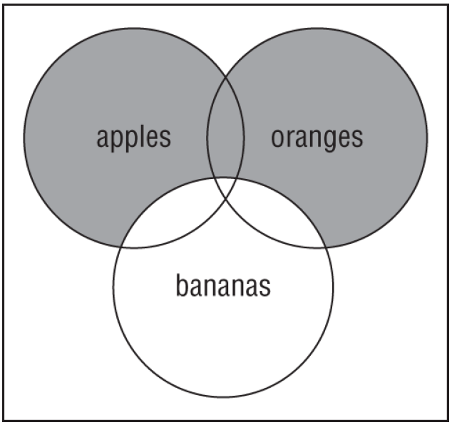

# Chapter 1 Working with Java Data Types

## INTRODUCING VAR

### Local Variable Type Inference
#### Only use this feature for local variables

### Type Inference
#### The compiler looks at the code on the line of the declaration 
- and uses it to infer the type
#### The type of ``` var ``` can’t change at runtime
#### The initial value used to determine the type needs to be part of the same statement
#### All the types declared on a single line must be the same type 
- and share the same declaration
#### Java Does Not Allow ``` var ``` in Multiple Variable Declarations
#### Java Does Not Allow ``` var ``` for null
- a ``` var ``` cannot be initialized with a ``` null ``` value without a type 
  - it can be assigned a ``` null ``` value after it is declared 
  - provided that the underlying data type of the ``` var ``` is an object
#### While var is not a reserved word and allowed to be used as an identifier 
  - it is considered a Reserved Type Name
#### It is often inappropriate to use var as the type for every local variable in your code
- That just makes the code difficult to understand
- [Style Guidelines for Local Variable Type Inference in Java](https://openjdk.java.net/projects/amber/guides/lvti-style-guide)


### ``` var ``` Rules

#### A ``` var ``` is USED as a Local Variable in 
- a constructor 
- method 
- initializer block 

#### A ``` var ``` CANNOT be Used in 
- constructor parameters 
- method parameter 
- instance variables 
- class variables

#### A ``` var ``` is always initialized on the same line (or statement) 
- where it is declared

#### The value of a ``` var ``` can change, but the TYPE CANNOT 

#### A ``` var ``` cannot be initialized with a null value Without A Type 

#### A var is NOT PERMITTED in a Multiple-Variable Declaration 

#### A var is a reserved type name but not a reserved word
- meaning it can be used as an identifier 
  - except as a ``` class ``` , ``` interface ```, or ``` enum name ```


## Quiz

1. ### Which of the following are not valid variable names? (Choose two)
- A. _
- B. _blue
- C. 2blue
- D. blue$
- E. Blue

2. ### What is the value of ``` tip ``` after executing the following code snippet? 
    ```
    int meal = 5;
    int tip = 2;
    var total = meal + (meal > 6 ? tip++ : tip--);
    ```
- A. 1
- B. 2
- C. 3
- D. 7
- E. None of the above

3. ### Which is equivalent to ``` var q = 4.0f; ```?
- A. float q = 4.0f;
- B. Float q = 4.0f;
- C. double q = 4.0f;
- D. Double q = 4.0f;
- E. Object q = 4.0f;

4. ### What is the output of the following?
    ```
    var b = "12";
    b += "3";
    b.reverse();
    System.out.println(b.toString());
    ```
- A. 12
- B. 123
- C. 321
- D. The code does not compile 

5. ### What is the output of the following?
    ```
    var line = new StringBuilder("-");
    var anotherLine = line.append("-");
    System.out.print(line == anotherLine);
    System.out.print(" ");
    System.out.print(line.length());
    ```
- A. false 1
- B. false 2
- C. true 1
- D. true 2
- E. It does not compile

6. ### Given the following Venn diagram and the boolean variables
   #### ``` apples ```, ``` oranges ```, and ``` bananas ```
   #### which expression most closely represents the filled‐in region of the diagram?

   
- A. apples && oranges && !bananas
- B. orange || (oranges && !bananas)
- C. (apples || bananas) && oranges
- D. oranges && apples
- E. (apples || oranges) && !bananas
- F. apples ^ oranges

7. ### What is the output of the following?

    ``` 
    var line = new String("-");
    var anotherLine = line.concat("-");
    System.out.print(line == anotherLine);
    System.out.print(" ");
    System.out.print(line.length());
    ```
- A. false 1
- B. false 2
- C. true 1
- D. true 2
- E. Does not compile

8. ### Which can fill in the blank? (Choose two)
    ```
    public void math() {
        _____ pi = 3.14;
    }
    ```
- A. byte
- B. double
- C. float
- D. short
- E. var

9. ### Fill in the blanks: 
   #### The operators !=, _______, _______, _______, and ++ are listed in 
   #### the same or increasing level of operator precedence. (Choose two)

- A. ==, *, !
- B. /, %, *
- C. *, ‐‐, /
- D. !, *, %
- E. +=, &&, *
- F. *, <, /

10. ### How many of these compile?

    ``` 
    Comparator<String> c1 = (j, k) -> 0; // 18
    Comparator<String> c2 = (String j, String k) -> 0; // 19
    Comparator<String> c3 = (var j, String k) -> 0; // 20
    Comparator<String> c4 = (var j, k) -> 0; // 21
    Comparator<String> c5 = (var j, var k) -> 0; // 22
    ```

- A. 0
- B. 1
- C. 2
- D. 3
- E. 4
- F. 5

11. ### The author of this method forgot to include the data type 
    #### Which of the following reference types can best fill in the blank to complete this method?

    ``` 
    public static void secret(___________ mystery) {
        char ch = mystery.charAt(3);
        mystery = mystery.insert(1, "more");
        int num = mystery.length();
    }
    ```
- A. String
- B. StringBuilder
- C. Both
- D. Neither

12. ### What is the output of the following?

    ``` 
    var teams = new StringBuilder("333");
    teams.append(" 806");
    teams.append(" 1601");
    System.out.print(teams);
    ```
- A. 333
- B. 333 806 1601
- C. The code compiles but outputs something else.
- D. The code does not compile.

13. ### Which of the following declarations does not compile?
- A. double num1, int num2 = 0;
- B. int num1, num2;
- C. int num1, num2 = 0;
- D. int num1 = 0, num2 = 0;
- E. All of the above
- F. None of the above

14. ### Given the file Magnet.java shown 
    #### which of the marked lines can you independently insert the line ```var color; ``` into and still have the code compile?

    ``` 
    // line a1
    public class Magnet {
        // line a2
        public void attach() {
            // line a3
        }
        // line a4
    }
    ```
- A. a2
- B. a3
- C. a2 and a3
- D. a1, a2, a3, and a4
- E. None of the above

15. ### Which is one of the lines output by this code?

    ```
    var list = new ArrayList<Integer>(); // 10
    list.add(10); // 11
    list.add(9); // 12
    list.add(8); // 13
    // 14
    var num = 9; // 15
    list.removeIf(x -> {int keep = num; return x != keep;}); // 16
    System.out.println(list); // 17
    // 18
    list.removeIf(x -> {int keep = num; return x == keep;}); // 19
    System.out.println(list); // 20
    ```
- A. []
- B. [8, 10]
- C. [8, 9, 10]
- D. [10, 8]
- E. The code does not compile.

16. Which of the following can fill in the blank so the code prints ``` true ```?
    ``` 
    var happy = " :) - (: ";
    var really = happy.trim();
    var question = _____________________;
    System.out.println(really.equals(question));
    ```
- A. happy.substring(0, happy.length() ‐ 1)
- B. happy.substring(0, happy.length())
- C. happy.substring(1, happy.length() ‐ 1)
- D. happy.substring(1, happy.length())

17. How many of the following lines contain a compiler error?
    ``` 
    double num1 = 2.718;
    double num2 = 2._718;
    double num3 = 2.7_1_8;
    double num4 = _2.718;
    ```
- A. 0
- B. 1
- C. 2
- D. 3
- E. 4

18. What is the output of the following application?
    ``` 
    public class Airplane {
        static int start = 2;
        final int end;
        public Airplane(int x) {
            x = 4;
            end = x;
        }
        public void fly(int distance) {
            System.out.print(end-start+" ");
            System.out.print(distance);
        }
        public static void main(String… start) {
            new Airplane(10).fly(5);
        }
    }
    ```
- A. 2 5
- B. 8 5
- C. 6 5
- D. The code does not compile 
- E. None of the above 

19. What is the output of the following class?
    ``` 
    1: package rocket;
    2: public class Countdown {
    3:     public static void main(String[] args) {
    4:         var builder = "54321";
    5:         builder = builder.substring(4);
    6:         System.out.println(builder.charAt(2));
    7:     }
    8: }
    ```
- A. 2
- B. 3
- C. 4
- D. None of the above

20. What is the output of the following application?
    ``` 
    package transporter;
    public class Rematerialize {
        public static void main(String[] input) {
            int init = 11;
            int split = 3;
            int partA = init / split;
            int partB = init % split;
            int result = split * (partB + partA);
            System.out.print(result);
        }
    }
    ```
- A. 9
- B. 11
- C. 12
- D. 15
- E. The code does not compile.
- F. None of the above.

21. What is the result of the following code?
    ``` 
    var sb = new StringBuilder("radical")
            .insert(sb.length(), "robots");
    System.out.println(sb);
    ```
- A. radicarobots
- B. radicalrobots
- C. The code does not compile 
- D. The code compiles but throws an exception at runtime 

22. Given the following code snippet, what is the value of ``` dinner ``` 
    after it is executed?
    ``` 
    int time = 9;
    int day = 3;
    var dinner = ++time>= 10 ? day-- <= 2
            ? "Takeout" : "Salad" : "Leftovers";
    ```
- A. Takeout
- B. Leftovers
- C. Salad
- D. The code does not compile but would compile if parentheses were added
- E. None of the above 

23. What is the output of the following?
    ``` 
    var teams = new String("694");
    teams.concat(" 1155");
    teams.concat(" 2265");
    teams.concat(" 2869");
    System.out.println(teams);
    ```
- A. 694
- B. 694 1155 2265 2869
- C. The code compiles but outputs something else 
- D. The code does not compile 

24. How many of the following lines compile?
    ``` 
    bool b = null;
    Bool bl = null;
    int i = null;
    Integer in = null;
    String s = null;
    ```
- A. None
- B. One
- C. Two
- D. Three
- E. Four
- F. Five

25. What is the output of the following code snippet?
    ``` 
    int height = 2, length = 3;
    boolean w = height> 1 | --length < 4;
    var x = height!=2 ? length++ : height;
    boolean z = height % length == 0;
    System.out.println(w + "-" + x + "-" + z);
    ```
- A. true‐2‐true
- B. false‐2‐false
- C. true‐2‐false
- D. true‐3‐false
- E. true‐3‐true
- F. false‐3‐false

26. What is the output of the following?
    ```
    1: public class Legos {
    2:     public static void main(String[] args) {
    3:         var sb = new StringBuilder();
    4:         sb.append("red");
    5:         sb.deleteCharAt(0);
    6:         sb.delete(1, 2);
    7:         System.out.println(sb);
    8:     }
    9: }
    ```
- A. e
- B. d
- C. ed
- D. None of the above

27. Which is a true statement?
- A. If ``` s.contains("abc") ``` is ``` true```, then ``` s.equals("abc") ``` 
     is also ``` true ```
- B. If ``` s.contains("abc") ``` is ``` true ``` , then ``` s.startsWith("abc") ``` 
     is also ``` true ```
- C. If ``` s.startsWith("abc") ``` is true, then ``` s.equals("abc") ``` is 
     also ``` true ```
- D. If ``` s.startsWith("abc") ``` is ``` true ``` , then ``` s.contains("abc") ``` 
     is also ``` true ``` 

28. What is the output of the following code snippet?
    ```
    boolean carrot = true;
    Boolean potato = false;
    var broccoli = true;
    carrot = carrot & potato; // false
    broccoli = broccoli ? !carrot : potato; // true
    potato = !broccoli ^ carrot; // false ^ false
    System.out.println(carrot + "," + potato + "," + broccoli);
    ```
- A. true,false,true
- B. true,true,true
- C. false,false,false
- D. false,true,true
- E. false,false,true
- F. The code does not compile 

29. What does this code output?
    ```
    var babies = Arrays.asList("chick", "cygnet", "duckling");
    babies.replaceAll(x -> { var newValue = "baby"; return newValue; });
    System.out.println(babies);
    ```
- A. ``` [baby] ```
- B. ``` [baby, baby, baby] ```
- C. ``` [chick, cygnet, duckling] ```
- D. None of the above
- E. The code does not compile

30. What is the output of the following class?
    ```
    1: package rocket;
    2: public class Countdown {
    3:     public static void main(String[] args) {
    4:         var builder = new StringBuilder("54321");
    5:         builder.substring(2);
    6:         System.out.println(builder.charAt(1));
    7:     }
    8: }
    ```
- A. 1
- B. 2
- C. 3
- D. 4
- E. Does not compile


