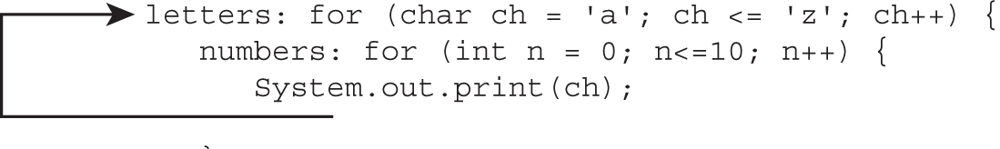

# Chapter 2 Controlling Program Flow

- Create and use loops 
- if / else 
- switch statements

1. Variables declared as which of the following are never permitted in a
   switch statement? (Choose two.)
- A. var
- B. double
- C. int
- D. String
- E. char
- F. Object

2. What happens when running the following code snippet?
   ```
   3: var gas = true;
   4: do (
   5:     System.out.println("helium");
   6:     gas = gas ^ gas;
   7:     gas = !gas;
   8: ) while (!gas);
   ```
- A. It completes successfully without output.
- B. It outputs helium once.
- C. It outputs helium repeatedly.
- D. Line 6 does not compile.
- E. None of the above.

3. What is output by the following?
   ```
   10: int m = 0, n = 0;
   11: while (m < 5) {
   12:     n++;
   13:     if (m == 3)
   14:         continue;
   15:
   16:     switch (m) {
   17:         case 0:
   18:         case 1:
   19:             n++;
   20:         default:
   21:             n++;
   22:     }
   23:     m++;
   24: }
   25: System.out.println(m + " " + n);
   ```
- A. 3 10
- B. 3 12
- C. 5 10
- D. 5 12
- E. The code does not compile.
- F. None of the above.

4. Given the following, which can fill in the blank and allow the code to
   compile? (Choose three.)
   ``` 
   var quest =       ;
   for (var zelda : quest) {
       System.out.print(zelda);
   }
   ```
- A. 3
- B. new int[] {3}
- C. new StringBuilder("3")
- D. List.of(3)
- E. new String[3]
- F. "Link"

5. Which of the following rules about a default branch in a switch
   statement are correct? (Choose two.)
- A. A switch statement is required to declare a default statement.
- B. A default statement must be placed after all case statements.
- C. A default statement can be placed between any case statements.
- D. Unlike a case statement, a default statement does not take a
     parameter value.
- E. A switch statement can contain more than one default
     statement.
- F. A default statement can be used only when at least one case
     statement is present.

6. What does the following method output?
   ```
   void dance() {
       var singer = 0;
       while (singer)
           System.out.print(singer++);
       }
   ```
- A. The code does not compile.
- B. The method completes with no output.
- C. The method prints 0 and then terminates.
- D. The method enters an infinite loop.
- E. None of the above.

7. Which are true statements comparing for‐each and traditional for
   loops? (Choose two.)
- A. Both can iterate through an array starting with the first element.
- B. Only the for‐each loop can iterate through an array starting with
     the first element.
- C. Only the traditional for loop can iterate through an array starting
     with the first element.
- D. Both can iterate through an array starting from the end.
- E. Only the for‐each loop can iterate through an array starting from
     the end.
- F. Only the traditional for loop can iterate through an array starting
     from the end.

8. What is the output of the following application?
   ```
   package planning;
   public class ThePlan {
           public static void main(String[] input) {
               var plan = 1;
               plan = plan++ + --plan;
               if (plan==1) {
                   System.out.print("Plan A");
               } else { if(plan==2) System.out.print("Plan B");
               } else System.out.print("Plan C"); }
           }
   }
   ```
- A. Plan A
- B. Plan B
- C. Plan C
- D. The class does not compile.
- E. None of the above.

9. What is true about the following code? (Choose two.)
   ```
   23: var race = "";
   24: loop:
   25: do {
   26:     race += "x";
   27:     break loop;
   28: } while (true);
   29: System.out.println(race);
   ```
- A. It outputs x.
- B. It does not compile.
- C. It is an infinite loop.
- D. With lines 25 and 28 removed, it outputs x.
- E. With lines 25 and 28 removed, it does not compile.
- F. With lines 25 and 28 removed, it is an infinite loop.

10. Which of the following can replace the body of the perform() method
    to produce the same output on any nonempty input? (Choose two.)
    ```
    public void perform(String[] circus) {
        for (int i=circus.length-1; i>=0; i--)
            System.out.print(circus[i]);
    }
    ```
- A. 
    ``` 
    for (int i=circus.length; i>0; i--)
        System.out.print(circus[i-1]);
    ```
- B. 
    ``` 
    for-reversed (String c = circus)
        System.out.print(c);
    ```
- C.
    ``` 
    for (var c : circus)
        System.out.print(c);
    ```
- D.
    ``` 
    for(var i=0; i<circus.length; i++)
        System.out.print(circus[circus.length-i-1]);
    ```
- E.
    ``` 
    for (int i=circus.length; i>0; i--)
        System.out.print(circus[i+1]);
    ```
- F.
    ``` 
    for-each (String c circus)
        System.out.print(c);
    ``` 

11. What does the following code snippet output?
    ```
    var bottles = List.of("glass", "plastic", "can");
    for (int type = 1; type < bottles.size();) {
        System.out.print(bottles.get(type) + "-");
        if(type < bottles.size()) break;
    }
    System.out.print("end");
    ```
- A. glass‐end
- B. glass‐plastic‐can‐end
- C. plastic‐end
- D. plastic‐can‐end
- E. The code does not compile.
- F. None of the above.

12. What is the result of executing the following code snippet?
    ``` 
    final var GOOD = 100;
    var score = 10;
    switch (score) {
        default:
        1 : System.out.print("1-");
        -1 : System.out.print("2-"); break;
        4,5 : System.out.print("3-");
        6 : System.out.print("4-");
        9 : System.out.print("5-");
    }
    ```
- A. 1‐
- B. 1‐2‐
- C. 2‐
- D. 3‐
- E. 4‐
- F. None of the above

13. What is the output of the following application?
    ``` 
    package dinosaur;
    public class Park {
        public final static void main(String… arguments) {
            int pterodactyl = 8;
            long triceratops = 3;
            if(pterodactyl % 3> 1 + 1)
                triceratops++;
                triceratops--;
           System.out.print(triceratops);
       }
    }
    ``` 
- A. 2
- B. 3
- C. 4
- D. The code does not compile.
- E. The code compiles but throws an exception at runtime.

14. What variable type of red allows the following application to compile?
    ``` 
    package tornado;
    public class Kansas {
        public static void main(String[] args) {
            int colorOfRainbow = 10;
            ___________ red = 5;
            switch(colorOfRainbow) {
                default:
                    System.out.print("Home");
                    break;
                case red:
                    System.out.print("Away");
            }
       }
    }
    ``` 
- A. long
- B. double
- C. int
- D. var
- E. String
- F. None of the above

15. How many lines of the magic() method contain compilation errors?
    ``` 
    10: public void magic() {
    11:     do {
    12:         int trick = 0;
    13:         LOOP: do {
    14:             trick++;
    15:         } while (trick < 2--);
    16:         continue LOOP;
    17:     } while (1> 2);
    18:     System.out.println(trick);
    19: }
    ``` 
- A. Zero
- B. One
- C. Two
- D. Three
- E. Four

16. How many of these statements can be inserted after the ``` print(ch) ``` 
    to have the code flow follow the arrow in this diagram ? (and which?)
    ``` 
    break;
    break letters;
    break numbers;
    continue;
    continue letters;
    continue numbers;
    ```

- A. One
- B. Two
- C. Three
- D. Four
- E. Five
- F. None of above

17. What is the output of the following application?

    ``` 
    package dessert;
    public class IceCream {
            public final static void main(String… args) {
                var flavors = 30;
                int eaten = 0;
                switch(flavors) {
                    case 30: eaten++;
                    case 40: eaten+=2;
                    default: eaten--;
               }
               System.out.print(eaten);
           }
    }
    ```
- A. 1
- B. 2
- C. 3
- D. The code does not compile because var cannot be used in a
     switch statement.
- E. The code does not compile for another reason.
- F. None of the above.

18. Which of the following statements compile and create infinite loops at 
    runtime? (Choose two.)
- A. while (!false) {}
- B. do {}
- C. for( : ) {}
- D. do {} while (true);
- E. while {}
- F. for( ; ; ) {}

19. Which of the following iterates a different number of times than the others?
- A. for (int k=0; k < 5; k++) {}
- B. for (int k=1; k <= 5; k++) {}
- C. int k=0; do { } while(k++ < 5);
- D. int k=0; while (k++ < 5) {}
- E. All of these iterate the same number of times.

20. What is the output of the following code snippet?
    ``` 
    int count = 0;
    var stops = new String[] { 
        "Washington", 
        "Monroe",
        "Jackson", 
        "LaSalle" 
    };
    while (count < stops.length)
        if (stops[++count].length() < 8)
            break;
        else continue;
    System.out.println(count);
    ```
- A. 0
- B. 1
- C. 2
- D. 3
- E. The code does not compile.
- F. None of the above.

21. What is the output of the following code snippet?
    ``` 
    int hops = 0;
    int jumps = 0;
    jumps = hops++;
    if (jumps)
        System.out.print("Jump!");
    else
        System.out.print("Hop!");
    ```
- A. Jump!
- B. Hop!
- C. The code does not compile.
- D. The code compiles but throws an exception at runtime.
- E. None of the above.

22. Which of the following best describes the flow of execution in this for 
    loop if beta always returns false?
    ``` 
    for (alpha; beta; gamma) {
        delta;
    }
    ```
- A. alpha
- B. alpha, beta
- C. alpha, beta, gamma
- D. alpha, gamma
- E. alpha, gamma, beta
- F. None of the above

23. What is the output of the following code snippet?
     ``` 
     boolean balloonInflated = false;
     do {
         if (!balloonInflated) {
             balloonInflated = true;
             System.out.print("inflate-");
         }
     } while (! balloonInflated);
     System.out.println("done");
     ```
- A. done
- B. inflate‐done
- C. The code does not compile.
- D. This is an infinite loop.
- E. None of the above.

24. Which of these code snippets behaves differently from the others?
- A.
  ``` 
    if (numChipmunks == 1)
        System.out.println("One chipmunk");
    if (numChipmunks == 2)
        System.out.println("Two chipmunks");
    if (numChipmunks == 3)
        System.out.println("Three chipmunks");
  ```
- B.
  ``` 
      switch (numChipmunks) {
        case 1: System.out.println("One chipmunk");
        case 2: System.out.println("Two chipmunks");
        case 3: System.out.println("Three chipmunks");
      }
  ```
- C. 
    ```
    if (numChipmunks == 1)
        System.out.println("One chipmunk");
    else if (numChipmunks == 2)
        System.out.println("Two chipmunks");
    else if (numChipmunks == 3)
        System.out.println("Three chipmunks");
    ```
- D. All three code snippets do the same thing 

25. Which statements about loops are correct? (Choose three.)
- A. A do/while loop requires a body.
- B. A while loop cannot be exited early with a return statement.
- C. A while loop requires a conditional expression.
- D. A do/while loop executes the body (if present) at least once.
- E. A do/while loop cannot be exited early with a return statement.
- F. A while loop executes the body (if present) at least once.

26. Given the following enum and class, which option fills in the blank and 
    allows the code to compile?
    ``` 
    enum Season { SPRING, SUMMER, WINTER }
    public class Weather {
        public int getAverageTemperate(Season s) {
            switch (s) {
                default:
                ______________ return 30;
            }
        }
    }
    ```
- A. case Season.WINTER:
- B. case WINTER, SPRING:
- C. case SUMMER | WINTER:
- D. case SUMMER ‐>
- E. case FALL:
- F. None of the above

27. Fill in the blank with the line of code that causes the application to 
    compile and print exactly one line at runtime.
    ``` 
    package nyc;
    public class TourBus {
        public static void main(String… args) {
            var nycTour = new String[] { "Downtown", "Uptown", "Brooklyn" };
            var times = new String[] { "Day", "Night" };
            for (_______________ i < nycTour.length && j < times.length; i++, j++)
                System.out.println(nycTour[i] + "-" + times[j]);
        } 
    }
    ```
- A. int i=1; j=1;
- B. int i=0, j=1;
- C. int i=1; int j=0;
- D. int i=1, int j=0;
- E. int i=1, j=0;
- F. None of the above

28. The code contains six pairs of curly braces. How many pairs can be removed 
    without changing the behavior?
    ``` 
    12: public static void main(String[] args) {
    13:     int secret = 0;
    14:     for (int i = 0; i < 10; i++) {
    15:         while (i < 10) {
    16:             if (i == 5) {
    17:                 System.out.println("if");
    18:             } else {
    19:                 System.out.println("in");
    20:                 System.out.println("else");
    21:             }
    22:         }
    23:     }
    24:     switch (secret) {
    25:         case 0: System.out.println("zero");
    26:     }
    27: }
    ```
- A. One
- B. Two
- C. Three
- D. Four
- E. Five
- F. Six

29. Which of the following can replace the body of the ``` travel() ``` method 
    to produce the same output on any non-empty input?
    ``` 
    public void travel(List<Integer> roads) {
        for (int w = 1; w <= roads.size(); w++)
            System.out.print(roads.get(w-1));
    }
    ```
- A. 
  ```
    for (int r = 0; r < roads.size(); r += 1)
            System.out.print(roads.get(0));
  ```
- B.
  ``` 
    for(var z : roads)
            System.out.print(z);
  ```
- C.
  ``` 
    for (int t = roads.size(); t> 0; t--)
            System.out.print(roads.get(t));
  ```
- D.
  ``` 
    for (var var : roads)
            System.out.print(roads);
  ```
- E.
  ``` 
    for (int q = roads.size(); q>= 0; q++)
            System.out.print(roads.get(q));
  ```
- F. None of the above

30. Which statement about the following code snippet is correct?
    ``` 
    3: final var javaVersions = List.of(9,10,11);
    4: var exams = List.of("1Z0-811", "1Z0-819");
    5: V: for (var e1 : javaVersions) {
    6:     E: for (String e2 : exams)
    7:            System.out.println(e1 + "_" + e2);
    8:            break;
    9: }
    ```
- A. One line does not compile.
- B. Two lines do not compile.
- C. Three lines do not compile.
- D. It compiles and prints two lines at runtime.
- E. It compiles and prints three lines at runtime.
- F. None of the above.